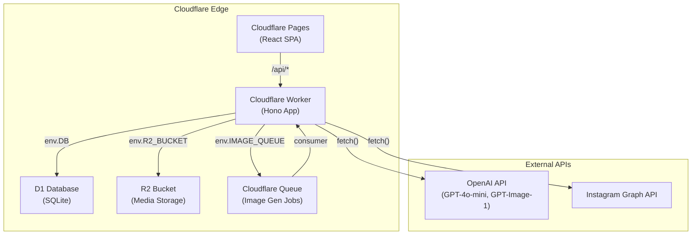

# Design Document: Cloudflare Workers Migration

## Overview

This design covers the migration of the Social Media Cross-Poster backend from Express.js + PostgreSQL + @aws-sdk/client-s3 to Cloudflare Workers (Hono) + D1 (SQLite) + native R2 bindings. The frontend moves from a Vite dev-server proxy to Cloudflare Pages. A Cloudflare Queue handles GPT-Image-1 calls that exceed the 30-second Worker CPU limit.

The migration preserves all 8 route groups, 13 services, the shared types package, and the PlatformError-based error handling. The key architectural shift is from singleton service instances importing a shared database pool to services that receive D1/R2 bindings from the Hono request context on every request.

### Migration Scope

| Current Stack | Target Stack |
|---|---|
| Express.js (server/) | Hono on Cloudflare Workers (worker/) |
| PostgreSQL via `pg` Pool | Cloudflare D1 (SQLite) |
| @aws-sdk/client-s3 for R2 | Native R2 bindings (env.R2_BUCKET) |
| Node.js crypto | Web Crypto API |
| Node.js Buffer | Uint8Array / ArrayBuffer |
| Vite proxy to localhost:3001 | Cloudflare Pages + Worker URL |
| Synchronous image generation | Queue-based async image generation |

### What Does NOT Change

- `shared/` types package (all exports remain identical)
- `client/` React app code (only Vite config and API base URL change)
- PlatformError class and formatErrorResponse utility
- Content templates (pure data, no runtime dependencies)
- Business logic in services (only the data access layer changes)

## Architecture



### Request Flow

1. Browser loads SPA from Cloudflare Pages
2. SPA makes `/api/*` requests to the Worker
3. Hono routes the request, session middleware validates the Bearer token against D1
4. Route handler creates service instances with D1/R2 bindings from `c.env`
5. Service executes business logic, returns response
6. Hono error handler catches any PlatformError and returns structured JSON

### Queue Flow (Image Generation)

1. POST `/api/media/generate` enqueues a job to `IMAGE_QUEUE` and returns `{ jobId }`
2. Queue consumer picks up the message, calls GPT-Image-1 (up to 120s)
3. Consumer stores the image in R2, writes metadata to D1, updates job status
4. Client polls GET `/api/media/generate-status/:jobId` until status is `completed` or `failed`

## Components and Interfaces

### Project Structure

```
worker/
  src/
    index.ts              # Hono app, route registration, error handler, queue consumer
    bindings.ts           # Bindings type definition (DB, R2_BUCKET, IMAGE_QUEUE, env vars)
    middleware/
      session.ts          # Hono middleware: Bearer token validation via D1
      error-handler.ts    # Hono onError handler for PlatformError
    routes/
      auth.ts             # /api/auth/*
      media.ts            # /api/media/*
      posts.ts            # /api/posts/*
      channels.ts         # /api/channels/*
      content.ts          # /api/content-types, /api/holidays, /api/posts/:id/generate-content
      settings.ts         # /api/settings, /api/content-advisor/suggest
      activity-log.ts     # /api/activity-log
      content-ideas.ts    # /api/content-ideas/*
    services/
      activity-log-service.ts
      auth-service.ts
      content-advisor.ts
      content-generator.ts
      content-ideas-service.ts
      content-templates.ts    # Unchanged (pure data)
      cross-poster.ts
      image-generator.ts
      instagram-channel.ts
      media-service.ts
      post-service.ts
      publish-approval-service.ts
      user-settings-service.ts
      index.ts
    errors/
      format-error.ts     # Unchanged
      index.ts
      platform-error.ts   # Unchanged
    migrations/
      0001_initial_schema.sql
    queue/
      image-consumer.ts   # Queue message handler
  wrangler.toml
  package.json
  tsconfig.json
shared/                   # Unchanged
client/                   # Vite config updated, API base URL updated
tests/
  unit/                   # Updated mocks for D1/R2
  property/
```

### Bindings Type

The central type that declares all Cloudflare bindings available on `c.env` in every Hono handler:

```typescript
// worker/src/bindings.ts
import type { D1Database, R2Bucket, Queue } from '@cloudflare/workers-types';

export interface Bindings {
  DB: D1Database;
  R2_BUCKET: R2Bucket;
  IMAGE_QUEUE: Queue;
  AI_TEXT_API_KEY: string;
  AI_TEXT_API_URL: string;
  FB_PAGE_ACCESS_TOKEN: string;
  IG_BUSINESS_ACCOUNT_ID: string;
  CHANNEL_ENCRYPTION_KEY: string;
  S3_PUBLIC_URL: string;
}
```

### Hono App Setup

```typescript
// worker/src/index.ts
import { Hono } from 'hono';
import type { Bindings } from './bindings.js';
import { errorHandler } from './middleware/error-handler.js';
import authRoutes from './routes/auth.js';
// ... other route imports

const app = new Hono<{ Bindings: Bindings }>();

app.get('/health', (c) => c.json({ status: 'ok' }));

app.route('/api/auth', authRoutes);
app.route('/api/media', mediaRoutes);
app.route('/api/posts', postRoutes);
app.route('/api/channels', channelRoutes);
app.route('/api', contentRoutes);
app.route('/api', settingsRoutes);
app.route('/api/activity-log', activityLogRoutes);
app.route('/api/content-ideas', contentIdeasRoutes);

app.onError(errorHandler);

export default {
  fetch: app.fetch,
  async queue(batch, env) {
    // Process image generation jobs
    await handleImageQueue(batch, env);
  },
};
```

### Service Layer Pattern

The key architectural change: services no longer import a shared database module. Instead, each service constructor receives the D1 and/or R2 binding. Route handlers create service instances per-request from `c.env`.

```typescript
// Example: worker/src/services/post-service.ts
export class PostService {
  private readonly db: D1Database;

  constructor(db: D1Database) {
    this.db = db;
  }

  async getById(postId: string, userId: string): Promise<Post> {
    const sql = 'SELECT ' + POST_COLUMNS + ' FROM posts WHERE id = ? AND user_id = ?';
    const result = await this.db.prepare(sql).bind(postId, userId).first();
    if (!result) {
      throw new PlatformError({ /* ... */ });
    }
    return this.mapRow(result);
  }
}

// Example route handler:
postsApp.get('/:id', sessionMiddleware, async (c) => {
  const postService = new PostService(c.env.DB);
  const post = await postService.getById(c.req.param('id'), c.get('user').id);
  return c.json(post);
});
```

### Session Middleware (Hono)

```typescript
// worker/src/middleware/session.ts
import { createMiddleware } from 'hono/factory';
import type { Bindings } from '../bindings.js';
import { AuthService } from '../services/auth-service.js';
import { PlatformError } from '../errors/index.js';

export const sessionMiddleware = createMiddleware<{ Bindings: Bindings }>(
  async (c, next) => {
    const authHeader = c.req.header('Authorization');
    const token = authHeader && authHeader.startsWith('Bearer ')
      ? authHeader.slice(7)
      : null;

    if (!token) {
      throw new PlatformError({
        severity: 'error',
        component: 'AuthModule',
        operation: 'sessionMiddleware',
        description: 'Authentication is required. Please log in.',
        recommendedActions: ['Log in with your @chicago-reno.com email'],
      });
    }

    const authService = new AuthService(c.env.DB);
    const user = await authService.verifySession(token);

    if (!user) {
      throw new PlatformError({
        severity: 'error',
        component: 'AuthModule',
        operation: 'sessionMiddleware',
        description: 'Your session has expired due to inactivity.',
        recommendedActions: ['Log in again to continue'],
      });
    }

    c.set('user', user);
    await next();
  },
);
```

### Error Handler (Hono)

```typescript
// worker/src/middleware/error-handler.ts
import type { ErrorHandler } from 'hono';
import { PlatformError } from '../errors/platform-error.js';
import { formatErrorResponse } from '../errors/format-error.js';

export const errorHandler: ErrorHandler = (err, c) => {
  let platformError: PlatformError;

  if (err instanceof PlatformError) {
    platformError = err;
  } else {
    platformError = new PlatformError({
      severity: 'error',
      component: 'Server',
      operation: 'unknown',
      description: err.message || 'An unexpected error occurred.',
      recommendedActions: ['Try again', 'Contact support if the problem persists'],
    });
  }

  const statusCode = platformError.severity === 'warning' ? 400 : 500;
  return c.json(formatErrorResponse(platformError), statusCode);
};
```

### Queue Consumer (Image Generation)

```typescript
// worker/src/queue/image-consumer.ts
export async function handleImageQueue(
  batch: MessageBatch,
  env: Bindings,
): Promise<void> {
  for (const message of batch.messages) {
    const job = message.body as ImageJobMessage;
    const db = env.DB;
    const r2 = env.R2_BUCKET;

    // Update job status to processing
    await db.prepare(
      'UPDATE image_generation_jobs SET status = ?, updated_at = datetime(\'now\') WHERE id = ?'
    ).bind('processing', job.jobId).run();

    try {
      const imageGenerator = new ImageGenerator(env.AI_TEXT_API_KEY);
      const images = await imageGenerator.generate(job.request);

      // Store first image in R2
      const mediaService = new MediaService(db, r2);
      const mediaItem = await mediaService.storeGenerated(images[0], job.userId);

      // Update job as completed
      await db.prepare(
        'UPDATE image_generation_jobs SET status = ?, result_media_id = ?, updated_at = datetime(\'now\') WHERE id = ?'
      ).bind('completed', mediaItem.id, job.jobId).run();

      message.ack();
    } catch (err) {
      const errorMsg = err instanceof Error ? err.message : 'Unknown error';
      await db.prepare(
        'UPDATE image_generation_jobs SET status = ?, error = ?, updated_at = datetime(\'now\') WHERE id = ?'
      ).bind('failed', errorMsg, job.jobId).run();

      message.ack();
    }
  }
}
```

### R2 Native Bindings (MediaService)

The MediaService replaces all @aws-sdk/client-s3 calls with native R2 binding methods:

```typescript
// worker/src/services/media-service.ts (key changes)
export class MediaService {
  private readonly db: D1Database;
  private readonly r2: R2Bucket;

  constructor(db: D1Database, r2: R2Bucket) {
    this.db = db;
    this.r2 = r2;
  }

  async upload(file: UploadedFile, userId: string): Promise<MediaItem> {
    this.validateFile(file);
    const storageKey = 'media/' + userId + '/' + crypto.randomUUID() + '-' + file.originalname;

    // Native R2 put instead of PutObjectCommand
    await this.r2.put(storageKey, file.buffer, {
      httpMetadata: { contentType: file.mimetype },
    });

    // D1 insert instead of pg query
    const id = crypto.randomUUID();
    await this.db.prepare(
      'INSERT INTO media_items (id, user_id, filename, mime_type, file_size_bytes, storage_key, thumbnail_url, source) VALUES (?, ?, ?, ?, ?, ?, ?, ?)'
    ).bind(id, userId, file.originalname, file.mimetype, file.size, storageKey, '/media/thumbnail/' + storageKey, 'uploaded').run();

    // ... return mapped result
  }

  async delete(mediaId: string, userId: string): Promise<void> {
    // ... lookup storage_key from D1
    await this.r2.delete(storageKey);  // Native R2 delete
    // ... delete from D1
  }
}
```

### Token Encryption (Web Crypto API)

The InstagramChannel replaces Node.js crypto with Web Crypto API for AES-GCM encryption:

```typescript
// worker/src/services/instagram-channel.ts (encryption helpers)
async function encrypt(text: string, keyHex: string): Promise<string> {
  const keyBytes = hexToBytes(keyHex);
  const key = await crypto.subtle.importKey('raw', keyBytes, 'AES-GCM', false, ['encrypt']);
  const iv = crypto.getRandomValues(new Uint8Array(16));
  const encoded = new TextEncoder().encode(text);
  const ciphertext = await crypto.subtle.encrypt({ name: 'AES-GCM', iv }, key, encoded);
  const ciphertextBytes = new Uint8Array(ciphertext);
  return bytesToHex(iv) + ':' + bytesToHex(ciphertextBytes);
}

async function decrypt(encryptedText: string, keyHex: string): Promise<string> {
  const [ivHex, ciphertextHex] = encryptedText.split(':');
  const keyBytes = hexToBytes(keyHex);
  const key = await crypto.subtle.importKey('raw', keyBytes, 'AES-GCM', false, ['decrypt']);
  const iv = hexToBytes(ivHex);
  const ciphertext = hexToBytes(ciphertextHex);
  const plaintext = await crypto.subtle.decrypt({ name: 'AES-GCM', iv }, key, ciphertext);
  return new TextDecoder().decode(plaintext);
}
```

### Wrangler Configuration

```toml
# worker/wrangler.toml
name = "social-media-cross-poster"
main = "src/index.ts"
compatibility_date = "2024-12-01"

[[d1_databases]]
binding = "DB"
database_name = "cross-poster-db"
database_id = "<D1_DATABASE_ID>"
migrations_dir = "src/migrations"

[[r2_buckets]]
binding = "R2_BUCKET"
bucket_name = "cross-poster-media"

[[queues.producers]]
binding = "IMAGE_QUEUE"
queue = "image-generation-queue"

[[queues.consumers]]
queue = "image-generation-queue"
max_batch_size = 1
max_retries = 2

[vars]
AI_TEXT_API_URL = "https://api.openai.com/v1/chat/completions"
S3_PUBLIC_URL = ""

# Secrets (set via `wrangler secret put`):
# AI_TEXT_API_KEY
# FB_PAGE_ACCESS_TOKEN
# IG_BUSINESS_ACCOUNT_ID
# CHANNEL_ENCRYPTION_KEY
```

### Frontend (Cloudflare Pages)

The client Vite config changes to proxy to the local Wrangler dev server in development and use the Worker URL in production:

```typescript
// client/vite.config.ts
import { defineConfig } from 'vite';
import react from '@vitejs/plugin-react';

export default defineConfig({
  plugins: [react()],
  server: {
    port: 5173,
    proxy: {
      '/api': {
        target: 'http://localhost:8787',  // Wrangler dev server
        changeOrigin: true,
      },
    },
  },
});
```

The client API module adds a base URL for production:

```typescript
// client/src/api.ts (change)
const API_BASE = import.meta.env.PROD
  ? (import.meta.env.VITE_API_URL || '')
  : '';

// All fetch calls prefix with API_BASE:
// fetch(API_BASE + '/api/auth/login', { ... })
```

## Data Models

### D1 Schema (SQLite Migration)

The PostgreSQL schema is converted to SQLite-compatible syntax. Key changes:
- `UUID PRIMARY KEY DEFAULT uuid_generate_v4()` becomes `TEXT PRIMARY KEY` (app generates UUIDs)
- `TIMESTAMP NOT NULL DEFAULT NOW()` becomes `TEXT NOT NULL DEFAULT (datetime('now'))`
- `JSONB` becomes `TEXT`
- `VARCHAR(n)` becomes `TEXT`
- `CREATE EXTENSION` statements are removed
- `BOOLEAN` becomes `INTEGER` (0/1)
- `SERIAL` / `INTEGER PRIMARY KEY` auto-increments in SQLite

```sql
-- worker/src/migrations/0001_initial_schema.sql

-- Users
CREATE TABLE IF NOT EXISTS users (
    id TEXT PRIMARY KEY,
    email TEXT NOT NULL UNIQUE,
    name TEXT NOT NULL,
    created_at TEXT NOT NULL DEFAULT (datetime('now')),
    last_active_at TEXT NOT NULL DEFAULT (datetime('now'))
);

-- User Settings
CREATE TABLE IF NOT EXISTS user_settings (
    id TEXT PRIMARY KEY,
    user_id TEXT NOT NULL UNIQUE REFERENCES users(id) ON DELETE CASCADE,
    advisor_mode TEXT NOT NULL DEFAULT 'manual',
    approval_mode TEXT NOT NULL DEFAULT 'manual_review',
    updated_at TEXT NOT NULL DEFAULT (datetime('now'))
);
CREATE INDEX IF NOT EXISTS idx_user_settings_user_id ON user_settings(user_id);

-- Channel Connections
CREATE TABLE IF NOT EXISTS channel_connections (
    id TEXT PRIMARY KEY,
    user_id TEXT NOT NULL REFERENCES users(id) ON DELETE CASCADE,
    channel_type TEXT NOT NULL,
    external_account_id TEXT,
    external_account_name TEXT,
    access_token_encrypted TEXT,
    token_expires_at TEXT,
    status TEXT NOT NULL DEFAULT 'disconnected',
    created_at TEXT NOT NULL DEFAULT (datetime('now')),
    updated_at TEXT NOT NULL DEFAULT (datetime('now'))
);
CREATE INDEX IF NOT EXISTS idx_channel_connections_user_id ON channel_connections(user_id);

-- Posts
CREATE TABLE IF NOT EXISTS posts (
    id TEXT PRIMARY KEY,
    user_id TEXT NOT NULL REFERENCES users(id) ON DELETE CASCADE,
    channel_connection_id TEXT REFERENCES channel_connections(id) ON DELETE SET NULL,
    content_type TEXT NOT NULL,
    caption TEXT,
    hashtags_json TEXT,
    status TEXT NOT NULL DEFAULT 'draft',
    external_post_id TEXT,
    template_fields TEXT,
    created_at TEXT NOT NULL DEFAULT (datetime('now')),
    updated_at TEXT NOT NULL DEFAULT (datetime('now')),
    published_at TEXT
);
CREATE INDEX IF NOT EXISTS idx_posts_user_id ON posts(user_id);
CREATE INDEX IF NOT EXISTS idx_posts_status ON posts(status);

-- Media Items
CREATE TABLE IF NOT EXISTS media_items (
    id TEXT PRIMARY KEY,
    user_id TEXT NOT NULL REFERENCES users(id) ON DELETE CASCADE,
    filename TEXT NOT NULL,
    mime_type TEXT NOT NULL,
    file_size_bytes INTEGER NOT NULL,
    storage_key TEXT NOT NULL,
    thumbnail_url TEXT,
    source TEXT NOT NULL DEFAULT 'uploaded',
    ai_description TEXT,
    width INTEGER,
    height INTEGER,
    created_at TEXT NOT NULL DEFAULT (datetime('now'))
);
CREATE INDEX IF NOT EXISTS idx_media_items_user_id ON media_items(user_id);

-- Post Media (join table)
CREATE TABLE IF NOT EXISTS post_media (
    id TEXT PRIMARY KEY,
    post_id TEXT NOT NULL REFERENCES posts(id) ON DELETE CASCADE,
    media_item_id TEXT NOT NULL REFERENCES media_items(id) ON DELETE CASCADE,
    display_order INTEGER NOT NULL DEFAULT 0
);
CREATE INDEX IF NOT EXISTS idx_post_media_post_id ON post_media(post_id);
CREATE INDEX IF NOT EXISTS idx_post_media_media_item_id ON post_media(media_item_id);

-- Activity Log Entries
CREATE TABLE IF NOT EXISTS activity_log_entries (
    id TEXT PRIMARY KEY,
    user_id TEXT NOT NULL REFERENCES users(id) ON DELETE CASCADE,
    component TEXT NOT NULL,
    operation TEXT NOT NULL,
    severity TEXT NOT NULL DEFAULT 'info',
    description TEXT NOT NULL,
    recommended_action TEXT,
    created_at TEXT NOT NULL DEFAULT (datetime('now'))
);
CREATE INDEX IF NOT EXISTS idx_activity_log_entries_user_id ON activity_log_entries(user_id);

-- Team Members
CREATE TABLE IF NOT EXISTS team_members (
    id TEXT PRIMARY KEY,
    name TEXT NOT NULL,
    role TEXT NOT NULL,
    bio_snippet TEXT,
    photo_media_id TEXT,
    created_at TEXT NOT NULL DEFAULT (datetime('now'))
);

-- Sessions
CREATE TABLE IF NOT EXISTS sessions (
    id TEXT PRIMARY KEY,
    user_id TEXT NOT NULL REFERENCES users(id) ON DELETE CASCADE,
    token TEXT NOT NULL UNIQUE,
    last_active_at TEXT NOT NULL DEFAULT (datetime('now')),
    created_at TEXT NOT NULL DEFAULT (datetime('now'))
);
CREATE INDEX IF NOT EXISTS idx_sessions_token ON sessions(token);

-- Content Ideas
CREATE TABLE IF NOT EXISTS content_ideas (
    id TEXT PRIMARY KEY,
    user_id TEXT NOT NULL REFERENCES users(id) ON DELETE CASCADE,
    content_type TEXT NOT NULL,
    idea TEXT NOT NULL,
    used INTEGER NOT NULL DEFAULT 0,
    created_at TEXT NOT NULL DEFAULT (datetime('now'))
);
CREATE INDEX IF NOT EXISTS idx_content_ideas_user_id ON content_ideas(user_id);
CREATE INDEX IF NOT EXISTS idx_content_ideas_content_type ON content_ideas(content_type);

-- Image Generation Jobs (new table for Queue workflow)
CREATE TABLE IF NOT EXISTS image_generation_jobs (
    id TEXT PRIMARY KEY,
    user_id TEXT NOT NULL REFERENCES users(id) ON DELETE CASCADE,
    status TEXT NOT NULL DEFAULT 'queued',
    description TEXT,
    style TEXT,
    count INTEGER NOT NULL DEFAULT 1,
    topic TEXT,
    result_media_id TEXT,
    error TEXT,
    created_at TEXT NOT NULL DEFAULT (datetime('now')),
    updated_at TEXT NOT NULL DEFAULT (datetime('now'))
);
CREATE INDEX IF NOT EXISTS idx_image_generation_jobs_user_id ON image_generation_jobs(user_id);
CREATE INDEX IF NOT EXISTS idx_image_generation_jobs_status ON image_generation_jobs(status);
```

### Query Translation Reference

| PostgreSQL Pattern | D1 Equivalent |
|---|---|
| `$1, $2, $3` | `?, ?, ?` |
| `query(sql, [a, b])` | `db.prepare(sql).bind(a, b).all()` |
| `query(sql, [a]).rows[0]` | `db.prepare(sql).bind(a).first()` |
| `INSERT ... RETURNING *` | `INSERT ... ` then `db.prepare('SELECT ... WHERE id = ?').bind(id).first()` (D1 does not support RETURNING) |
| `BEGIN; ...; COMMIT` | `db.batch([stmt1, stmt2, ...])` |
| `NOW()` | `datetime('now')` |
| `ON CONFLICT (col) DO UPDATE SET ...` | Same syntax (SQLite supports it) |
| `uuid_generate_v4()` | `crypto.randomUUID()` in application code |
| `INTERVAL '30 days'` | `datetime('now', '-30 days')` |
| `COUNT(*)::int` | `COUNT(*)` (SQLite returns integer natively) |
| `BOOLEAN` column | `INTEGER` (0 = false, 1 = true) |

### D1 Batch Operations (Replacing Transactions)

D1 does not support `BEGIN`/`COMMIT`/`ROLLBACK`. Instead, `db.batch()` executes multiple statements atomically:

```typescript
// PostService.create() — D1 batch version
async create(params: CreatePostParams): Promise<Post> {
  const postId = crypto.randomUUID();
  const hashtagsJson = params.hashtags ? JSON.stringify(params.hashtags) : null;
  const templateFields = params.templateFields ? JSON.stringify(params.templateFields) : null;

  const statements = [
    this.db.prepare(
      'INSERT INTO posts (id, user_id, channel_connection_id, content_type, caption, hashtags_json, status, template_fields) VALUES (?, ?, ?, ?, ?, ?, ?, ?)'
    ).bind(postId, params.userId, params.channelConnectionId, params.contentType, params.caption || null, hashtagsJson, 'draft', templateFields),
  ];

  if (params.mediaItemIds) {
    for (let i = 0; i < params.mediaItemIds.length; i++) {
      statements.push(
        this.db.prepare(
          'INSERT INTO post_media (id, post_id, media_item_id, display_order) VALUES (?, ?, ?, ?)'
        ).bind(crypto.randomUUID(), postId, params.mediaItemIds[i], i)
      );
    }
  }

  await this.db.batch(statements);

  const row = await this.db.prepare(
    'SELECT ' + POST_COLUMNS + ' FROM posts WHERE id = ?'
  ).bind(postId).first();

  return this.mapRow(row);
}
```


## Correctness Properties

*A property is a characteristic or behavior that should hold true across all valid executions of a system -- essentially, a formal statement about what the system should do. Properties serve as the bridge between human-readable specifications and machine-verifiable correctness guarantees.*

### Property 1: R2 Storage Round-Trip

*For any* valid binary payload (represented as a Uint8Array) and any valid storage key, storing the payload in R2 via `env.R2_BUCKET.put()` and then retrieving it via `env.R2_BUCKET.get()` should return bytes identical to the original payload. This includes base64-decoded image data from data URIs.

**Validates: Requirements 3.1, 3.3, 3.6, 8.6**

### Property 2: R2 Delete Removes Object

*For any* valid storage key that has been stored in R2, calling `env.R2_BUCKET.delete()` on that key and then calling `env.R2_BUCKET.get()` should return null.

**Validates: Requirements 3.2**

### Property 3: Session Create-Verify Round-Trip

*For any* valid @chicago-reno.com email address, creating a session via `AuthService.initiateAuth()` and then verifying the returned token via `AuthService.verifySession()` should return a user whose email matches the original login email, and the session's `last_active_at` should be updated.

**Validates: Requirements 4.1, 4.2, 4.4**

### Property 4: Session Expiry After 7 Days

*For any* valid session token whose `last_active_at` timestamp is more than 7 days in the past, calling `AuthService.verifySession()` should return null and the session row should be deleted from D1.

**Validates: Requirements 4.3**

### Property 5: Session Logout Invalidation

*For any* valid session token, after calling `AuthService.logout()` with that token, calling `AuthService.verifySession()` with the same token should return null.

**Validates: Requirements 4.5**

### Property 6: AES-GCM Encryption Round-Trip

*For any* plaintext string and any valid 256-bit AES key (as a hex string), encrypting the plaintext with `encrypt()` and then decrypting the result with `decrypt()` should return the original plaintext.

**Validates: Requirements 8.5, 11.1, 11.2**

### Property 7: Image Generation Job Lifecycle

*For any* valid image generation request, enqueuing the job should create a record in `image_generation_jobs` with status 'queued'. After the queue consumer processes the job successfully, the status should be 'completed' and `result_media_id` should reference a valid media item. After the queue consumer fails, the status should be 'failed' and `error` should contain a non-empty description. The GET status endpoint should always return the current status matching the D1 record.

**Validates: Requirements 5.1, 5.2, 5.3, 5.4**

### Property 8: D1 Batch Atomicity

*For any* set of D1 prepared statements executed via `db.batch()`, if any statement in the batch fails, none of the statements should have their effects persisted in the database.

**Validates: Requirements 8.4**

### Property 9: Error Handler Status Code Mapping

*For any* error thrown during request handling, the Hono error handler should return HTTP 400 for PlatformError with severity 'warning', HTTP 500 for PlatformError with severity 'error', and HTTP 500 for non-PlatformError instances (wrapped as PlatformError with component 'Server' and operation 'unknown'). The response body should always match the `formatErrorResponse()` output shape.

**Validates: Requirements 13.1, 13.2**

### Property 10: Error Handler Activity Logging

*For any* error that passes through the Hono error handler, an entry should be written to the `activity_log_entries` table in D1 with the error's component, operation, severity, and description fields.

**Validates: Requirements 13.3**

### Property 11: Application-Level UUID Generation

*For any* record created by any service (posts, media items, sessions, users, etc.), the `id` field should be a valid UUID v4 string generated by `crypto.randomUUID()` before the INSERT statement, not by a database default.

**Validates: Requirements 2.2**

### Property 12: Post Status State Machine Preservation

*For any* post and any attempted status transition, the PostService should allow the transition only if it matches the valid transitions map (draft->awaiting_approval, awaiting_approval->approved|draft, approved->publishing, publishing->published|failed, failed->publishing|draft). Invalid transitions should throw a PlatformError. This property must hold identically in the D1-backed implementation as in the original PostgreSQL-backed implementation.

**Validates: Requirements 8.3**

## Error Handling

### PlatformError Propagation

The PlatformError class and `formatErrorResponse()` utility are unchanged from the Express implementation. The only change is how errors are caught and returned:

- Express: `app.use(errorHandler)` middleware with `(err, req, res, next)` signature
- Hono: `app.onError(errorHandler)` with `(err, c)` signature

### Error Flow

1. Service throws `PlatformError` (or any Error)
2. Hono catches the error and calls `onError`
3. Error handler wraps non-PlatformError in a PlatformError
4. Error handler logs to D1 activity_log_entries (best-effort, does not throw if logging fails)
5. Error handler returns `c.json(formatErrorResponse(err), statusCode)`

### Queue Consumer Error Handling

Queue consumer errors do not propagate to HTTP responses. Instead:
- The consumer catches all errors during image generation
- On failure, it updates the job record in D1 with status 'failed' and the error message
- The message is acknowledged (acked) regardless of success/failure to prevent infinite retries
- The client discovers failures by polling the status endpoint

### Missing Encryption Key

If `CHANNEL_ENCRYPTION_KEY` is not set in the environment, the encrypt/decrypt functions throw a PlatformError with:
- severity: 'error'
- component: 'InstagramChannel'
- operation: 'encryption'
- description: 'Channel encryption key is not configured.'

This matches the existing behavior from the Express implementation.

### D1 Error Handling

D1 errors (constraint violations, query failures) are caught by the service layer and wrapped in PlatformError instances with appropriate descriptions. The `db.batch()` method throws if any statement fails, and since it's atomic, no partial state is left behind.

## Testing Strategy

### Dual Testing Approach

The test suite uses two complementary strategies:

1. **Unit tests** (vitest): Verify specific examples, edge cases, and integration points between components. These use mocked D1/R2 bindings.
2. **Property-based tests** (fast-check + vitest): Verify universal properties across randomly generated inputs. Each property test runs a minimum of 100 iterations.

### D1 Mock Strategy

The current tests mock `query()` and `getClient()` from `server/src/config/database.js`. The migrated tests will mock the D1 binding object directly:

```typescript
function createMockD1(): D1Database {
  const results = new Map<string, unknown>();
  return {
    prepare: vi.fn().mockReturnValue({
      bind: vi.fn().mockReturnThis(),
      first: vi.fn().mockImplementation(() => results.get('first') || null),
      all: vi.fn().mockImplementation(() => ({ results: results.get('all') || [] })),
      run: vi.fn().mockImplementation(() => ({ success: true })),
    }),
    batch: vi.fn().mockImplementation(async (stmts) => {
      return stmts.map(() => ({ success: true }));
    }),
    exec: vi.fn(),
    dump: vi.fn(),
  } as unknown as D1Database;
}
```

Each test creates a fresh mock D1 and configures the return values for the specific queries under test. This replaces the `vi.mock('../../server/src/config/database.js')` pattern.

### R2 Mock Strategy

```typescript
function createMockR2(): R2Bucket {
  const store = new Map<string, ArrayBuffer>();
  return {
    put: vi.fn().mockImplementation(async (key: string, value: ArrayBuffer) => {
      store.set(key, value);
    }),
    get: vi.fn().mockImplementation(async (key: string) => {
      const data = store.get(key);
      if (!data) return null;
      return { arrayBuffer: async () => data } as R2ObjectBody;
    }),
    delete: vi.fn().mockImplementation(async (key: string) => {
      store.delete(key);
    }),
    head: vi.fn(),
    list: vi.fn(),
    createMultipartUpload: vi.fn(),
    resumeMultipartUpload: vi.fn(),
  } as unknown as R2Bucket;
}
```

### Queue Mock Strategy

```typescript
function createMockQueue(): Queue {
  const messages: unknown[] = [];
  return {
    send: vi.fn().mockImplementation(async (body: unknown) => {
      messages.push(body);
    }),
    sendBatch: vi.fn(),
  } as unknown as Queue;
}
```

### Test Migration Mapping

Each existing test file maps to a migrated equivalent:

| Current Test | Migrated Test | Key Change |
|---|---|---|
| `tests/unit/post-service.test.ts` | Same path | Mock D1 instead of pg query/getClient |
| `tests/unit/cross-poster.test.ts` | Same path | Mock D1 instead of pg query |
| `tests/unit/auth-service.test.ts` | Same path | Mock D1 instead of pg query |
| `tests/unit/publish-approval-service.test.ts` | Same path | Mock D1 instead of pg query |
| `tests/unit/activity-log-service.test.ts` | Same path | Mock D1 instead of pg query |
| `tests/unit/user-settings-service.test.ts` | Same path | Mock D1 instead of pg query |
| `tests/unit/instagram-channel.test.ts` | Same path | Mock D1 + Web Crypto instead of pg + Node crypto |
| `tests/unit/error-formatting.test.ts` | Same path | No changes needed |
| `tests/unit/quick-start.test.ts` | Same path | Mock D1 instead of pg query |

### Property-Based Test Configuration

- Library: `fast-check` (already in devDependencies)
- Runner: `vitest`
- Minimum iterations: 100 per property
- Each property test references its design document property with a comment tag

Tag format: `Feature: cloudflare-workers-migration, Property {number}: {property_text}`

Example:

```typescript
// Feature: cloudflare-workers-migration, Property 6: AES-GCM Encryption Round-Trip
it('encrypt then decrypt returns original plaintext', () => {
  fc.assert(
    fc.asyncProperty(fc.string(), async (plaintext) => {
      const key = '0123456789abcdef0123456789abcdef0123456789abcdef0123456789abcdef';
      const encrypted = await encrypt(plaintext, key);
      const decrypted = await decrypt(encrypted, key);
      expect(decrypted).toBe(plaintext);
    }),
    { numRuns: 100 },
  );
});
```

### What Each Property Test Covers

| Property | Test Strategy |
|---|---|
| 1: R2 Round-Trip | Generate random Uint8Array payloads, put then get, compare bytes |
| 2: R2 Delete | Generate random keys, put then delete then get, assert null |
| 3: Session Round-Trip | Generate random valid emails, initiateAuth then verifySession, compare user |
| 4: Session Expiry | Generate sessions with old timestamps, verify returns null |
| 5: Session Logout | Generate sessions, logout then verify, assert null |
| 6: Encryption Round-Trip | Generate random strings, encrypt then decrypt, compare |
| 7: Job Lifecycle | Generate random job params, enqueue then process then check status |
| 8: Batch Atomicity | Generate batch with one failing statement, verify no side effects |
| 9: Error Status Codes | Generate random PlatformErrors with random severity, verify HTTP status |
| 10: Error Logging | Generate random errors, pass through handler, verify D1 insert |
| 11: UUID Generation | Generate random service create calls, verify id is valid UUID |
| 12: Post State Machine | Generate random (status, targetStatus) pairs, verify allowed/rejected matches the transition map |
