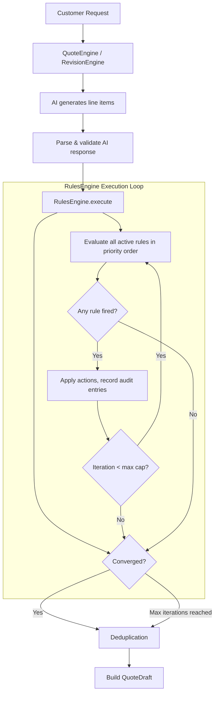

# Design Document: Deterministic Rules Engine

## Overview

This design introduces a deterministic rules engine that programmatically enforces business rules **after** the AI generates initial line items. The current system injects free-text rule descriptions into the AI system prompt and trusts the AI to self-report which rules it applied — an approach that is unreliable, unauditable, and cannot support conditional logic or rule chaining.

The new engine is a **pure TypeScript module** (`RulesEngine`) that takes a set of line items and a product catalog, evaluates structured conditions against the line items, executes typed actions, and iterates until convergence or a max-iteration cap. It produces a complete audit trail of every rule application.

### Key Design Decisions

1. **Post-AI execution**: The engine runs after AI response parsing/validation but before deduplication, ensuring business rules always override AI behavior.
2. **Pure function core**: The `RulesEngine` has no external dependencies (no D1, no fetch). It receives all inputs as arguments and returns a result object. This makes it trivially testable.
3. **Iterative convergence loop**: Rules are evaluated in priority order across iterations. When an action modifies the line item set, a new iteration begins. This supports chaining (rule A adds an item that triggers rule B).
4. **Backward compatibility**: Legacy rules (no structured condition/action JSON) are skipped by the engine and continue to be injected into the AI prompt via the existing `buildRulesSection` function.
5. **Shared types**: All condition, action, and result types are exported from the `shared` package so both client and worker can reference them.

## Architecture

The rules engine integrates into the existing quote generation pipeline as a post-processing step:



### Integration Points

- **QuoteEngine.generateQuote()**: After `parseAIResponse()` and `validateAIResponse()`, before `deduplicateLineItems()`. The engine receives the validated AI line items and the product catalog.
- **RevisionEngine.revise()**: After `parseAndValidate()` produces the AI line items, before `deduplicateLineItems()`. Same integration pattern.
- **RulesService**: Extended to read/write the new `condition_json`, `action_json`, and `trigger_mode` columns. Provides structured rules to the engine.
- **Shared types**: New types (`StructuredRule`, `RuleCondition`, `RuleAction`, `RulesEngineResult`, `AuditEntry`) exported from `shared/src/types/quote.ts`.

## Components and Interfaces

### 1. RulesEngine (Pure Module)

**Location**: `worker/src/services/rules-engine.ts`

The core engine is a stateless module with a single entry point:

```typescript
export interface RulesEngineInput {
  lineItems: EngineLineItem[];
  rules: StructuredRule[];
  catalog: ProductCatalogEntry[];
  maxIterations?: number; // defaults to 10
}

export interface EngineLineItem {
  id: string;
  productCatalogEntryId: string | null;
  productName: string;
  description: string;
  quantity: number;
  unitPrice: number;
  confidenceScore: number;
  originalText: string;
  ruleIdsApplied: string[];
}

export interface RulesEngineResult {
  lineItems: EngineLineItem[];
  auditTrail: AuditEntry[];
  iterationCount: number;
  converged: boolean;
}

export function executeRules(input: RulesEngineInput): RulesEngineResult;
```

**Internal flow of `executeRules`**:

1. Clone the input line items (engine never mutates inputs).
2. For each iteration (up to `maxIterations`):
   a. Filter eligible rules based on trigger mode (iteration 1: all; iteration 2+: only `chained`).
   b. Sort eligible rules by `priorityOrder` ascending.
   c. For each rule, evaluate its condition against the current line items.
   d. If the condition matches and the rule hasn't already been applied to the same target line item in this execution run, execute all actions.
   e. Record an `AuditEntry` for each action executed.
   f. Track whether any action modified the line item set.
3. If no modifications occurred, terminate (converged).
4. If max iterations reached, terminate with `converged: false` and a warning audit entry.
5. Return the final line items, audit trail, iteration count, and convergence flag.

### 2. Condition Evaluator

**Location**: Internal to `rules-engine.ts`

```typescript
function evaluateCondition(
  condition: RuleCondition,
  lineItems: EngineLineItem[],
): ConditionResult;

interface ConditionResult {
  matched: boolean;
  matchingLineItemIds: string[]; // IDs of line items that matched the condition
}
```

Condition types and their evaluation:

| Condition Type | Fields | Evaluation |
|---|---|---|
| `line_item_exists` | `productNamePattern: string` | Case-insensitive match of any line item's `productName` against the pattern |
| `line_item_not_exists` | `productNamePattern: string` | No line item's `productName` matches the pattern (case-insensitive) |
| `line_item_quantity_gte` | `productNamePattern: string, threshold: number` | A matching line item has `quantity >= threshold` |
| `line_item_quantity_lte` | `productNamePattern: string, threshold: number` | A matching line item has `quantity <= threshold` |
| `always` | _(none)_ | Always returns `matched: true` |

Product name matching uses exact case-insensitive string comparison (`productName.toLowerCase() === pattern.toLowerCase()`).

### 3. Action Executor

**Location**: Internal to `rules-engine.ts`

```typescript
function executeAction(
  action: RuleAction,
  lineItems: EngineLineItem[],
  catalog: ProductCatalogEntry[],
  ruleId: string,
): ActionResult;

interface ActionResult {
  modified: boolean;
  lineItems: EngineLineItem[]; // updated line item array
  warning?: string; // e.g., product not found in catalog
  beforeSnapshot?: EngineLineItem[]; // affected items before change
  afterSnapshot?: EngineLineItem[]; // affected items after change
}
```

Action types and their execution:

| Action Type | Fields | Execution |
|---|---|---|
| `add_line_item` | `productName: string, quantity: number, unitPrice: number, description?: string` | Look up product in catalog (case-insensitive). If found, add a new line item with catalog ID. If not found, skip and record warning. |
| `remove_line_item` | `productNamePattern: string` | Remove all line items whose `productName` matches the pattern (case-insensitive). |
| `set_quantity` | `productNamePattern: string, quantity: number` | Set `quantity` on all matching line items. |
| `adjust_quantity` | `productNamePattern: string, delta: number` | Add `delta` to `quantity` on all matching line items. Clamp to minimum 0. |
| `set_unit_price` | `productNamePattern: string, unitPrice: number` | Set `unitPrice` on all matching line items. |

For all actions that modify existing line items, the rule's ID is appended to the line item's `ruleIdsApplied` array.

### 4. Schema Validator

**Location**: `worker/src/services/rules-engine.ts` (exported)

```typescript
export function validateCondition(condition: unknown): { valid: boolean; error?: string };
export function validateAction(action: unknown): { valid: boolean; error?: string };
export function validateActions(actions: unknown): { valid: boolean; errors?: string[] };
```

Validates condition/action JSON at creation time (API layer) and at runtime (engine skips invalid rules with a warning audit entry). Checks:
- Known `type` field
- Required fields present for each type
- Correct field types (string for patterns, number for quantities/prices)

### 5. RulesService Extensions

**Location**: `worker/src/services/rules-service.ts` (modified)

Extended methods:
- `createRule()`: Accepts optional `conditionJson`, `actionJson`, `triggerMode` fields. Validates schemas before persisting.
- `updateRule()`: Same validation for condition/action updates.
- `getActiveStructuredRules()`: New method that returns `StructuredRule[]` — only rules with valid condition and action JSON, parsed and typed.
- `getActiveRulesGrouped()`: Unchanged — continues to return all active rules for prompt injection (legacy rules).

### 6. QuoteEngine / RevisionEngine Integration

Both engines are modified to:
1. Fetch structured rules via `RulesService.getActiveStructuredRules()`.
2. Separate legacy rules (no condition/action JSON) from structured rules.
3. Pass legacy rules to `buildRulesSection()` for AI prompt injection (unchanged).
4. After AI response parsing, call `executeRules()` with the AI line items, structured rules, and catalog.
5. Use the engine's output line items for deduplication and draft construction.
6. Attach the audit trail to the quote draft response.

## Data Models

### New Shared Types

Added to `shared/src/types/quote.ts`:

```typescript
/** Trigger mode for structured rules */
export type TriggerMode = 'on_create' | 'chained';

/** Condition types supported by the rules engine */
export type RuleConditionType =
  | 'line_item_exists'
  | 'line_item_not_exists'
  | 'line_item_quantity_gte'
  | 'line_item_quantity_lte'
  | 'always';

/** A typed condition for a structured rule */
export type RuleCondition =
  | { type: 'line_item_exists'; productNamePattern: string }
  | { type: 'line_item_not_exists'; productNamePattern: string }
  | { type: 'line_item_quantity_gte'; productNamePattern: string; threshold: number }
  | { type: 'line_item_quantity_lte'; productNamePattern: string; threshold: number }
  | { type: 'always' };

/** Action types supported by the rules engine */
export type RuleActionType =
  | 'add_line_item'
  | 'remove_line_item'
  | 'set_quantity'
  | 'adjust_quantity'
  | 'set_unit_price';

/** A typed action for a structured rule */
export type RuleAction =
  | { type: 'add_line_item'; productName: string; quantity: number; unitPrice: number; description?: string }
  | { type: 'remove_line_item'; productNamePattern: string }
  | { type: 'set_quantity'; productNamePattern: string; quantity: number }
  | { type: 'adjust_quantity'; productNamePattern: string; delta: number }
  | { type: 'set_unit_price'; productNamePattern: string; unitPrice: number };

/** A structured rule with typed condition and actions */
export interface StructuredRule {
  id: string;
  name: string;
  priorityOrder: number;
  triggerMode: TriggerMode;
  condition: RuleCondition;
  actions: RuleAction[];
}

/** An audit entry produced by the rules engine */
export interface AuditEntry {
  ruleId: string;
  ruleName: string;
  iteration: number;
  condition: RuleCondition;
  action: RuleAction;
  matchingLineItemIds: string[];
  beforeSnapshot: Array<{ id: string; productName: string; quantity: number; unitPrice: number }>;
  afterSnapshot: Array<{ id: string; productName: string; quantity: number; unitPrice: number }>;
  warning?: string;
}

/** Result of a rules engine execution */
export interface RulesEngineResult {
  lineItems: EngineLineItem[];
  auditTrail: AuditEntry[];
  iterationCount: number;
  converged: boolean;
}

/** Line item representation used internally by the rules engine */
export interface EngineLineItem {
  id: string;
  productCatalogEntryId: string | null;
  productName: string;
  description: string;
  quantity: number;
  unitPrice: number;
  confidenceScore: number;
  originalText: string;
  ruleIdsApplied: string[];
}
```

### Database Migration

**File**: `worker/src/migrations/0009_structured_rules.sql`

```sql
-- Add structured rule columns to existing rules table
ALTER TABLE rules ADD COLUMN condition_json TEXT DEFAULT NULL;
ALTER TABLE rules ADD COLUMN action_json TEXT DEFAULT NULL;
ALTER TABLE rules ADD COLUMN trigger_mode TEXT NOT NULL DEFAULT 'chained';
```

- `condition_json`: JSON string of a `RuleCondition` object. NULL for legacy prompt-only rules.
- `action_json`: JSON string of a `RuleAction[]` array. NULL for legacy prompt-only rules.
- `trigger_mode`: Either `'on_create'` or `'chained'`. Defaults to `'chained'` for backward compatibility.

Legacy rules (where `condition_json` and `action_json` are NULL) continue to work as prompt-only rules — they are passed to `buildRulesSection()` for AI prompt injection and skipped by the `RulesEngine`.

### Extended Rule Type

The existing `Rule` interface in `shared/src/types/quote.ts` is extended:

```typescript
export interface Rule {
  id: string;
  name: string;
  description: string;
  ruleGroupId: string;
  priorityOrder: number;
  isActive: boolean;
  conditionJson?: RuleCondition | null;
  actionJson?: RuleAction[] | null;
  triggerMode?: TriggerMode;
  createdAt: Date;
  updatedAt: Date;
}
```

