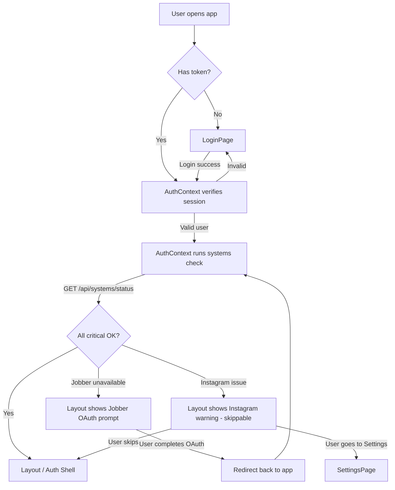

# Design Document: Jobber Auth on Login

## Overview

This feature replaces the current mid-flow `SessionExpiredBanner` approach with a unified systems check that runs at app startup. Instead of discovering broken connections while the user is working, the app verifies all external service connections (Jobber OAuth, Instagram channel) immediately after login or page reload. If any critical connection is missing, the user is prompted to fix it before entering the app.

The feature also inverts the client API error toast model (no toast by default, opt-in toasts), removes the entire Jobber web session cookie system, collapses the form-data fallback chain to a single server-side endpoint, adds background enrichment of incomplete Jobber requests in the worker, and fixes the OAuth callback to redirect back to the app instead of showing an HTML page.

### Key Design Decisions

1. **Systems check merged into AuthContext** — instead of a separate `SystemsCheckGate` wrapper component, the `AuthContext` is extended with a `systemsStatus` field. The `verifySession` call already runs on mount; the systems check is added to that same flow. This keeps all "is the user ready to use the app" logic in one place. `ProtectedRoute` or `Layout` reads `systemsStatus` from context and shows the appropriate UI (Jobber OAuth prompt, Instagram warning, etc.) without adding another wrapper to the route tree.

2. **Flipped handleResponse default — no toast by default, opt-in toasts** — the existing `handleResponse` is changed to NOT fire `globalErrorListener`. A new `handleResponseWithToast` function (or a `{ toast: true }` parameter) is added for the few places that actually want user-visible error toasts. This inverts the current model and eliminates the entire class of "silent fetch" problems. Most API calls should NOT show toasts — only explicit user-initiated actions (create post, generate quote, save settings, etc.) should show toasts on failure.

3. **Server-side form data fallback chain** — instead of the client trying web session → D1 → API → local data with multiple API calls and partial error states, the worker's `GET /jobber/requests/:id/form-data` endpoint handles the ENTIRE fallback chain server-side and returns one definitive result. The client just calls one endpoint and gets data or null. No client-side fallback logic, no multiple API calls, no partial error states.

4. **Web session cookie system removed entirely** — the web session cookies (Jobber internal API for `requestDetails.form`) expire every 4 hours and require either manual cookie pasting or a Puppeteer script. The public API + webhook data already provides notes, descriptions, and images. The form-data endpoint relies on: D1 webhook data → Jobber public API fetch → return null. No web session cookies needed. Removed: `JobberWebSession` service, `set-cookies` endpoints, `session-cookies/status` endpoint, `checkJobberSessionStatus` from client, all `sessionExpired` state tracking, `SessionExpiredBanner` component.

5. **OAuth callback redirect** — the worker's `/api/jobber-auth/callback` endpoint changes from returning HTML to issuing a `302` redirect to the app root (or with an error query parameter on failure). This enables seamless return from the OAuth flow.

6. **Enrichment in worker** — background enrichment of incomplete Jobber requests happens server-side in the existing `GET /jobber/requests` handler using `waitUntil` (Cloudflare's mechanism for fire-and-forget work after the response is sent).

7. **Critical vs non-critical** — Jobber OAuth is critical (blocks entry) because the quote engine cannot function without it. Instagram is non-critical (skippable) because the social media module can still be browsed without a connected account.

## Architecture



### Component Tree (Auth Flow)

```
BrowserRouter
  └── AuthProvider (manages user + systemsStatus)
       └── ErrorToastProvider
            └── Routes
                 ├── /login → LoginPage
                 └── ProtectedRoute (checks auth + systemsStatus)
                      └── Layout (reads systemsStatus, shows prompts if needed)
                           └── Outlet (page routes)
```

Note: No separate `SystemsCheckGate` component. The systems check lives inside `AuthContext`, and `Layout` reads `systemsStatus` from context to conditionally render prompts or the normal Auth Shell.

## Components and Interfaces

### 1. New Worker Endpoint: `GET /api/systems/status`

**File**: `worker/src/routes/systems.ts` (new file)

Aggregates the status of all external connections into a single response. Requires session authentication.

```typescript
// Response shape
interface SystemsStatusResponse {
  jobber: {
    available: boolean;  // true if valid OAuth tokens exist in D1
  };
  instagram: {
    status: 'connected' | 'expired' | 'not_connected';
    accountName?: string;
  };
}
```

**Implementation**:
- Reuses the existing `JobberTokenStore` to check if valid tokens exist (same logic as `GET /api/quotes/jobber/status`)
- Queries `channel_connections` table for Instagram status (same logic as `GET /api/channels` but without token refresh — just status check)
- Protected by `sessionMiddleware`
- Registered in `worker/src/index.ts` as `app.route('/api/systems', systemsRoutes)`

### 2. Modified: `client/src/AuthContext.tsx` — Extended with `systemsStatus`

Instead of a separate gate component, `AuthContext` is extended with a `systemsStatus` field that tracks the state of external service connections.

**New fields on `AuthState`**:
```typescript
interface AuthState {
  user: User | null;
  loading: boolean;
  systemsStatus: SystemsStatus;
  login: (email: string) => Promise<void>;
  logout: () => Promise<void>;
  recheckSystems: () => Promise<void>;
  skipInstagram: () => void;
  error: ErrorResponse | null;
  clearError: () => void;
}

type SystemsStatus =
  | { state: 'idle' }                    // before auth
  | { state: 'checking' }                // systems check in flight
  | { state: 'ready' }                   // all critical checks passed
  | { state: 'jobber_unavailable' }      // Jobber OAuth missing — blocks entry
  | { state: 'instagram_issue'; instagram: { status: 'expired' | 'not_connected'; accountName?: string } }
  | { state: 'error'; message: string }; // systems check endpoint failed
```

**Behavior**:
- After `verifySession` succeeds (on mount or after login), `AuthContext` calls `GET /api/systems/status`
- Sets `systemsStatus` to `'checking'` during the call
- On success: evaluates the response — if `jobber.available === false`, sets `'jobber_unavailable'`; if Instagram has issues but Jobber is fine, sets `'instagram_issue'`; if all good, sets `'ready'`
- On network error: sets `'error'` with a message
- `recheckSystems()` re-calls the endpoint (used after OAuth return)
- `skipInstagram()` sets status to `'ready'` (user chose to skip)
- Detects `?oauth_error=...` query parameter on load and sets error state

### 3. Modified: `client/src/Layout.tsx` — Reads `systemsStatus` from Context

`Layout` reads `systemsStatus` from `useAuth()` and conditionally renders:

- `systemsStatus.state === 'checking'`: loading spinner overlay
- `systemsStatus.state === 'jobber_unavailable'`: full-page Jobber OAuth prompt with "Connect Jobber" button that navigates to `GET /api/jobber-auth/authorize`
- `systemsStatus.state === 'instagram_issue'`: dismissible warning banner at the top of the Layout with link to Settings and a "Skip" button
- `systemsStatus.state === 'error'`: error message with retry button (calls `recheckSystems()`)
- `systemsStatus.state === 'ready'`: normal Layout with sidebar + Outlet

This approach avoids adding a new wrapper component to the route tree. The `Layout` component already renders for all authenticated routes, so it's the natural place to show system status prompts.

### 4. Modified: `client/src/App.tsx` — No Route Tree Changes

The route tree stays exactly as-is. No `SystemsCheckGate` wrapper is inserted:

```tsx
<Route element={<ProtectedRoute />}>
  <Route element={<Layout />}>
    {/* existing routes — unchanged */}
  </Route>
</Route>
```

### 5. New Client API Function: `fetchSystemsStatus`

**File**: `client/src/api.ts`

```typescript
export async function fetchSystemsStatus(): Promise<SystemsStatusResponse> {
  const res = await fetch(API_BASE + '/api/systems/status', {
    headers: { ...authHeaders() },
  });
  return handleResponse(res);
}
```

### 6. Modified: `client/src/api.ts` — Flipped Toast Default

The core change: `handleResponse` no longer calls `globalErrorListener`. A new `handleResponseWithToast` function is added for the few call sites that want user-visible error toasts.

```typescript
// DEFAULT: No toast. Used by most API calls.
async function handleResponse<T>(res: Response): Promise<T> {
  if (!res.ok) {
    const body = await res.json().catch(() => null);
    let error: ErrorResponse;
    if (body && 'severity' in body) {
      error = body as ErrorResponse;
    } else {
      const msg = (body && typeof body.error === 'string')
        ? body.error
        : 'Request failed (' + res.status + ')';
      error = { severity: 'error', component: 'API', operation: '', message: msg, actions: [] };
    }
    // NOTE: No globalErrorListener call — silent by default
    throw error;
  }
  return res.json();
}

// OPT-IN TOAST: Used only for explicit user-initiated actions.
async function handleResponseWithToast<T>(res: Response): Promise<T> {
  if (!res.ok) {
    const body = await res.json().catch(() => null);
    let error: ErrorResponse;
    if (body && 'severity' in body) {
      error = body as ErrorResponse;
    } else {
      const msg = (body && typeof body.error === 'string')
        ? body.error
        : 'Request failed (' + res.status + ')';
      error = { severity: 'error', component: 'API', operation: '', message: msg, actions: [] };
    }
    globalErrorListener?.(error);  // Fire toast
    throw error;
  }
  return res.json();
}
```

**Which calls use `handleResponseWithToast`** (explicit user-initiated actions):
- `createPost`, `updatePost`, `publishPost`, `approvePost` — user clicked a button
- `generateContent` — user requested content generation
- `generateQuote`, `reviseDraft` — user initiated quote generation/revision
- `uploadMedia`, `generateImages`, `deleteMedia` — user-initiated media operations
- `saveCatalog`, `saveTemplates` — user saving data
- `updateSettings` — user saving settings
- `connectInstagram`, `disconnectChannel`, `refreshInstagramToken` — user managing connections
- `createRule`, `updateRule`, `deactivateRule`, `createRuleGroup`, `updateRuleGroup`, `deleteRuleGroup` — user managing rules
- `login` — user logging in

**Which calls use `handleResponse` (default, no toast)**:
- `verifySession`, `logout` — background/session operations
- `fetchPosts`, `fetchPost`, `fetchChannels`, `fetchContentTypes` — data loading
- `fetchSettings`, `fetchActivityLog` — data loading
- `fetchDrafts`, `fetchDraft`, `deleteDraft` — data loading (delete is debatable but currently silent)
- `fetchCatalog`, `fetchTemplates` — data loading
- `checkJobberStatus`, `fetchJobberRequests`, `fetchJobberRequestFormData` — data loading with fallbacks
- `fetchCorpusStatus`, `syncCorpus` — background/polling operations
- `syncInstagramPosts` — fire-and-forget background sync
- `quickStart`, `fetchAdvisorSuggestion` — data loading
- `fetchContentIdeas`, `generateContentIdeas`, `useContentIdea`, `dismissContentIdea` — data loading
- `fetchRules` — data loading
- `fetchSystemsStatus` — systems check

Remove the `checkJobberSessionStatus` export entirely (web session system removed).

### 7. Modified: `worker/src/routes/jobber-auth.ts` — OAuth Callback Redirect + Remove Web Session Endpoints

**OAuth callback changes** — the `GET /callback` handler redirects instead of returning HTML:

**On success**:
```typescript
await tokenStore.save(data.access_token, data.refresh_token);
const appUrl = new URL('/', c.req.url).origin;
return c.redirect(appUrl + '/social/dashboard');
```

**On failure**:
```typescript
const appUrl = new URL('/', c.req.url).origin;
const errorMsg = encodeURIComponent(`Token exchange failed (${response.status})`);
return c.redirect(appUrl + '/social/dashboard?oauth_error=' + errorMsg);
```

**Removed endpoints**:
- `POST /set-cookies` — no longer needed (web session system removed)
- `GET /set-cookies` — no longer needed
- `GET /session-cookies/status` — no longer needed

**Removed import**: `JobberWebSession` is no longer imported in this file.

The file retains only `GET /authorize` and `GET /callback`.

### 8. Modified: `worker/src/routes/quotes.ts` — Server-Side Form Data Fallback + Background Enrichment

#### Form Data Endpoint (`GET /jobber/requests/:id/form-data`)

The entire fallback chain is handled server-side. The client calls one endpoint and gets data or null. No `sessionExpired` field in the response.

**New fallback chain** (all server-side):
1. Check D1 `jobber_webhook_requests` table for stored data
2. If not found or incomplete, fetch from Jobber public GraphQL API and store in D1
3. Return assembled form data or `null`

**No web session cookies involved.** The `JobberWebSession` import and usage are removed from this handler.

```typescript
// Response shape — simplified, no sessionExpired
{ formData: JobberRequestFormData | null }
```

#### Background Enrichment (`GET /jobber/requests`)

After building the response, identify incomplete requests and fire-and-forget enrichment calls:

```typescript
const incomplete = requests.filter(r =>
  !r.description && r.structuredNotes.length === 0 && r.imageUrls.length === 0
);

const toEnrich = incomplete.slice(0, 5);
if (toEnrich.length > 0 && c.executionCtx?.waitUntil) {
  c.executionCtx.waitUntil(
    Promise.allSettled(
      toEnrich.map(async (req) => {
        try {
          const detail = await jobberIntegration.graphqlRequest(/* ... */);
          // Store in jobber_webhook_requests using existing upsert pattern
        } catch (err) {
          console.error(`[enrichment] Failed for ${req.id}:`, err);
        }
      })
    )
  );
}
```

Uses `c.executionCtx.waitUntil()` — Cloudflare Workers' mechanism for running work after the response is sent. Each enrichment call is individually wrapped in try/catch.

### 9. Modified: `client/src/pages/QuoteInputPage.tsx` — Remove Session State + Simplify Form Data

Remove:
- `sessionExpired` state variable and all `setSessionExpired` calls
- `handleReconnected` callback
- `sessionExpired` and `onReconnected` props passed to `RequestSelector`

Simplify `handleRequestSelect`:
- Call `fetchJobberRequestFormData(request.id)` — gets data or null (no `sessionExpired` field)
- If data returned, use it; if null, fall back to title + description + notes from the request object
- No client-side fallback chain, no multiple API calls

### 10. Modified: `client/src/pages/RequestSelector.tsx` — Remove Banner

Remove:
- `sessionExpired` and `onReconnected` from props interface
- `SessionExpiredBanner` import and rendering
- All references to session expiration

### 11. Deleted: `client/src/pages/SessionExpiredBanner.tsx`

Delete the entire file.

### 12. Modified: `client/src/pages/DashboardPage.tsx` — No Changes Needed

With the flipped `handleResponse` default (no toast), the existing `syncInstagramPosts().catch(() => {})` call already works correctly — `handleResponse` no longer fires the global error listener, so no toast appears. No code changes needed in this file.

### 13. Modified: `client/src/pages/CorpusStatusIndicator.tsx` — No Changes Needed

With the flipped `handleResponse` default, `fetchCorpusStatus` calls during polling already won't trigger toasts. No code changes needed.

### 14. Removed: `worker/src/services/jobber-web-session.ts`

The entire `JobberWebSession` service is removed. The form-data endpoint no longer uses web session cookies. The D1 table `jobber_web_session` becomes unused (can be cleaned up in a future migration, but no schema change is required for this feature).

### 15. Removed: `worker/scripts/sync-cookies.mjs`

The Puppeteer cookie sync script is removed since the web session cookie system is eliminated.

## Data Models

### SystemsStatusResponse (new shared type)

```typescript
// shared/src/types/common.ts
export interface SystemsStatusResponse {
  jobber: {
    available: boolean;
  };
  instagram: {
    status: 'connected' | 'expired' | 'not_connected';
    accountName?: string;
  };
}
```

### Modified: `fetchJobberRequestFormData` Response

The response no longer includes `sessionExpired`:

```typescript
// Before
{ formData: JobberRequestFormData | null; sessionExpired: boolean }

// After
{ formData: JobberRequestFormData | null }
```

### No Database Changes

This feature does not require new D1 migrations. All data is read from existing tables:
- `jobber_token_store` — for Jobber OAuth token availability
- `channel_connections` — for Instagram channel status
- `jobber_webhook_requests` — for enrichment upserts and form data fallback (existing table)

The `jobber_web_session` table becomes unused but is not dropped (no migration needed).

## Correctness Properties

*A property is a characteristic or behavior that should hold true across all valid executions of a system — essentially, a formal statement about what the system should do. Properties serve as the bridge between human-readable specifications and machine-verifiable correctness guarantees.*

### Property 1: Systems status aggregation is consistent

*For any* combination of Jobber token state (present/absent in D1) and Instagram channel state (connected row exists/expired row exists/no row), the systems status aggregation logic SHALL return a response where `jobber.available` correctly reflects token presence and `instagram.status` correctly reflects the channel row state.

**Validates: Requirements 1.5**

### Property 2: Critical vs non-critical gate logic

*For any* `SystemsStatusResponse` object with any combination of `jobber.available` (true/false) and `instagram.status` ('connected'/'expired'/'not_connected'), the AuthContext's "can proceed to ready" logic SHALL return `true` if and only if `jobber.available === true`, regardless of the Instagram status value.

**Validates: Requirements 1.4, 2.5**

### Property 3: handleResponse default suppresses toast, handleResponseWithToast fires toast

*For any* HTTP error response (status codes 400-599 with various error body shapes including structured `ErrorResponse` bodies and plain `{ error: string }` bodies), calling `handleResponse` SHALL throw the error but SHALL NOT invoke the `globalErrorListener` callback, while calling `handleResponseWithToast` with the same response SHALL throw the error AND invoke the `globalErrorListener` callback exactly once.

**Validates: Requirements 6.1, 8.1**

### Property 4: Enrichment target selection respects completeness and cap

*For any* list of `JobberCustomerRequest` objects (0 to 100 items with varying completeness), the enrichment selection function SHALL return exactly `min(count of incomplete requests, 5)` items, where a request is "incomplete" if it has an empty description AND zero structuredNotes AND zero imageUrls. All returned items SHALL be truly incomplete.

**Validates: Requirements 7.1, 7.2**

### Property 5: Enrichment error isolation

*For any* set of enrichment targets (1 to 5 requests) where a random subset of enrichment calls throw errors, the remaining enrichment calls SHALL still complete successfully, and the original API response SHALL be unaffected.

**Validates: Requirements 7.4**

## Error Handling

### Systems Check Endpoint Errors
- If the D1 query for Jobber tokens fails: return `jobber.available: false` (fail-closed — user will be prompted to re-auth)
- If the D1 query for Instagram channels fails: return `instagram.status: 'not_connected'` (fail-open — user can skip)
- If the endpoint itself throws: the client's AuthContext sets `systemsStatus` to `{ state: 'error', message: '...' }` with a retry option

### OAuth Callback Errors
- Token exchange HTTP failure: redirect to app with `?oauth_error=Token+exchange+failed+(status)`
- Missing authorization code: redirect to app with `?oauth_error=Missing+authorization+code`
- Missing client credentials: redirect to app with `?oauth_error=Server+configuration+error`

### Form Data Endpoint Errors (Server-Side Fallback)
- D1 query fails: fall through to Jobber API fetch
- Jobber API fetch fails: return `{ formData: null }` — client shows whatever data it has from the request object
- All errors are logged server-side but never surface as client-side toasts (handleResponse default is silent)

### handleResponse / handleResponseWithToast Errors
- `handleResponse` (default): throws the error for callers to catch, but never fires the global toast. Callers are responsible for their own fallback behavior (e.g., `setJobberAvailable(false)`, showing inline error messages)
- `handleResponseWithToast`: throws the error AND fires the global toast. Used only for explicit user-initiated actions where the user expects feedback

### Background Enrichment Errors
- Each enrichment call is individually wrapped in try/catch
- Failures are logged to console but do not affect the response or other enrichment calls
- No activity log entries for enrichment failures (too noisy for a background optimization)

## Testing Strategy

### Unit Tests

**Example-based tests** for:
- `AuthContext` systems check flow: after verifySession succeeds, systems check is called; systemsStatus transitions through checking → ready/jobber_unavailable/instagram_issue/error
- `Layout` rendering states: loading spinner when checking, Jobber OAuth prompt when jobber_unavailable, Instagram warning when instagram_issue, normal shell when ready, error with retry when error
- OAuth callback redirect behavior (success → redirect to app, failure → redirect with error param)
- `RequestSelector` renders without session banner or session-related props
- `QuoteInputPage` no longer tracks `sessionExpired` state, calls simplified form-data endpoint
- Form-data endpoint server-side fallback chain: D1 hit → return data; D1 miss → API fetch → store → return data; both miss → return null
- `handleResponseWithToast` fires toast for user-initiated actions (createPost, generateQuote, etc.)

### Property-Based Tests

Property-based testing is appropriate for this feature because several requirements involve pure logic functions that vary meaningfully with input:

- **Library**: fast-check (already in the project)
- **Minimum iterations**: 100 per property test
- **Tag format**: `Feature: jobber-auth-on-login, Property N: <title>`

Tests to implement:

1. **Property 1: Systems status aggregation** — Generate random D1 states (token rows present/absent, channel rows with various statuses), call the status aggregation logic, verify response correctness.

2. **Property 2: Critical vs non-critical gate logic** — Generate random `SystemsStatusResponse` objects with all combinations of `jobber.available` and `instagram.status`, verify the AuthContext's "can proceed" function returns `true` iff `jobber.available === true`.

3. **Property 3: handleResponse default vs handleResponseWithToast** — Generate random error response objects (various status codes 400-599, various body shapes including structured ErrorResponse and plain error strings), call both functions, verify `handleResponse` never calls `globalErrorListener` and `handleResponseWithToast` always does.

4. **Property 4: Enrichment target selection** — Generate random arrays of request objects (varying sizes 0-100, varying completeness), verify the enrichment selection returns `min(incomplete, 5)` items and all returned items are truly incomplete.

5. **Property 5: Enrichment error isolation** — Generate random enrichment target sets with random failure patterns, verify non-failing enrichments complete and the response is unaffected.

### Integration Tests

- End-to-end flow: login → systems check → Jobber unavailable → OAuth redirect → callback → redirect back → systems check passes → Auth Shell renders
- Verify `SessionExpiredBanner.tsx` file no longer exists in the build output
- Form-data endpoint returns data from D1 when available, fetches from API when not, returns null when both fail

### Files Changed Summary

| File | Action | Requirement |
|------|--------|-------------|
| `worker/src/routes/systems.ts` | **New** | Req 1 |
| `worker/src/index.ts` | Modified (register systems route) | Req 1 |
| `client/src/AuthContext.tsx` | Modified (add systemsStatus, recheckSystems, skipInstagram) | Req 1, 2 |
| `client/src/Layout.tsx` | Modified (read systemsStatus, show prompts) | Req 1, 2 |
| `client/src/App.tsx` | **Unchanged** (no route tree changes) | — |
| `client/src/api.ts` | Modified (flip handleResponse default, add handleResponseWithToast, add fetchSystemsStatus, remove checkJobberSessionStatus) | Req 1, 4, 6, 8 |
| `worker/src/routes/jobber-auth.ts` | Modified (callback redirect, remove set-cookies + session-cookies endpoints) | Req 4, 5 |
| `worker/src/routes/quotes.ts` | Modified (form-data endpoint removes web session, background enrichment) | Req 4, 7 |
| `client/src/pages/QuoteInputPage.tsx` | Modified (remove session state, simplify form data call) | Req 3, 4 |
| `client/src/pages/RequestSelector.tsx` | Modified (remove banner props) | Req 3 |
| `client/src/pages/SessionExpiredBanner.tsx` | **Deleted** | Req 3 |
| `client/src/pages/DashboardPage.tsx` | **Unchanged** (flipped default handles this) | Req 6 |
| `client/src/pages/CorpusStatusIndicator.tsx` | **Unchanged** (flipped default handles this) | Req 8 |
| `worker/src/services/jobber-web-session.ts` | **Deleted** | Req 4 |
| `worker/scripts/sync-cookies.mjs` | **Deleted** | Req 4 |
| `shared/src/types/common.ts` | Modified (add SystemsStatusResponse type) | Req 1 |
