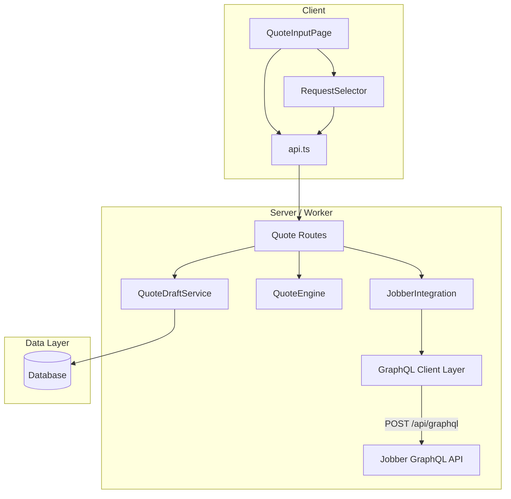

# Design Document: Jobber GraphQL Integration

## Overview

This feature replaces the broken REST-based Jobber integration with a working GraphQL implementation. The current `JobberIntegration` class in both the Express server and Cloudflare Worker sends `GET` requests to non-existent REST endpoints (`/products`, `/templates`). Jobber's API is exclusively GraphQL — all requests must be `POST` to `https://api.getjobber.com/api/graphql` with a JSON body containing `query` and `variables`.

The design introduces:
1. A GraphQL client layer that sends `POST` requests with proper headers (`Authorization`, `Content-Type`, `X-JOBBER-GRAPHQL-VERSION`)
2. Paginated fetching for products (`productsAndServices`), quotes (used as templates), and requests
3. A new `fetchCustomerRequests` method so users can select a Jobber request instead of copy-pasting text
4. A `JobberCustomerRequest` shared type and `jobberRequestId` on `QuoteDraft`
5. A new `GET /api/quotes/jobber/requests` endpoint
6. A `RequestSelector` UI component on the quote input page
7. Database migration to add `jobber_request_id` to `quote_drafts`

Both the server (`server/src/services/jobber-integration.ts`) and worker (`worker/src/services/jobber-integration.ts`) implementations are updated in parallel, preserving their existing constructor patterns (server reads `process.env`, worker takes config via constructor params).

## Architecture



The GraphQL client layer is internal to `JobberIntegration` — a private `graphqlRequest` method replaces the current `apiRequest` method. It handles:
- Building the POST request with `query` + `variables` JSON body
- Setting required headers (`Authorization`, `Content-Type`, `X-JOBBER-GRAPHQL-VERSION`)
- 10-second timeout via `AbortController`
- Parsing the response and extracting `data` / `errors`
- Relay-style cursor pagination (looping on `pageInfo.hasNextPage`)

### Key Design Decisions

1. **No separate GraphQL client library** — The queries are simple enough that raw `fetch` with string templates is sufficient. Adding `graphql-request` or `@apollo/client` would be overkill for three read-only queries.

2. **Quotes as templates** — Jobber has no dedicated "template" entity. The existing `fetchTemplateLibrary` method will query `quotes` and map their `lineItems` and `message` fields to `QuoteTemplate`. This matches how Jobber users actually use quotes as reusable templates.

3. **Request notes for description** — The Jobber `Request` type does not have a direct description field. The customer's description lives in `notes` (a `RequestNoteUnionConnection`). The `fetchCustomerRequests` query must fetch `notes` edges to extract the description text.

4. **Pagination with `first: 50`** — All paginated queries use `first: 50` per page to balance between minimizing round trips and staying within rate limits (each field costs 1 point, connection fields multiply by `first`).

5. **Request cache does not affect availability** — Per requirement 4.5, if fetching requests fails, the integration logs the error but does NOT set `available = false`. The user can still enter text manually.

## Components and Interfaces

### 1. GraphQL Client Layer (private to JobberIntegration)

Replaces the existing `apiRequest` method with a `graphqlRequest` method.

```typescript
interface GraphQLResponse<T> {
  data?: T;
  errors?: Array<{ message: string; extensions?: Record<string, unknown> }>;
}

// Private method on JobberIntegration
private async graphqlRequest<T>(query: string, variables?: Record<string, unknown>): Promise<T>
```

**Behavior:**
- Sends `POST` to the GraphQL endpoint URL
- Body: `JSON.stringify({ query, variables })`
- Headers: `Authorization: Bearer <token>`, `Content-Type: application/json`, `X-JOBBER-GRAPHQL-VERSION: 2025-04-16`
- Timeout: 10 seconds via `AbortController`
- If response is not ok (HTTP 401, 429, 5xx), throws with status code for error classification
- If response JSON contains `errors` array, throws with first error message
- If response JSON has no `data` field, throws a structure error
- Returns `response.data` as `T`

### 2. Pagination Helper (private to JobberIntegration)

```typescript
private async fetchAllPages<TNode>(
  query: string,
  variables: Record<string, unknown>,
  connectionPath: string[],  // e.g. ['productsAndServices'] or ['requests']
  pageSize?: number,
): Promise<TNode[]>
```

**Behavior:**
- Starts with `variables.after = null`
- Calls `graphqlRequest` in a loop
- Navigates the response using `connectionPath` to find the connection object
- Extracts `edges[].node` into an accumulator array
- Reads `pageInfo.hasNextPage` and `pageInfo.endCursor`
- If `hasNextPage`, sets `variables.after = endCursor` and loops
- Returns the accumulated array of nodes
- Default page size: 50

### 3. Updated `fetchProductCatalog`

**GraphQL Query:**
```graphql
query FetchProducts($first: Int!, $after: String) {
  productsAndServices(first: $first, after: $after) {
    edges {
      node {
        id
        name
        description
        defaultUnitCost
        category
      }
    }
    pageInfo {
      hasNextPage
      endCursor
    }
  }
}
```

**Mapping:** Each node maps to `ProductCatalogEntry` with `unitPrice = node.defaultUnitCost`, `source = 'jobber'`.

### 4. Updated `fetchTemplateLibrary`

Since Jobber has no dedicated template entity, we query quotes and treat them as templates.

**GraphQL Query:**
```graphql
query FetchQuoteTemplates($first: Int!, $after: String) {
  quotes(first: $first, after: $after) {
    edges {
      node {
        id
        quoteNumber
        title
        message
        quoteStatus
      }
    }
    pageInfo {
      hasNextPage
      endCursor
    }
  }
}
```

**Mapping:** Each quote node maps to `QuoteTemplate` with:
- `id = node.id`
- `name = node.title || "Quote #" + node.quoteNumber`
- `content = node.message || ""`
- `source = 'jobber'`

### 5. New `fetchCustomerRequests`

**GraphQL Query:**
```graphql
query FetchRequests($first: Int!, $after: String) {
  requests(first: $first, after: $after) {
    edges {
      node {
        id
        title
        companyName
        contactName
        phone
        email
        requestStatus
        createdAt
        notes(first: 1) {
          edges {
            node {
              ... on RequestNote {
                message
              }
            }
          }
        }
      }
    }
    pageInfo {
      hasNextPage
      endCursor
    }
  }
}
```

**Mapping:** Each request node maps to `JobberCustomerRequest` with:
- `id = node.id`
- `title = node.title || "Untitled Request"`
- `clientName = node.companyName || node.contactName || "Unknown"`
- `description = node.notes.edges[0]?.node?.message || ""`
- `createdAt = node.createdAt`

**Sorting:** Results are returned sorted by `createdAt` descending (newest first). If the API doesn't guarantee order, the method sorts client-side after fetching.

**Cache:** Uses the same TTL-based cache pattern as products and templates, stored in a `customerRequestsCache` field.

**Error handling:** On failure, logs the error and returns `[]` but does NOT set `available = false`.

### 6. Quote Routes — New Endpoint

**Server** (`server/src/routes/quotes.ts`):
```typescript
router.get('/jobber/requests', async (req, res, next) => { ... });
```

**Worker** (`worker/src/routes/quotes.ts`):
```typescript
app.get('/jobber/requests', async (c) => { ... });
```

**Response shape:**
```json
{
  "requests": JobberCustomerRequest[],
  "available": boolean
}
```

If `jobberIntegration.isAvailable()` is false, returns `{ requests: [], available: false }`.

### 7. Quote Routes — Updated Generate Endpoint

The `POST /generate` endpoint accepts an optional `jobberRequestId: string` in the body. When present, it is stored on the persisted `QuoteDraft`.

### 8. Client API — New Functions

```typescript
// In client/src/api.ts
export async function fetchJobberRequests(): Promise<{
  requests: JobberCustomerRequest[];
  available: boolean;
}>

// Updated generateQuote to accept jobberRequestId
export async function generateQuote(data: {
  customerText?: string;
  mediaItemIds?: string[];
  jobberRequestId?: string;
}): Promise<QuoteDraft>
```

### 9. RequestSelector Component

A new component rendered inside `QuoteInputPage` when Jobber is available.

**Props:**
```typescript
interface RequestSelectorProps {
  onSelect: (request: JobberCustomerRequest) => void;
  onClear: () => void;
  selectedRequestId: string | null;
}
```

**Behavior:**
- On mount, calls `fetchJobberRequests()`
- Shows a loading spinner while fetching
- On error, shows an inline message and allows manual text entry
- Renders a list of requests with title, client name, and formatted date
- Clicking a request calls `onSelect` with the full request object
- A "Clear selection" button calls `onClear`

### 10. QuoteInputPage Updates

- On mount, calls `checkJobberStatus()` (existing) to determine if Jobber is available
- If available, renders `RequestSelector` above the textarea
- When a request is selected:
  - Populates `customerText` with the request's `description`
  - Stores `jobberRequestId` in local state
  - Passes `jobberRequestId` to `generateQuote` call
- When selection is cleared, resets `jobberRequestId` and allows free text editing

## Data Models

### New Shared Type: `JobberCustomerRequest`

```typescript
/** A customer request from Jobber */
export interface JobberCustomerRequest {
  id: string;
  title: string;
  clientName: string;
  description: string;
  createdAt: string;  // ISO 8601
}
```

### Updated Shared Type: `QuoteDraft`

```typescript
export interface QuoteDraft {
  // ... existing fields ...
  jobberRequestId: string | null;  // NEW — optional link to Jobber request
}
```

### Database Migration

**Server** (`server/src/migrations/004_jobber_graphql.sql`):
```sql
ALTER TABLE quote_drafts ADD COLUMN jobber_request_id VARCHAR(255);
```

**Worker** (`worker/src/migrations/0003_jobber_graphql.sql`):
```sql
ALTER TABLE quote_drafts ADD COLUMN jobber_request_id TEXT;
```

### Internal GraphQL Response Types (private to JobberIntegration)

```typescript
interface JobberProductNode {
  id: string;
  name: string;
  description: string | null;
  defaultUnitCost: number;
  category: string;
}

interface JobberQuoteNode {
  id: string;
  quoteNumber: string;
  title: string | null;
  message: string | null;
  quoteStatus: string;
}

interface JobberRequestNode {
  id: string;
  title: string | null;
  companyName: string | null;
  contactName: string | null;
  phone: string | null;
  email: string | null;
  requestStatus: string;
  createdAt: string;
  notes: {
    edges: Array<{ node: { message?: string } }>;
  };
}

interface RelayConnection<T> {
  edges: Array<{ node: T }>;
  pageInfo: { hasNextPage: boolean; endCursor: string | null };
}
```

