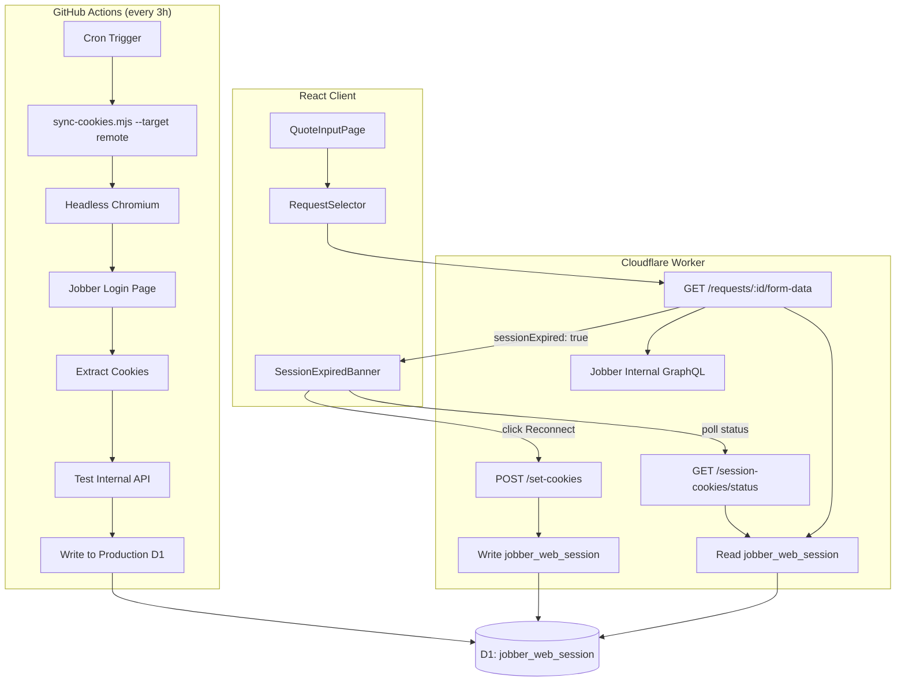
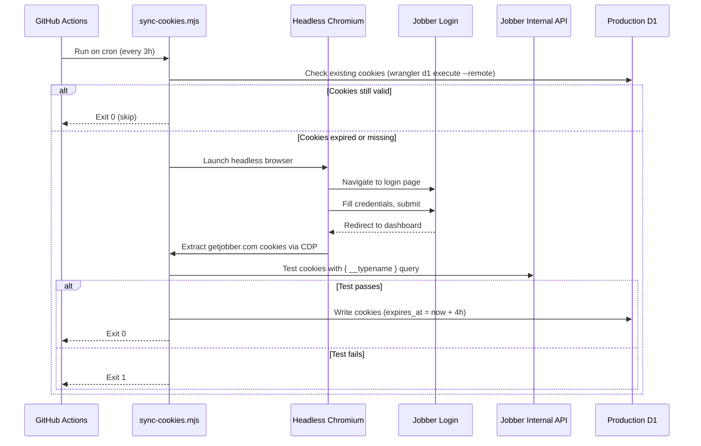
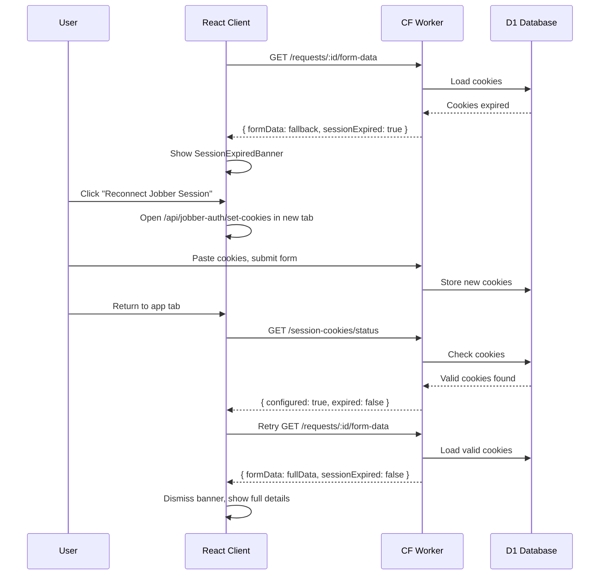

# Design Document: Jobber Session Automation

## Overview

This feature automates the lifecycle of Jobber web session cookies so the deployed Cloudflare Worker always has valid credentials for the internal GraphQL API. Today, cookies are only refreshed during local development via `sync-cookies.mjs`, and the production worker silently degrades to incomplete data when cookies expire (~4 hours).

The design introduces three coordinated changes:

1. **Scheduled GitHub Actions workflow** — runs every 3 hours to refresh cookies via headless Puppeteer and push them to production D1.
2. **Enhanced API signaling** — the form-data endpoint and a new session-status endpoint communicate cookie state to the client.
3. **Client-side re-auth UI** — detects expired sessions and provides a one-click reconnect flow as a fallback when the automated refresh fails.

### Design Rationale

The automated workflow handles the common case (cookies stay fresh without human intervention). The client-side re-auth handles the uncommon case (Jobber changes their login flow, credentials rotate, or GitHub Actions has an outage). This layered approach means the system self-heals most of the time and degrades gracefully when it can't.

## Architecture



### Data Flow: Automated Cookie Refresh



### Data Flow: Client Re-Auth Fallback



## Components and Interfaces

### 1. GitHub Actions Workflow (`refresh-jobber-cookies.yml`)

A new workflow file at `.github/workflows/refresh-jobber-cookies.yml`.

**Triggers:**
- `schedule`: cron `0 */3 * * *` (every 3 hours)
- `workflow_dispatch`: manual trigger

**Steps:**
1. Checkout repo
2. Setup Node.js 20
3. Install dependencies (`npm ci`)
4. Install Chromium for Puppeteer (`npx puppeteer browsers install chrome`)
5. Run `node worker/scripts/sync-cookies.mjs --target remote`

**Environment:**
- `JOBBER_WEB_EMAIL` — from GitHub secrets
- `JOBBER_WEB_PASSWORD` — from GitHub secrets
- `CLOUDFLARE_API_TOKEN` — from GitHub secrets (existing)

**Exit codes:**
- `0` — cookies refreshed or already valid
- `1` — login failed, validation failed, or timeout

### 2. Refactored `sync-cookies.mjs`

The existing script is refactored to support a `--target` flag while preserving backward compatibility.

**Interface changes:**

| Aspect | Before | After |
|--------|--------|-------|
| Target | Always writes to both local + remote | `--target local\|remote\|both` (default: `both`) |
| Credentials | `.dev.vars` only | `.dev.vars` first, then `process.env` fallback |
| Exit code | Always 0 (swallowed errors) | 0 on success, 1 on failure |
| Cookie check | Checks local, then syncs from remote | Checks target store(s), skips if valid |

**Key functions (conceptual):**

```
parseTarget(args: string[]): 'local' | 'remote' | 'both'
readCredentials(): { email: string, password: string } | null
checkExistingCookies(target: 'local' | 'remote'): boolean
loginAndExtractCookies(email, password): string  // cookie string
validateCookies(cookieString): boolean
writeCookies(cookieString, target: 'local' | 'remote' | 'both'): void
```

**Behavior by target:**

- `--target remote`: Check remote D1 → if expired, login → validate → write to remote D1 only. Used by GitHub Actions.
- `--target local`: Check local D1 → if expired, try sync from remote → if still expired, login → validate → write to local D1 only.
- `--target both` (default): Check local D1 → if expired, try sync from remote → if still expired, login → validate → write to both. Preserves current `npm run dev` behavior.

### 3. Enhanced Session Status Endpoint

**Existing endpoint:** `GET /api/jobber-auth/session-cookies/status`

Currently returns `{ configured: boolean }`. Enhanced to also return `expired` status.

**New response shape:**

```typescript
interface SessionCookieStatus {
  configured: boolean;  // true if any row exists in jobber_web_session
  expired: boolean;     // true if row exists but expires_at < now
}
```

**Implementation:** Modify `JobberWebSession` to expose a `getStatus()` method that returns both fields, and update the route handler.

```typescript
// New method on JobberWebSession
async getStatus(): Promise<{ configured: boolean; expired: boolean }> {
  const row = await this.db.prepare(
    "SELECT expires_at FROM jobber_web_session WHERE id = 'default'"
  ).first() as { expires_at: string } | null;

  if (!row) return { configured: false, expired: false };

  const expiresAt = new Date(row.expires_at + 'Z').getTime();
  const expired = Date.now() > expiresAt;
  return { configured: true, expired };
}
```

### 4. Form Data Endpoint Changes

**Existing endpoint:** `GET /api/quotes/jobber/requests/:id/form-data`

Currently returns `{ formData: RequestFormData | null }`. Enhanced to include `sessionExpired`.

**New response shape:**

```typescript
interface FormDataResponse {
  formData: RequestFormData | null;
  sessionExpired: boolean;
}
```

**Logic changes:**

```
1. Load cookies from D1
2. If cookies are null (expired or missing):
   a. Set sessionExpired = true
   b. Skip internal API call, go to fallback
3. If cookies exist, call internal API:
   a. If success: return { formData, sessionExpired: false }
   b. If 401/403/unauthenticated: set sessionExpired = true, clear cookies, go to fallback
4. Fallback: build formData from webhook/API data
5. Return { formData: fallbackData, sessionExpired }
```

The key change is that `fetchRequestFormData` on `JobberWebSession` needs to communicate *why* it returned null — was it "no cookies" vs "API returned no data for this request." We'll modify the return type:

```typescript
interface FetchResult {
  formData: RequestFormData | null;
  sessionExpired: boolean;
}
```

### 5. Client API Changes

**Modified function in `client/src/api.ts`:**

```typescript
export async function fetchJobberRequestFormData(
  requestId: string
): Promise<{ formData: JobberRequestFormData | null; sessionExpired: boolean }> {
  const res = await fetch(
    API_BASE + '/api/quotes/jobber/requests/' + requestId + '/form-data',
    { headers: { ...authHeaders() } }
  );
  return handleResponse(res);
}
```

**New function:**

```typescript
export async function checkJobberSessionStatus(): Promise<{
  configured: boolean;
  expired: boolean;
}> {
  const res = await fetch(
    API_BASE + '/api/jobber-auth/session-cookies/status',
    { headers: { ...authHeaders() } }
  );
  return handleResponse(res);
}
```

### 6. SessionExpiredBanner Component

A new React component at `client/src/pages/SessionExpiredBanner.tsx`.

**Props:**

```typescript
interface SessionExpiredBannerProps {
  onReconnected: () => void;  // called when session is restored
}
```

**Behavior:**
1. Renders a warning banner with text explaining the session expired
2. Shows a "Reconnect Jobber Session" button
3. On click: opens `/api/jobber-auth/set-cookies` in a new tab/window
4. Starts polling `GET /api/jobber-auth/session-cookies/status` every 3 seconds
5. When status returns `expired: false` → calls `onReconnected()` and dismisses
6. Stops polling after 5 minutes or when the component unmounts
7. Uses the existing app color scheme (`#00a89d` teal, `#fff3e0` warning background)

**Visual design:**
- Amber/warning-colored banner (consistent with existing `inlineMessageStyle` pattern)
- Icon + message: "⚠️ Jobber session expired. Request details may be incomplete."
- Teal "Reconnect Jobber Session" button
- Placed inside the `RequestSelector` detail card, below the form data section

### 7. Integration in QuoteInputPage / RequestSelector

**QuoteInputPage changes:**
- Track `sessionExpired` state from form-data response
- Pass it down to `RequestSelector`
- When `onReconnected` fires: re-fetch form data for the selected request

**RequestSelector changes:**
- Accept `sessionExpired` prop
- When `sessionExpired` is true and a request is selected, render `SessionExpiredBanner`
- Position the banner after the form data section (or in place of the "form details not available" message)

## Data Models

### Existing: `jobber_web_session` Table (No Changes)

```sql
CREATE TABLE IF NOT EXISTS jobber_web_session (
  id TEXT PRIMARY KEY DEFAULT 'default',
  cookies TEXT NOT NULL,
  expires_at TEXT NOT NULL,          -- ISO 8601 timestamp
  updated_at TEXT NOT NULL DEFAULT (datetime('now'))
);
```

No schema changes needed. The table already supports everything required.

### API Response Types

```typescript
// GET /api/jobber-auth/session-cookies/status
interface SessionCookieStatusResponse {
  configured: boolean;
  expired: boolean;
}

// GET /api/quotes/jobber/requests/:id/form-data (enhanced)
interface FormDataResponse {
  formData: JobberRequestFormData | null;
  sessionExpired: boolean;
}
```

### GitHub Actions Secrets

| Secret | Purpose | Already Exists |
|--------|---------|----------------|
| `CLOUDFLARE_API_TOKEN` | Wrangler D1 access | ✅ Yes |
| `JOBBER_WEB_EMAIL` | Jobber login email | ❌ New |
| `JOBBER_WEB_PASSWORD` | Jobber login password | ❌ New |


## Correctness Properties

*A property is a characteristic or behavior that should hold true across all valid executions of a system — essentially, a formal statement about what the system should do. Properties serve as the bridge between human-readable specifications and machine-verifiable correctness guarantees.*

### Property 1: Cookie status reflects expiration correctly

*For any* `expires_at` timestamp stored in the `jobber_web_session` table, the `getStatus()` method SHALL return `configured: true` and `expired` equal to whether the current time is past `expires_at`. When no row exists, it SHALL return `configured: false, expired: false`.

**Reasoning:** Requirements 3.2 and 3.3 together define a mapping from cookie state to status response. The key logic is the timestamp comparison: for any future timestamp, `expired` must be `false`; for any past timestamp, `expired` must be `true`. This is a universal property over all possible timestamps — generating random timestamps (past and future) exercises the boundary logic thoroughly.

**Validates: Requirements 3.2, 3.3**

### Property 2: Form-data sessionExpired reflects cookie validity

*For any* request to the form-data endpoint, the `sessionExpired` field in the response SHALL be `true` if and only if the stored cookies are expired, missing, or the internal API returned an authentication failure. When valid cookies exist and the internal API returns data successfully, `sessionExpired` SHALL be `false`.

**Reasoning:** Requirements 4.1 and 4.2 define complementary behaviors. We can generate random cookie states (valid, expired, missing) and mock internal API responses (success, auth failure, other error) and verify that `sessionExpired` is correctly set in every combination. This property covers the full decision matrix.

**Validates: Requirements 4.1, 4.2**

### Property 3: Auth error classification as session expired

*For any* HTTP response from the internal API with status 401 or 403, or any GraphQL response containing an error message with "unauthenticated" or "hidden", the `queryInternalApi` method SHALL classify the result as `authFailed: true`.

**Reasoning:** Requirement 4.3 specifies which error conditions constitute a session expiration. We can generate random HTTP status codes and random GraphQL error messages, and verify that exactly the specified codes/messages trigger `authFailed: true` while all others do not. This catches regressions where new error codes are accidentally treated as auth failures or vice versa.

**Validates: Requirements 4.3**

## Error Handling

### GitHub Actions Workflow Errors

| Error Condition | Behavior | Exit Code |
|----------------|----------|-----------|
| Login page unreachable / timeout (60s) | Log error with reason, exit | 1 |
| Login fails (still on login page after submit) | Log "credentials invalid or login rejected", exit | 1 |
| Cookie validation fails (test API request fails) | Log "extracted cookies are not valid", exit | 1 |
| Wrangler D1 write fails | Log error, exit | 1 |
| Missing credentials (no email/password) | Log "credentials not available", exit | 1 |
| Puppeteer not installed / Chrome not found | Log error with install instructions, exit | 1 |

The workflow uses `set -e` behavior — any non-zero exit from the script fails the workflow step, which is visible in the GitHub Actions UI.

### Worker API Errors

| Endpoint | Error Condition | Response |
|----------|----------------|----------|
| `GET /session-cookies/status` | D1 query fails | `{ configured: false, expired: false }` (safe default) |
| `GET /requests/:id/form-data` | Cookies expired | `{ formData: <fallback>, sessionExpired: true }` |
| `GET /requests/:id/form-data` | Internal API 401/403 | Clear cookies, `{ formData: <fallback>, sessionExpired: true }` |
| `GET /requests/:id/form-data` | Internal API timeout/error | `{ formData: <fallback>, sessionExpired: false }` (transient error, not expired) |
| `GET /requests/:id/form-data` | No fallback data available | `{ formData: null, sessionExpired: true/false }` |

### Client-Side Error Handling

- **Polling timeout:** The `SessionExpiredBanner` stops polling after 5 minutes and shows a "manual refresh" message.
- **Network errors during polling:** Silently retry on next interval (3s). Don't show additional error toasts for background polling.
- **Form-data fetch failure after re-auth:** Show the standard error toast via the existing `globalErrorListener` pattern.

## Testing Strategy

### Property-Based Tests (fast-check)

Three property tests corresponding to the correctness properties above. Each runs a minimum of 100 iterations.

| Test | What It Generates | What It Verifies |
|------|-------------------|------------------|
| Cookie status determination | Random `expires_at` timestamps (past/future/edge) | `getStatus()` returns correct `configured`/`expired` |
| Form-data sessionExpired signaling | Random cookie states × API response combinations | `sessionExpired` field matches cookie/API state |
| Auth error classification | Random HTTP status codes × GraphQL error messages | `authFailed` is true iff 401/403/unauthenticated |

**Library:** fast-check (already in the project)
**Location:** `tests/property/jobber-session-automation.property.test.ts`
**Tag format:** `Feature: jobber-session-automation, Property N: <description>`

### Unit Tests (Vitest)

| Test | Scope |
|------|-------|
| `parseTarget` returns correct target for valid/invalid args | sync-cookies.mjs argument parsing |
| `readCredentials` falls back to env vars when .dev.vars missing | Credential resolution |
| Default target is `both` when no --target provided | Backward compatibility |
| Session status endpoint returns correct shape for each state | Route handler |
| Form-data endpoint includes sessionExpired in response | Route handler integration |
| SessionExpiredBanner renders when sessionExpired is true | React component |
| SessionExpiredBanner opens set-cookies page on button click | React component |
| SessionExpiredBanner dismisses after successful re-auth | React component |
| SessionExpiredBanner persists when re-auth window closed without completing | React component |

**Location:** `tests/unit/jobber-session-automation.test.ts`

### Integration Tests

| Test | Scope |
|------|-------|
| Workflow YAML has correct cron, triggers, and secret references | GitHub Actions config |
| sync-cookies.mjs --target remote writes only to remote D1 | Script end-to-end (mocked wrangler) |
| Full re-auth flow: expired → banner → reconnect → poll → retry | Client flow (mocked API) |

### What Is NOT Tested via PBT

- Puppeteer browser automation (external service interaction)
- Wrangler CLI commands (infrastructure tooling)
- GitHub Actions workflow execution (CI platform)
- React component rendering/layout (UI — use example-based tests)
- Polling timing behavior (time-dependent — use example-based tests with fake timers)
