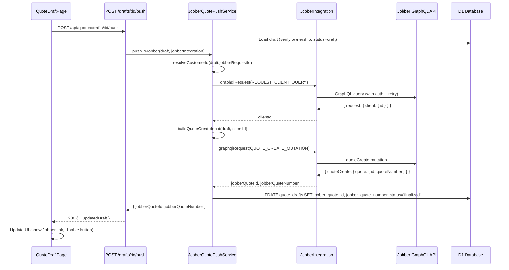
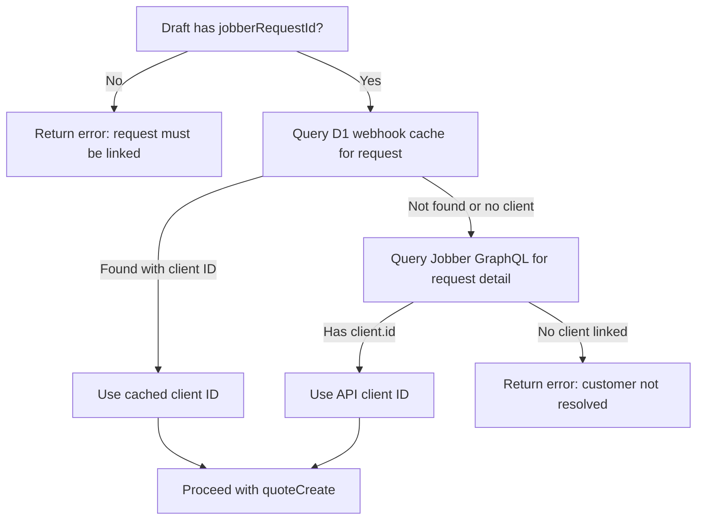

# Design Document: Push Quote to Jobber

## Overview

This feature enables users to push a finalized quote draft from the app directly into Jobber as a real Jobber quote, closing the loop between AI-powered quote generation and the Jobber platform. The implementation spans four layers:

1. **Database migration** — adds `jobber_quote_id` and `jobber_quote_number` columns to `quote_drafts`
2. **Push service** — new `JobberQuotePushService` that orchestrates customer resolution, GraphQL mutation, and D1 persistence
3. **API route** — new `POST /api/quotes/drafts/:id/push` endpoint in the existing quotes router
4. **Client UI** — "Push to Jobber" button on `QuoteDraftPage` with loading/success/error states and Jobber links

The design reuses the existing `JobberIntegration.graphqlRequest()` method for authenticated GraphQL calls (including automatic token refresh and throttle retry), and extends `QuoteDraftService` to persist the Jobber quote identifiers after a successful push.

### Key Design Decisions

- **Separate push service class** rather than inlining in the route handler — the push orchestration involves multiple steps (customer resolution, mutation building, response parsing, D1 update) that warrant a dedicated service for testability and clarity.
- **Reuse `JobberIntegration.graphqlRequest()`** — this method already handles auth headers, token refresh on 401, throttle backoff, and timeout. The push service delegates all GraphQL communication through it.
- **Customer ID resolved from Jobber request** — the `quoteCreate` mutation requires a `clientId`. We resolve this by fetching the request detail from Jobber (or from the cached webhook data in D1) and extracting the linked client ID. Drafts without a `jobberRequestId` cannot be pushed.
- **Unresolved items included as quote message** — Jobber's `quoteCreate` accepts a `message` field. Any unresolved line items are serialized into this message so no information is lost.

## Architecture



## Components and Interfaces

### 1. Database Migration (`worker/src/migrations/0013_jobber_quote_push.sql`)

Adds two nullable columns to `quote_drafts` for storing the Jobber-assigned identifiers after a successful push.

### 2. `JobberQuotePushService` (`worker/src/services/jobber-quote-push-service.ts`)

New service class responsible for the push orchestration.

```typescript
interface PushResult {
  jobberQuoteId: string;
  jobberQuoteNumber: string;
}

class JobberQuotePushService {
  constructor(
    private db: D1Database,
    private jobberIntegration: JobberIntegration,
  ) {}

  /**
   * Push a quote draft to Jobber. Resolves the customer, builds the mutation,
   * executes it, and persists the result back to D1.
   * Throws PlatformError on validation or API failures.
   */
  async pushToJobber(draft: QuoteDraft): Promise<PushResult>;

  /**
   * Resolve the Jobber client ID from a request ID.
   * First checks D1 webhook cache, then falls back to a live GraphQL query.
   */
  private async resolveCustomerId(jobberRequestId: string): Promise<string>;

  /**
   * Build the quoteCreate mutation input from a draft and client ID.
   */
  private buildQuoteCreateInput(
    draft: QuoteDraft,
    clientId: string,
  ): { query: string; variables: Record<string, unknown> };

  /**
   * Persist the Jobber quote identifiers and update status to 'finalized'.
   */
  private async persistPushResult(
    draftId: string,
    jobberQuoteId: string,
    jobberQuoteNumber: string,
  ): Promise<void>;
}
```

### 3. API Route Extension (`worker/src/routes/quotes.ts`)

New endpoint added to the existing quotes router:

```typescript
/**
 * POST /drafts/:id/push
 * Push a quote draft to Jobber as a real Jobber quote.
 */
app.post('/drafts/:id/push', async (c) => {
  // 1. Load draft (verify ownership + status === 'draft')
  // 2. Validate draft has jobberRequestId
  // 3. Create JobberQuotePushService
  // 4. Call pushToJobber(draft)
  // 5. Re-fetch updated draft from D1
  // 6. Return updated draft as JSON
});
```

### 4. Client API Function (`client/src/api.ts`)

```typescript
export async function pushDraftToJobber(draftId: string): Promise<QuoteDraft> {
  const res = await fetch(API_BASE + '/api/quotes/drafts/' + draftId + '/push', {
    method: 'POST',
    headers: { ...authHeaders() },
  });
  return handleResponseWithToast(res);
}
```

### 5. Client UI Changes (`client/src/pages/QuoteDraftPage.tsx`)

- **"Push to Jobber" button** at the bottom of the page, below the revision section
- **Conditional rendering**: enabled when `status === 'draft'` and `jobberRequestId` is present; disabled + shows Jobber quote number when already pushed
- **Loading state**: spinner + "Pushing to Jobber…" text while request is in flight
- **Error state**: error message displayed below button, button re-enabled for retry
- **Success state**: button replaced with Jobber quote number and link
- **Jobber links section**: clickable links to the Jobber quote and customer request (opens in new tab)

### 6. Shared Type Updates (`shared/src/types/quote.ts`)

Add two optional fields to the `QuoteDraft` interface:

```typescript
export interface QuoteDraft {
  // ... existing fields ...
  jobberQuoteId?: string | null;
  jobberQuoteNumber?: string | null;
}
```

## Data Models

### Database Schema Change

```sql
-- Migration 0013_jobber_quote_push.sql
ALTER TABLE quote_drafts ADD COLUMN jobber_quote_id TEXT DEFAULT NULL;
ALTER TABLE quote_drafts ADD COLUMN jobber_quote_number TEXT DEFAULT NULL;
```

### GraphQL Mutation: `quoteCreate`

The Jobber GraphQL API `quoteCreate` mutation follows the standard Jobber mutation pattern (similar to `clientCreate`). Based on the Jobber API conventions and the existing quote schema observed in the codebase's `QUOTES_QUERY`:

```graphql
mutation CreateQuote($input: QuoteCreateInput!) {
  quoteCreate(input: $input) {
    quote {
      id
      quoteNumber
      quoteStatus
    }
    userErrors {
      message
      path
    }
  }
}
```

**Input structure:**

```typescript
interface QuoteCreateInput {
  clientId: string;          // Encoded Jobber client ID
  title?: string;            // e.g., "Draft D-001"
  message?: string;          // Quote message / notes (includes unresolved items)
  lineItems: Array<{
    name: string;            // Product name
    description?: string;    // Product description
    quantity: number;        // Quantity
    unitPrice: number;       // Unit price in dollars
    productOrServiceId?: string; // Optional Jobber product ID for linked items
  }>;
}
```

### Line Item Mapping

Each resolved `QuoteLineItem` from the draft maps to a Jobber line item:

| Draft Field | Jobber Field | Notes |
|---|---|---|
| `productName` | `name` | Direct mapping |
| `quantity` | `quantity` | Direct mapping |
| `unitPrice` | `unitPrice` | Direct mapping |
| `productCatalogEntryId` | `productOrServiceId` | Only when source is Jobber catalog |
| (from catalog) | `description` | Looked up from product catalog if available |

### Customer Resolution Flow



The GraphQL query to resolve the client:

```graphql
query FetchRequestClient($id: EncodedId!) {
  request(id: $id) {
    id
    client {
      id
    }
  }
}
```


## Correctness Properties

*A property is a characteristic or behavior that should hold true across all valid executions of a system — essentially, a formal statement about what the system should do. Properties serve as the bridge between human-readable specifications and machine-verifiable correctness guarantees.*

### Property 1: Line item mapping completeness and field correctness

*For any* array of resolved `QuoteLineItem` objects, the `buildLineItems` mapping function SHALL produce an output array of the same length, in the same order, where each output item contains the correct `name` (from `productName`), `quantity`, and `unitPrice`. Furthermore, *for any* line item with a non-null `productCatalogEntryId`, the output SHALL include `productOrServiceId` set to that ID; and *for any* line item without a `productCatalogEntryId`, the output SHALL omit `productOrServiceId`.

**Validates: Requirements 4.1, 4.2, 4.3, 4.4, 4.5**

### Property 2: Unresolved items preserved in quote message

*For any* non-empty array of unresolved `QuoteLineItem` objects, the generated quote message SHALL contain the `originalText` of every unresolved item. *For any* empty array of unresolved items, the message SHALL either be empty or contain only the base message content (no unresolved item text).

**Validates: Requirements 4.6**

### Property 3: Push result persistence invariant

*For any* quote draft, after a successful push operation, the draft record SHALL have a non-null `jobber_quote_id`, a non-null `jobber_quote_number`, and a `status` of `'finalized'`. Conversely, *for any* draft that has not been pushed, `jobber_quote_id` and `jobber_quote_number` SHALL both be null.

**Validates: Requirements 1.1, 1.2, 5.4**

### Property 4: Title traceability from draft number

*For any* valid draft number (positive integer), the generated Jobber quote title SHALL contain the string `"D-"` followed by the zero-padded draft number (e.g., draft number 1 → title contains `"D-001"`, draft number 42 → title contains `"D-042"`).

**Validates: Requirements 3.4**

## Error Handling

All errors use the existing `PlatformError` class with structured fields. The push flow has several distinct failure modes:

### Validation Errors (thrown before any API call)

| Condition | Component | Operation | Description | Recommended Action |
|---|---|---|---|---|
| Draft not found or not owned by user | QuoteDraftService | getById | The quote draft was not found or you do not have permission to view it. | Verify the draft exists in your quotes list |
| Draft status is not 'draft' | QuoteRoutes | pushToJobber | This quote has already been pushed to Jobber. | View the existing Jobber quote using the link on the draft page |
| Draft has no `jobberRequestId` | JobberQuotePushService | pushToJobber | A Jobber request must be linked to this draft before pushing to Jobber. | Generate the quote from a Jobber customer request |
| Customer request has no linked client | JobberQuotePushService | resolveCustomerId | The customer request does not have a linked client in Jobber. Cannot create a quote without a customer. | Link a client to the request in Jobber, then retry |

### API Errors (from Jobber GraphQL)

| Condition | Component | Operation | Description | Recommended Action |
|---|---|---|---|---|
| GraphQL `userErrors` returned | JobberQuotePushService | pushToJobber | Jobber rejected the quote: {first userError message} | Review the error details and adjust the quote draft |
| Network/timeout error | JobberIntegration | graphqlRequest | Jobber API request timed out or failed | Check your internet connection and try again |
| 401 after token refresh | JobberIntegration | graphqlRequest | Jobber authentication failed after token refresh | Re-authenticate with Jobber in Settings |
| Throttle after max retries | JobberIntegration | graphqlRequest | Jobber API throttled after max retries | Wait a few minutes and try again |

### Client-Side Error Display

The client uses `handleResponseWithToast` for the push API call, which triggers the global error toast for any non-2xx response. Additionally, the push button area displays the error message inline so the user can see it in context and retry.

## Testing Strategy

### Property-Based Tests (fast-check)

Property-based tests validate the four correctness properties above. Each test generates random inputs and verifies the property holds across 100+ iterations.

- **Library**: `fast-check` (already used in the project)
- **Location**: `tests/property/push-quote-to-jobber.property.test.ts`
- **Configuration**: Minimum 100 runs per property
- **Tag format**: `Feature: push-quote-to-jobber, Property {N}: {title}`

The properties focus on the pure mapping/transformation functions that can be tested without mocks:
- `buildLineItems()` — maps draft line items to Jobber mutation input (Properties 1, 2)
- `buildQuoteTitle()` — formats the draft number into a title (Property 4)
- Persistence invariant tested via mock D1 (Property 3)

### Unit Tests (Vitest)

Unit tests cover specific examples, edge cases, and integration points:

- **Location**: `tests/unit/jobber-quote-push-service.test.ts`
- **Mock helpers**: Uses existing `tests/unit/helpers/mock-d1.ts`

| Test | Validates |
|---|---|
| Push succeeds with valid draft and linked customer | Req 3.1, 5.1, 5.2 |
| Push fails when draft has no jobberRequestId | Req 8.4 |
| Push fails when customer request has no linked client | Req 8.3 |
| Push fails when draft is already finalized | Req 2.3 |
| GraphQL userErrors are propagated as PlatformError | Req 3.5 |
| Unresolved items appear in quote message | Req 4.6 |
| Line items with Jobber product IDs include productOrServiceId | Req 4.3 |
| Line items without Jobber product IDs omit productOrServiceId | Req 4.3 |
| Draft status updated to 'finalized' after push | Req 5.4 |
| Jobber quote ID and number persisted to D1 | Req 5.2 |

### Integration / E2E Considerations

- The Jobber GraphQL API interaction is tested via unit tests with mocked `JobberIntegration.graphqlRequest()` — no live API calls in CI.
- The D1 migration is verified by the `npm run dev:worker` command which applies migrations before starting.
- Client UI changes can be verified via the existing Playwright smoke tests or manual testing.
