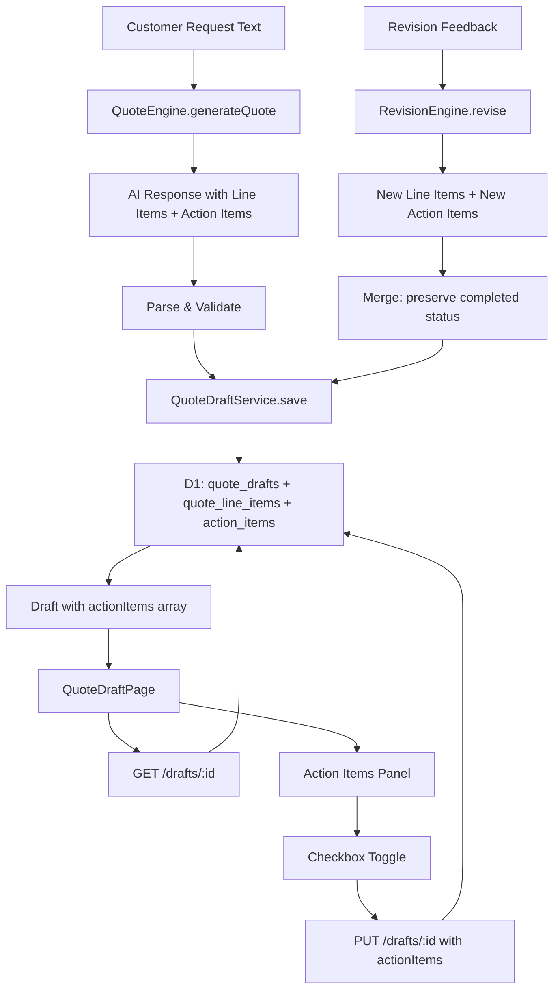
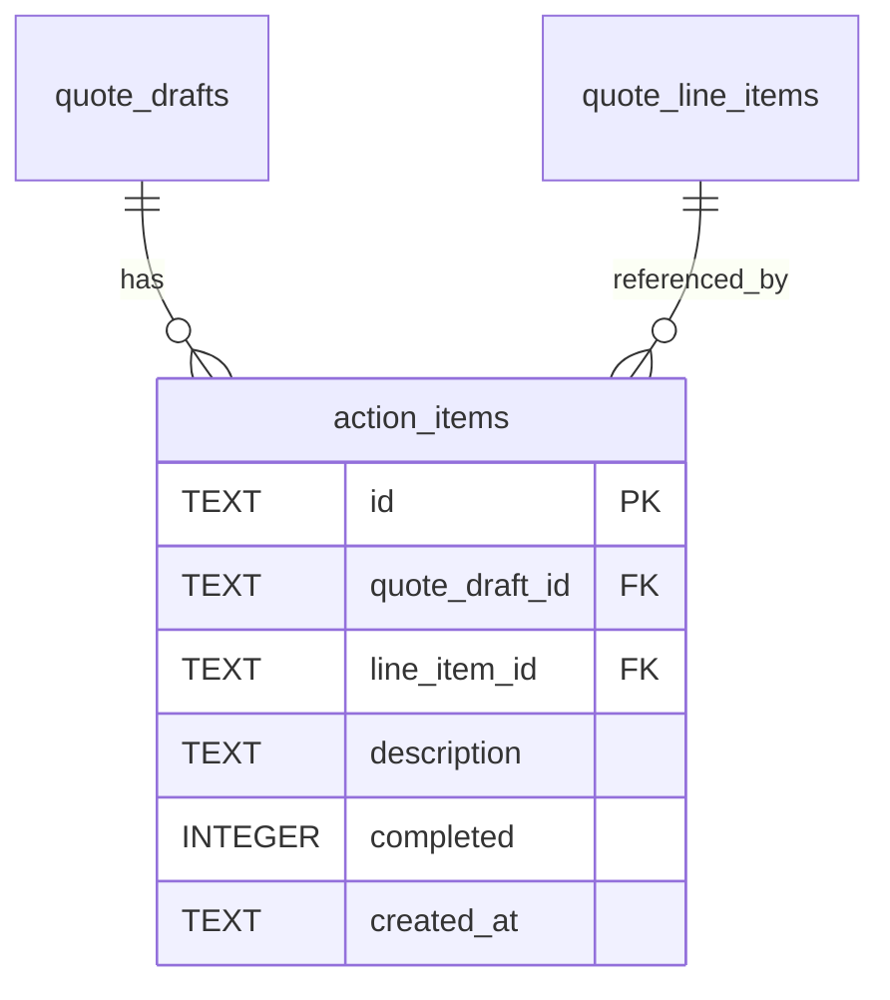

# Design Document: Quote Action Items

## Overview

This feature adds an **Action Items** system to the quote generation workflow. When the AI generates a quote draft, it identifies line items that cannot be accurately priced without additional user input (e.g., square footage for flooring, number of cabinets). These are surfaced as action items on the Quote Draft Page, giving the user a clear checklist of information to gather before finalizing the quote.

The design extends the existing quote generation pipeline with minimal disruption:
- The AI prompt is augmented to output action item annotations alongside line items
- A new `action_items` D1 table stores the data
- The `QuoteDraft` type gains an `actionItems` field
- The existing `PUT /drafts/:id` endpoint handles action item updates
- A new UI panel renders the checklist with optimistic toggle behavior

## Architecture



## Components and Interfaces

### Shared Types (`shared/src/types/quote.ts`)

```typescript
/** An action item requiring user input before a line item can be finalized */
export interface ActionItem {
  id: string;
  quoteDraftId: string;
  lineItemId: string;
  description: string;
  completed: boolean;
}
```

The `QuoteDraft` interface gains:
```typescript
actionItems?: ActionItem[];
```

The `QuoteDraftUpdate` interface gains:
```typescript
actionItems?: Partial<ActionItem>[];
```

### Database Migration (`worker/src/migrations/0024_action_items.sql`)

```sql
CREATE TABLE IF NOT EXISTS action_items (
    id TEXT PRIMARY KEY,
    quote_draft_id TEXT NOT NULL REFERENCES quote_drafts(id) ON DELETE CASCADE,
    line_item_id TEXT NOT NULL,
    description TEXT NOT NULL,
    completed INTEGER NOT NULL DEFAULT 0,
    created_at TEXT NOT NULL DEFAULT (datetime('now'))
);
CREATE INDEX IF NOT EXISTS idx_action_items_draft_id ON action_items(quote_draft_id);
```

### AI Prompt Extension (QuoteEngine)

The `SYSTEM_PROMPT` in `worker/src/services/quote-engine.ts` is extended with additional rules and response format:

**Additional prompt rules:**
```
- For each line item, determine if the customer provided enough information to accurately price it.
- If a line item requires measurements (e.g., square footage, linear feet) not mentioned in the request, add an action item.
- If a line item requires a specific quantity (e.g., number of cabinets, fixtures, outlets) that the customer did not specify, add an action item.
- Do NOT add action items for line items where the customer provided sufficient detail.
- Action item descriptions should be concise and actionable (e.g., "Square footage needed for accurate pricing", "Number of cabinets to install needed").
```

**Extended response format:**
```json
{
  "selectedTemplateId": "id or null",
  "selectedTemplateName": "name or null",
  "lineItems": [...],
  "actionItems": [
    {
      "lineItemProductName": "exact product name from lineItems",
      "description": "What information is needed"
    }
  ]
}
```

### Service Layer Changes

#### `QuoteEngine` modifications (`worker/src/services/quote-engine.ts`)

New interface for AI action item output:
```typescript
interface AIActionItem {
  lineItemProductName: string;
  description: string;
}

// AIResponse gains:
interface AIResponse {
  selectedTemplateId: string | null;
  selectedTemplateName: string | null;
  lineItems: AILineItem[];
  actionItems?: AIActionItem[];
}
```

**`buildDraft()` changes:**
After constructing line items, map `aiResult.actionItems` to `ActionItem` objects:
1. For each AI action item, find the line item whose `productName` matches `lineItemProductName`
2. If found, create an `ActionItem` with a new UUID, the draft ID, the matched line item's ID, the description, and `completed: false`
3. Discard action items that don't match any line item

#### `QuoteDraftService` modifications (`worker/src/services/quote-draft-service.ts`)

**`save(draft)`:**
After inserting line items, insert action items:
```typescript
for (const actionItem of draft.actionItems ?? []) {
  statements.push(
    this.db.prepare(
      "INSERT INTO action_items (id, quote_draft_id, line_item_id, description, completed) VALUES (?, ?, ?, ?, ?)"
    ).bind(actionItem.id, draft.id, actionItem.lineItemId, actionItem.description, actionItem.completed ? 1 : 0)
  );
}
```

**`getById()` / `list()`:**
Add a `fetchActionItems(draftId)` helper that queries the `action_items` table and maps rows to `ActionItem[]`. Attach to the returned `QuoteDraft`.

**`update()`:**
When `updates.actionItems` is provided:
1. Delete existing action items for the draft
2. Insert the new set

This full-replace approach is simple and matches how `lineItems` updates work (delete all, re-insert). The client always sends the complete action items array.

**`delete()`:**
Add to the batch:
```typescript
this.db.prepare('DELETE FROM action_items WHERE quote_draft_id = ?').bind(draftId)
```

#### `RevisionEngine` modifications (`worker/src/services/revision-engine.ts`)

The revision prompt is extended identically to the generation prompt to output `actionItems`. The `RevisionOutput` interface gains `actionItems?: AIActionItem[]`.

**Completion status preservation logic** (in the route handler after revision):
```typescript
function mergeActionItems(
  oldItems: ActionItem[],
  newItems: ActionItem[],
): ActionItem[] {
  return newItems.map(newItem => {
    const match = oldItems.find(
      old => old.lineItemId === newItem.lineItemId && old.description === newItem.description
    );
    return {
      ...newItem,
      completed: match?.completed ?? false,
    };
  });
}
```

### Route Layer Changes (`worker/src/routes/quotes.ts`)

**`PUT /drafts/:id`:**
The body type is extended to accept `actionItems`. Before passing to `quoteDraftService.update()`, validate each action item:
- `id` must be a non-empty string
- `lineItemId` must be a non-empty string
- `description` must be a non-empty string
- `completed` must be a boolean

If validation fails, throw a `PlatformError` with severity `error` and a descriptive message.

**`POST /drafts/:id/revise`:**
After the revision engine returns, build action items from the AI output, merge with old action items to preserve completion status, then include in the draft update.

### Client Changes

#### `client/src/pages/QuoteDraftPage.tsx`

A new **Action Items Panel** section is rendered near the unresolved items section when `draft.actionItems` has items:

```tsx
{draft.actionItems && draft.actionItems.length > 0 && (
  <ActionItemsPanel
    actionItems={draft.actionItems}
    lineItems={[...draft.lineItems, ...draft.unresolvedItems]}
    onToggle={handleToggleActionItem}
  />
)}
```

**Panel structure:**
- Heading: "📋 Action Items ({incompleteCount} remaining)"
- List of items, each with:
  - Checkbox (`<input type="checkbox">`)
  - Product name (looked up from line items by `lineItemId`)
  - Description text
  - Completed items get `text-decoration: line-through` and muted opacity

**Optimistic update flow:**
1. User clicks checkbox → immediately update local `draft` state with toggled `completed`
2. Call `updateDraft(id, { actionItems: updatedActionItems })`
3. On success: state already correct, no-op
4. On failure: revert local state to previous, show error via existing toast system

## Data Models

### Entity Relationship



### ActionItem Lifecycle

1. **Created** during `QuoteEngine.generateQuote()` — `completed = false`
2. **Persisted** by `QuoteDraftService.save()` into `action_items` table
3. **Toggled** by user via `PUT /drafts/:id` with updated `actionItems` array
4. **Replaced** on revision — new set generated, completed status preserved for matching items
5. **Deleted** when parent draft is deleted (explicit DELETE in batch)

## Correctness Properties

*A property is a characteristic or behavior that should hold true across all valid executions of a system — essentially, a formal statement about what the system should do. Properties serve as the bridge between human-readable specifications and machine-verifiable correctness guarantees.*

### Property 1: Action item line item reference validity

*For any* quote draft with action items, every action item's `lineItemId` SHALL reference a line item that exists in the draft's combined `lineItems` and `unresolvedItems` arrays.

**Validates: Requirements 1.4**

### Property 2: New action items default to incomplete

*For any* set of action items produced by the quote engine during initial generation, all items SHALL have `completed === false`.

**Validates: Requirements 1.5**

### Property 3: Action item persistence round-trip

*For any* quote draft with a valid set of action items (each having id, quoteDraftId, lineItemId, description, and completed), saving the draft and then retrieving it SHALL return action items with identical field values for all fields.

**Validates: Requirements 2.1, 2.2, 2.3**

### Property 4: Incomplete count accuracy

*For any* set of action items with varying completion states, the computed incomplete count SHALL equal the number of items where `completed === false`.

**Validates: Requirements 3.5**

### Property 5: Validation rejects invalid action item payloads

*For any* action item payload where any required field (`id`, `lineItemId`, `description`, or `completed`) is missing or has an invalid type, the validation function SHALL reject the payload and not persist any changes.

**Validates: Requirements 6.3, 6.4**

### Property 6: Revision replaces previous action items

*For any* quote draft revision that produces a new set of action items, the persisted action items after the update SHALL contain exactly the new set (no leftover items from the previous set that aren't in the new set).

**Validates: Requirements 7.2**

### Property 7: Revision preserves completed status for matching items

*For any* revision where a new action item shares the same `lineItemId` and `description` as a previously completed action item, the merged result SHALL have `completed === true` for that item.

**Validates: Requirements 7.3**

## Error Handling

| Scenario | Handling |
|----------|----------|
| AI returns malformed `actionItems` JSON | Graceful degradation: treat as empty array, draft saves with line items only |
| AI action item references non-existent product name | Discard that action item during `buildDraft` mapping |
| `PUT /drafts/:id` with invalid action item fields | Return `PlatformError` with severity `error`, component `QuoteRoutes`, descriptive message, and recommended action |
| D1 write failure on action item toggle | Client reverts optimistic update, shows error toast via `globalErrorListener` |
| Action item references a line item removed in revision | Action item is not preserved (part of old set replaced by new set) |
| Empty `actionItems` array in AI response | Valid — draft has no action items, panel is hidden |

All errors follow the existing `PlatformError` pattern with `severity`, `component`, `operation`, `description`, and `recommendedActions` fields.

## Testing Strategy

### Property-Based Tests (fast-check)

The feature is well-suited for property-based testing because the core logic involves data transformations with clear invariants (reference validity, round-trips, merge semantics).

**Library:** `fast-check` (already in use in the project)  
**Location:** `tests/property/quote-action-items.property.test.ts`  
**Minimum iterations:** 100 per property

Each property test will be tagged with:
```
Feature: quote-action-items, Property {N}: {property text}
```

Properties to implement:
1. **Line item reference validity** — generate random drafts with action items, verify all `lineItemId` references point to existing line items
2. **Default incomplete** — generate action items from engine output parsing, verify all `completed === false`
3. **Persistence round-trip** — save/load with mock D1, verify field equality for all action item fields
4. **Incomplete count** — generate random completion states, verify count computation
5. **Validation rejection** — generate invalid payloads (missing fields, wrong types), verify rejection
6. **Revision replacement** — simulate old + new action item sets, verify old items fully replaced
7. **Completion preservation** — simulate revision with matching items (same lineItemId + description), verify completed status carries forward

### Unit Tests

- **AI response parsing:** verify `actionItems` array is correctly extracted from AI JSON output
- **`buildDraft` mapping:** verify product name matching links action items to correct line item IDs; verify unmatched items are discarded
- **Validation logic:** specific examples of valid/invalid payloads with expected error messages
- **Cascade delete:** verify action items are removed when draft is deleted
- **Merge function:** specific examples of old/new item sets with expected merge results

### Integration Tests

- **Full generation flow:** generate quote → verify action items in response → toggle completion → verify persistence
- **Revision flow:** generate → complete an item → revise → verify completed status preserved for matching items
- **Deletion flow:** create draft with action items → delete draft → verify action_items table is clean
