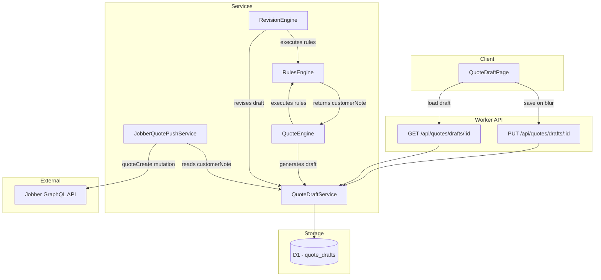

# Design Document: Quote Customer Note

## Overview

This feature adds a `customerNote` field to the quote draft system, enabling users and the rules engine to attach a customer-facing message to quotes before publishing them to Jobber. The note maps to Jobber's `message` field in the `quoteCreate` mutation.

The implementation spans all layers of the stack:
- **Data model**: New `customer_note` TEXT column on `quote_drafts` table
- **Shared types**: Updated interfaces and rule action type unions
- **Worker services**: QuoteDraftService persistence, rules engine actions, Jobber push service message construction
- **Client UI**: Editable textarea on QuoteDraftPage with save-on-blur behavior
- **Rules engine**: Two new action types (`set_customer_note`, `append_customer_note`) with audit trail support

## Architecture



### Design Decisions

1. **Column on `quote_drafts` table** (not a separate table): The customer note is a single scalar value per draft with no history beyond the audit trail. A column is simpler and avoids joins.

2. **Rules engine carries `customerNote` as a separate field on the result** (not embedded in line items): The customer note is a draft-level concept, not a line-item-level concept. It lives alongside `lineItems` and `auditTrail` on `RulesEngineResult`.

3. **`set_customer_note` uses last-writer-wins**: When multiple rules set the note, the last rule (by priority order) wins. This is consistent with how other "set" actions work in the engine.

4. **`append_customer_note` with configurable separator**: Allows multiple rules to each contribute a paragraph or line to the note. Default separator is `\n` (newline).

5. **Message field combines customerNote + unresolved items**: The existing unresolved items text is preserved as a suffix. The customerNote takes priority position (appears first) since it's the intentional customer-facing message.

6. **Save-on-blur for the UI**: Consistent with how other editable fields work on the QuoteDraftPage (inline editing pattern). No separate save button needed.

## Components and Interfaces

### Shared Types (`shared/src/types/quote.ts`)

```typescript
// Updated QuoteDraft interface
export interface QuoteDraft {
  // ... existing fields ...
  customerNote: string | null;  // NEW
}

// Updated QuoteDraftUpdate interface
export interface QuoteDraftUpdate {
  // ... existing fields ...
  customerNote?: string | null;  // NEW (optional — omitting leaves value unchanged)
}

// Updated RuleActionType union
export type RuleActionType =
  | 'add_line_item'
  | 'remove_line_item'
  | 'move_line_item'
  | 'set_quantity'
  | 'adjust_quantity'
  | 'set_unit_price'
  | 'set_description'
  | 'append_description'
  | 'extract_request_context'
  | 'set_customer_note'       // NEW
  | 'append_customer_note';   // NEW

// Updated RuleAction union — new variants
export type RuleAction =
  | { type: 'add_line_item'; /* ... existing ... */ }
  // ... existing variants ...
  | { type: 'set_customer_note'; text: string }                              // NEW
  | { type: 'append_customer_note'; text: string; separator?: string };      // NEW

// Updated RulesEngineResult interface
export interface RulesEngineResult {
  lineItems: EngineLineItem[];
  auditTrail: AuditEntry[];
  iterationCount: number;
  converged: boolean;
  pendingEnrichments: PendingEnrichment[];
  customerNote: string | null;  // NEW
}
```

### Database Migration (`worker/src/migrations/0025_customer_note.sql`)

```sql
ALTER TABLE quote_drafts ADD COLUMN customer_note TEXT DEFAULT NULL;
```

### QuoteDraftService Changes (`worker/src/services/quote-draft-service.ts`)

- **`save()`**: Include `customer_note` in the INSERT column list, binding `draft.customerNote ?? null`.
- **`getById()` / `list()`**: Add `customer_note` to the SELECT column list.
- **`update()`**: When `updates.customerNote !== undefined`, add `customer_note = ?` to the SET clauses and bind the value.
- **`mapDraftRow()`**: Map `row.customer_note` → `customerNote: (row.customer_note as string) ?? null`.

### Rules Engine Changes (`worker/src/services/rules-engine.ts`)

**New state in `executeRules`**: A `customerNote: string | null` variable initialized to `null`, tracked alongside `lineItems`.

**New action handlers in `executeAction`** (or a new helper since these don't modify line items):

```typescript
// set_customer_note handler
case 'set_customer_note': {
  return { modified: true, lineItems, customerNote: action.text };
}

// append_customer_note handler
case 'append_customer_note': {
  const separator = action.separator ?? '\n';
  // Note: actual append logic lives in the executeRules loop since it
  // needs access to the current customerNote state
  return { modified: true, lineItems, appendText: action.text, appendSeparator: separator };
}
```

The `executeRules` loop applies customer note changes after each action:
- For `set_customer_note`: `customerNote = actionResult.customerNote`
- For `append_customer_note`: `customerNote = (customerNote ? customerNote + separator + text : text)`

**Validation additions to `validateAction`**:

```typescript
case 'set_customer_note': {
  if (typeof action.text !== 'string' || action.text.trim() === '') {
    return { valid: false, error: 'set_customer_note requires a non-empty string "text" field' };
  }
  return { valid: true };
}

case 'append_customer_note': {
  if (typeof action.text !== 'string' || action.text.trim() === '') {
    return { valid: false, error: 'append_customer_note requires a non-empty string "text" field' };
  }
  if (action.separator !== undefined && typeof action.separator !== 'string') {
    return { valid: false, error: 'append_customer_note "separator" must be a string if provided' };
  }
  return { valid: true };
}
```

**Audit trail for customer note actions**: Each action produces an `AuditEntry` with:
- `matchingLineItemIds: []` (not line-item-scoped)
- `beforeSnapshot`: `[{ id: '__customer_note__', productName: 'Customer Note', description: previousValue ?? '', quantity: 0, unitPrice: 0 }]`
- `afterSnapshot`: `[{ id: '__customer_note__', productName: 'Customer Note', description: newValue, quantity: 0, unitPrice: 0 }]`

This reuses the existing snapshot shape while clearly identifying customer note entries via the sentinel ID.

**Result**: `executeRules` returns `{ lineItems, auditTrail, iterationCount, converged, pendingEnrichments, customerNote }`.

### QuoteEngine / RevisionEngine Changes

After calling `executeRules`, both engines check `engineResult.customerNote`:

```typescript
// In QuoteEngine.generateQuote() and RevisionEngine.validateAndPartition()
if (engineResult.customerNote !== null) {
  // Set on the draft object before saving
  draft.customerNote = engineResult.customerNote;
}
```

For `QuoteEngine`, this is set on the draft in `buildDraft()`. For `RevisionEngine`, the customerNote is returned as part of `RevisionOutput` and the route handler persists it via `QuoteDraftService.update()`.

### JobberQuotePushService Changes (`buildQuoteCreateInput`)

Replace the current message construction:

```typescript
// Build message: customerNote first, then unresolved items
const messageParts: string[] = [];

if (draft.customerNote?.trim()) {
  messageParts.push(draft.customerNote.trim());
}

if (draft.unresolvedItems && draft.unresolvedItems.length > 0) {
  const unresolvedTexts = draft.unresolvedItems.map((item) => `• ${item.originalText}`);
  messageParts.push(`Unresolved items from original request:\n${unresolvedTexts.join('\n')}`);
}

let message: string | undefined;
if (messageParts.length > 0) {
  message = messageParts.join('\n\n');
}
```

### Client UI Changes (`client/src/pages/QuoteDraftPage.tsx`)

A new "Note to Customer" section positioned between the line items table and the "Push to Jobber" button:

```tsx
// State for tracking saved vs current value
const [customerNoteValue, setCustomerNoteValue] = useState(draft?.customerNote ?? '');
const [customerNoteSaved, setCustomerNoteSaved] = useState(draft?.customerNote ?? '');

// Save handler
const handleCustomerNoteBlur = async () => {
  const trimmed = customerNoteValue.trim() || null;
  const savedTrimmed = customerNoteSaved.trim() || null;
  if (trimmed === savedTrimmed) return; // No change
  
  try {
    await updateDraft(id!, { customerNote: trimmed });
    setCustomerNoteSaved(customerNoteValue);
  } catch (err) {
    // Show error toast
  }
};

// Render
<div style={{ marginTop: '1.5rem' }}>
  <label htmlFor="customer-note" style={{ fontWeight: 600, display: 'block', marginBottom: '0.5rem' }}>
    Note to Customer
  </label>
  <textarea
    id="customer-note"
    rows={4}
    placeholder="Optional note visible to the customer on the published quote..."
    value={customerNoteValue}
    onChange={(e) => setCustomerNoteValue(e.target.value)}
    onBlur={handleCustomerNoteBlur}
    disabled={draft.status === 'finalized'}
    readOnly={draft.status === 'finalized'}
    style={{ width: '100%', resize: 'vertical' }}
  />
</div>
```

### Client API (`client/src/api.ts`)

No new functions needed. The existing `updateDraft` function sends a `PUT /api/quotes/drafts/:id` with the body. The `QuoteDraftUpdate` type gains the optional `customerNote` field, which flows through naturally.

## Data Models

### D1 Schema Change

| Column | Type | Default | Nullable | Description |
|--------|------|---------|----------|-------------|
| `customer_note` | TEXT | NULL | Yes | Free-text customer-facing note for the published quote |

### Data Flow Summary

| Source | Trigger | Effect |
|--------|---------|--------|
| User (UI) | Blur on textarea | `PUT /api/quotes/drafts/:id` with `customerNote` |
| Rules Engine (`set_customer_note`) | Rule condition matches | Overwrites `customerNote` on result |
| Rules Engine (`append_customer_note`) | Rule condition matches | Appends to `customerNote` on result |
| QuoteEngine | After `executeRules` | Persists `customerNote` on new draft |
| RevisionEngine | After `executeRules` | Updates `customerNote` on existing draft |
| JobberQuotePushService | Push to Jobber | Includes `customerNote` in `message` field |

## Correctness Properties

*A property is a characteristic or behavior that should hold true across all valid executions of a system — essentially, a formal statement about what the system should do. Properties serve as the bridge between human-readable specifications and machine-verifiable correctness guarantees.*

### Property 1: Customer note persistence round-trip

*For any* valid string value (including unicode, multi-line, and special characters), saving a quote draft with that `customerNote` value and then retrieving it SHALL return the identical string.

**Validates: Requirements 1.3, 1.4, 3.1, 3.3**

### Property 2: Omitted customerNote field preserves existing value

*For any* quote draft with an existing non-null `customerNote` value, updating the draft with a payload that omits the `customerNote` field SHALL leave the `customerNote` unchanged.

**Validates: Requirements 3.2**

### Property 3: set_customer_note sets the value

*For any* non-empty string `text`, executing a `set_customer_note` action with that text SHALL result in the `RulesEngineResult.customerNote` equaling `text`.

**Validates: Requirements 5.1, 5.2**

### Property 4: Last-writer-wins for multiple set_customer_note actions

*For any* sequence of rules each containing a `set_customer_note` action with distinct text values, the final `RulesEngineResult.customerNote` SHALL equal the text from the last rule to fire (highest matching priority order).

**Validates: Requirements 5.3**

### Property 5: append_customer_note concatenation

*For any* initial `customerNote` value (including null) and any `append_customer_note` action with text `t` and separator `s` (defaulting to `\n`): if the initial value is null or empty, the result SHALL equal `t`; otherwise the result SHALL equal `initial + s + t`.

**Validates: Requirements 6.1, 6.2, 6.3**

### Property 6: Message field construction for Jobber push

*For any* quote draft with a `customerNote` value (or null) and any set of unresolved items (or empty), the `message` field in the `quoteCreate` mutation SHALL be: if both customerNote and unresolved items are present, `customerNote + "\n\n" + unresolvedText`; if only customerNote, just `customerNote`; if only unresolved items, just `unresolvedText`; if neither, the message field is omitted.

**Validates: Requirements 8.1, 8.2, 8.3, 8.4**

### Property 7: Customer note actions produce audit entries with correct snapshots

*For any* `set_customer_note` or `append_customer_note` action that fires, the rules engine SHALL produce an `AuditEntry` where the `beforeSnapshot` reflects the customerNote value before the action and the `afterSnapshot` reflects the value after.

**Validates: Requirements 10.1, 10.2**

## Error Handling

| Scenario | Handling |
|----------|----------|
| `customerNote` exceeds reasonable length | Accept it — D1 has a ~1 MB row size limit, but customer notes are short free-text messages (a few paragraphs at most). No truncation or length validation needed for this single-user internal tool. |
| `set_customer_note` with empty `text` | Schema validation rejects the rule at save time. If somehow executed at runtime, skip with a warning in the audit trail. |
| `append_customer_note` with empty `text` | Same as above — rejected by validation. |
| Migration failure | Standard D1 migration error handling. `ALTER TABLE ADD COLUMN` is safe on existing data — all existing rows get NULL. |
| Concurrent edits to customerNote | Last-write-wins at the D1 level. Single-user app, so conflicts are unlikely. |
| `customerNote` contains characters that could break GraphQL | The Jobber GraphQL client handles string escaping via JSON serialization. No special handling needed. |
| Network failure during save-on-blur | Show error toast via existing `ErrorToastProvider`. User can retry by blurring again. |

## Testing Strategy

### Property-Based Tests (`tests/property/quote-customer-note.property.test.ts`)

Using `fast-check` with minimum 100 iterations per property:

| Property | Generator Strategy |
|----------|-------------------|
| 1: Persistence round-trip | `fc.string()` including unicode, newlines, special chars. Mock D1 save/retrieve cycle. |
| 2: Omitted field preservation | `fc.string()` for initial value, update payload without customerNote. |
| 3: set_customer_note | `fc.string({ minLength: 1 })` for text. Single rule with `always` condition. |
| 4: Last-writer-wins | `fc.array(fc.string({ minLength: 1 }), { minLength: 2, maxLength: 5 })` for rule texts. Multiple rules with `always` condition. |
| 5: append concatenation | `fc.option(fc.string())` for initial, `fc.string({ minLength: 1 })` for text, `fc.string()` for separator. |
| 6: Message construction | `fc.option(fc.string())` for customerNote, `fc.array(fc.record({ originalText: fc.string() }))` for unresolved items. |
| 7: Audit entries | `fc.oneof(set_customer_note_arb, append_customer_note_arb)` for actions. Verify audit trail entries. |

Each test tagged: `Feature: quote-customer-note, Property {N}: {title}`

### Unit Tests (`tests/unit/`)

- **QuoteDraftService**: verify `save()` includes customer_note column, `update()` handles customerNote field correctly, `mapDraftRow()` maps the column
- **Rules engine validation**: `validateAction` rejects empty text for both new action types, accepts valid actions
- **JobberQuotePushService**: edge cases — null note + no unresolved = no message, null note + unresolved = only unresolved text
- **QuoteDraftPage** (if component tests are added): textarea renders, blur triggers save, finalized state disables editing

### Integration Tests

- QuoteEngine + RulesEngine: verify customerNote flows from rules result to the saved draft
- RevisionEngine + RulesEngine: same flow for revisions
- Full API round-trip: PUT customerNote → GET returns it correctly
