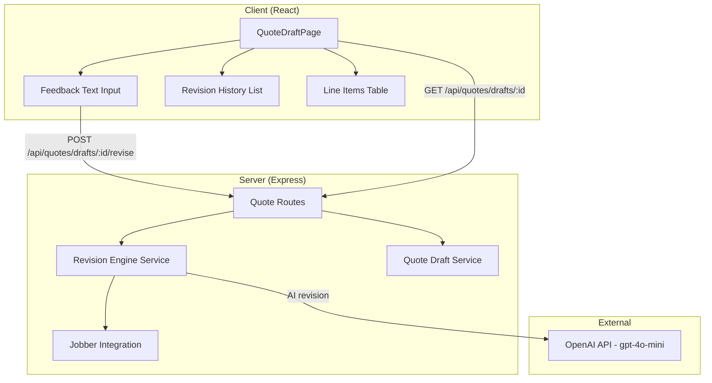

# Design Document: Quote Feedback & Revision

## Overview

This feature adds iterative natural-language feedback and AI-powered revision to the existing quote draft system. After a quote draft is generated, users can type feedback like "move underlayment before hardwood installation" or "increase drywall to 12 sheets" directly on the draft page. A new `RevisionEngine` service interprets the feedback against the current line items and product catalog, producing a revised set of line items. The updated draft is persisted and displayed immediately, and the user can repeat the cycle until satisfied.

### Key Design Decisions

1. **RevisionEngine as a separate service**: Rather than extending `QuoteEngine`, a dedicated `RevisionEngine` handles revision logic. This keeps the initial generation prompt and the revision prompt cleanly separated — they have different system prompts, different input shapes (full customer request vs. delta feedback), and different validation rules. The `RevisionEngine` follows the same `buildPrompt` → OpenAI call → parse → validate pattern established by `QuoteEngine`.

2. **Revision history as a lightweight append-only table**: Each feedback submission creates a `quote_revision_history` row with the feedback text and timestamp. We do NOT snapshot the full line-item state per revision — the current line items are always the source of truth on `quote_line_items`, and history is purely a log of what the user asked for. This keeps storage lean and avoids complex diffing.

3. **Reuse of existing `QuoteDraftService.update()`**: After the `RevisionEngine` produces revised line items, the route handler calls the existing `QuoteDraftService.update()` method to persist the new line items. No new persistence logic is needed for the draft itself.

4. **Client-side feedback UI integrated into `QuoteDraftPage`**: The feedback input and revision history are added directly to the existing draft page component rather than creating a new page. This keeps the user in context with the line items they're reviewing.

5. **Product catalog passed to revision prompt**: When the user asks to add new items, the `RevisionEngine` needs the catalog to match against. The route handler fetches the catalog (same logic as the generate route) and passes it to the engine.

## Architecture



### Request Flow

1. User views a quote draft on `QuoteDraftPage` and types feedback into the text input
2. Client sends `POST /api/quotes/drafts/:id/revise` with `{ feedbackText: string }`
3. Route handler loads the current draft via `QuoteDraftService.getById()`
4. Route handler fetches the product catalog (Jobber or manual, same logic as generate route)
5. `RevisionEngine.revise()` builds a prompt with the current line items, catalog, and feedback text
6. OpenAI returns a revised set of line items as JSON
7. `RevisionEngine` validates and sanitizes the response (catalog reference integrity, confidence scores, etc.)
8. Route handler persists the revision history entry to `quote_revision_history`
9. Route handler calls `QuoteDraftService.update()` with the new line items
10. Updated draft (with revision history) is returned to the client
11. Client updates the displayed line items and appends the feedback to the history list

## Components and Interfaces

### Client Components

#### FeedbackInput (added to `QuoteDraftPage`)
- A text input area below the line items table for typing natural-language feedback
- "Submit Feedback" button, disabled when input is empty/whitespace or a revision is in progress
- Inline validation message when user attempts to submit empty feedback
- Loading spinner replaces the button while revision is processing
- Input is cleared and re-enabled after successful revision

#### RevisionHistoryList (added to `QuoteDraftPage`)
- Displayed below the feedback input
- Scrollable list of past feedback messages with timestamps
- Chronological order (oldest first)
- Only shown when there is at least one history entry

### Server Services

#### RevisionEngine (`server/src/services/revision-engine.ts`)
```typescript
export interface RevisionInput {
  feedbackText: string;
  currentLineItems: QuoteLineItem[];
  currentUnresolvedItems: QuoteLineItem[];
  catalog: ProductCatalogEntry[];
}

export interface RevisionOutput {
  lineItems: QuoteLineItem[];
  unresolvedItems: QuoteLineItem[];
}

export class RevisionEngine {
  async revise(input: RevisionInput): Promise<RevisionOutput>;
}
```

The `RevisionEngine`:
- Builds a system prompt instructing the AI to interpret feedback as delta operations on the current line items
- Sends the current line items, catalog, and feedback text as the user prompt
- Parses the AI JSON response into line items
- Validates catalog references (same logic as `QuoteEngine.validateAIResponse`)
- Partitions items into resolved/unresolved using the same confidence threshold (70)
- On parse failure, returns the original line items unchanged with an error description
- Uses a 30-second timeout (matching `QuoteEngine`)

#### RevisionHistoryService (methods added to `QuoteDraftService`)
Rather than a separate service, revision history methods are added to the existing `QuoteDraftService`:

```typescript
// Added to QuoteDraftService
async addRevisionEntry(draftId: string, userId: string, feedbackText: string): Promise<RevisionHistoryEntry>;
async getRevisionHistory(draftId: string): Promise<RevisionHistoryEntry[]>;
```

### API Routes (added to `server/src/routes/quotes.ts`)

| Method | Path | Description |
|--------|------|-------------|
| `POST` | `/api/quotes/drafts/:id/revise` | Submit feedback and get revised draft |

The revise endpoint:
1. Validates `feedbackText` is non-empty after trimming
2. Loads the draft (verifies ownership)
3. Fetches the product catalog
4. Calls `RevisionEngine.revise()`
5. Persists the revision history entry
6. Updates the draft with new line items via `QuoteDraftService.update()`
7. Returns the updated `QuoteDraft` with `revisionHistory` included

### Client API Function (added to `client/src/api.ts`)

```typescript
export async function reviseDraft(
  draftId: string,
  feedbackText: string,
): Promise<QuoteDraft> {
  const res = await fetch(API_BASE + '/api/quotes/drafts/' + draftId + '/revise', {
    method: 'POST',
    headers: { 'Content-Type': 'application/json', ...authHeaders() },
    body: JSON.stringify({ feedbackText }),
  });
  return handleResponse(res);
}
```

## Data Models

### New Shared Types (`shared/src/types/quote.ts` — additions)

```typescript
/** A single entry in the revision history for a quote draft */
export interface RevisionHistoryEntry {
  id: string;
  quoteDraftId: string;
  feedbackText: string;
  createdAt: Date;
}
```

The `QuoteDraft` interface gains an optional field:
```typescript
export interface QuoteDraft {
  // ... existing fields ...
  revisionHistory?: RevisionHistoryEntry[];
}
```

### Database Schema (new migration `009_quote_revision_history.sql`)

```sql
-- Revision history for quote draft feedback
CREATE TABLE quote_revision_history (
    id UUID PRIMARY KEY DEFAULT uuid_generate_v4(),
    quote_draft_id UUID NOT NULL REFERENCES quote_drafts(id) ON DELETE CASCADE,
    feedback_text TEXT NOT NULL,
    created_at TIMESTAMP NOT NULL DEFAULT NOW()
);

CREATE INDEX idx_quote_revision_history_draft_id ON quote_revision_history(quote_draft_id);
```

This is a simple append-only table. Each row records one feedback submission. The current state of the draft's line items is always in `quote_line_items` — we don't snapshot line items per revision to keep things simple.


## Correctness Properties

*A property is a characteristic or behavior that should hold true across all valid executions of a system — essentially, a formal statement about what the system should do. Properties serve as the bridge between human-readable specifications and machine-verifiable correctness guarantees.*

### Property 1: Whitespace feedback rejection

*For any* string composed entirely of whitespace characters (spaces, tabs, newlines, or any combination), the feedback submission logic SHALL reject the input and the draft's line items SHALL remain unchanged.

**Validates: Requirements 1.4**

### Property 2: Revision output partitioning and catalog pricing

*For any* revision output produced by the `RevisionEngine`, every line item with a `productCatalogEntryId` that exists in the provided catalog SHALL have its `unitPrice` set to the catalog entry's price and SHALL be marked as resolved (confidence >= 70). Every line item without a valid catalog match SHALL appear in the unresolved items list with a non-empty `unmatchedReason`.

**Validates: Requirements 2.7, 2.8**

### Property 3: Revised line items persistence round-trip

*For any* set of revised line items and unresolved items produced by a revision, persisting them via `QuoteDraftService.update()` and then retrieving the draft via `QuoteDraftService.getById()` SHALL return equivalent line items (same product names, quantities, unit prices, and display order).

**Validates: Requirements 3.3**

### Property 4: Revision history persistence round-trip

*For any* non-empty feedback text string, after persisting a revision history entry via `addRevisionEntry()` and then fetching the history via `getRevisionHistory()`, the returned entries SHALL contain an entry with the exact feedback text and a valid timestamp.

**Validates: Requirements 4.3, 5.1**

### Property 5: Revision history chronological ordering

*For any* set of revision history entries for a draft, the entries returned by `getRevisionHistory()` SHALL be sorted in ascending order by `createdAt` (oldest first).

**Validates: Requirements 5.3**

### Property 6: Unparseable AI response preserves original items

*For any* non-JSON string returned by the AI service, the `RevisionEngine` SHALL return the original line items and unresolved items unchanged, without throwing an exception.

**Validates: Requirements 6.2**

## Error Handling

### Client-Side Errors

| Error Scenario | Handling |
|---|---|
| Empty/whitespace feedback submission | Inline validation message below the input; submit button remains disabled |
| Network error during revision | Error alert displayed above the feedback input via existing `ErrorToast` pattern; input re-enabled for retry |
| Revision API returns error response | Error message displayed; input re-enabled; draft line items unchanged |

### Server-Side Errors

| Error Scenario | Handling |
|---|---|
| Draft not found or not owned by user | Return `PlatformError` with severity `error`, component `QuoteRoutes`, 404 status |
| Empty feedback text after trimming | Return 400 with `PlatformError` describing the validation failure |
| OpenAI API error during revision | Return `PlatformError` with severity `error`, component `RevisionEngine`, recommended action "Try again" |
| OpenAI API timeout (30s) | Abort the request, return `PlatformError` with timeout-specific message |
| Unparseable AI response | `RevisionEngine` returns original line items unchanged; logs a warning; includes error description in response |
| Database write failure for history | Return 500 with `PlatformError`; revision is not applied (transaction rollback) |
| Product catalog fetch failure | Return `PlatformError`; user can retry after catalog issue is resolved |

### Fallback Behavior

- When the AI returns an unparseable response, the draft is left unchanged rather than corrupted — the user sees an error and can retry
- The revision and history insert happen in the same transaction — if either fails, neither is applied
- All errors follow the existing `PlatformError` → `ErrorResponse` pattern for consistent client handling via `ErrorToast`

## Testing Strategy

### Unit Tests

Unit tests cover specific examples, edge cases, and integration points:

- **RevisionEngine prompt construction**: Verify the prompt includes current line items, catalog, and feedback text in the expected format
- **RevisionEngine response parsing**: Test with valid JSON, malformed JSON, empty string, and markdown-wrapped JSON
- **RevisionEngine validation**: Test catalog reference integrity — items referencing non-existent catalog entries are downgraded to unresolved
- **RevisionEngine timeout**: Mock a slow fetch, verify AbortError is caught and converted to PlatformError
- **Feedback input validation**: Test empty string, whitespace-only strings, and valid text
- **QuoteDraftPage feedback UI**: Test loading state, error state, successful revision state, and history display
- **Revision history ordering**: Test that entries are returned oldest-first

### Property-Based Tests

Property-based tests use `fast-check` with Vitest to verify universal properties across randomized inputs. Each test runs a minimum of 100 iterations.

| Property | Test Description | Generator Strategy |
|---|---|---|
| Property 1 | Generate random whitespace-only strings, verify rejection | `fc.stringOf(fc.constantFrom(' ', '\t', '\n', '\r'))` filtered to non-empty |
| Property 2 | Generate random line items with random catalog references, run through validation, verify partitioning and pricing | Custom arbitraries for catalog entries and AI line items |
| Property 3 | Generate random QuoteLineItem arrays, persist via update, fetch, verify equivalence | Custom QuoteLineItem arbitrary with random names, quantities, prices |
| Property 4 | Generate random non-empty feedback strings, persist history entry, fetch, verify text match | `fc.string({ minLength: 1 })` filtered to non-whitespace-only |
| Property 5 | Generate random arrays of history entries with random timestamps, verify ascending sort | `fc.array(fc.record({ feedbackText: fc.string(), createdAt: fc.date() }))` |
| Property 6 | Generate random non-JSON strings, pass to RevisionEngine parse logic, verify original items returned | `fc.string()` filtered to exclude valid JSON |

### Test Configuration

- Library: `fast-check` with Vitest
- Minimum iterations: 100 per property test
- Each property test tagged with: `Feature: quote-feedback-revision, Property {N}: {title}`
- Test files: `tests/property/quote-feedback-revision.property.test.ts`
- Unit test files: `tests/unit/revision-engine.test.ts`
