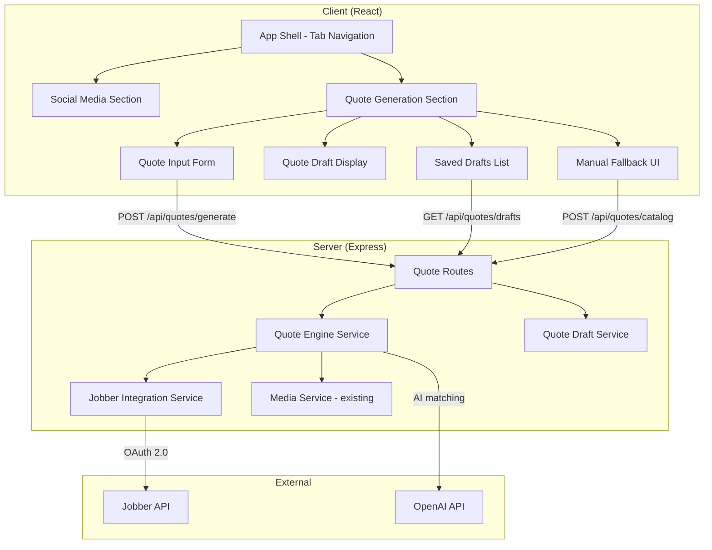

# Design Document: Quote Generation

## Overview

This feature adds a quote generation workflow to the existing social media cross-poster application. The app gains top-level tab-based navigation splitting the UI into two sections: the existing Social Media tools and a new Quote Generation section. Users paste customer request text (from emails/texts), upload reference images, and the system generates a structured draft quote by matching items against a Jobber product catalog and template library. Unmatched items are surfaced for manual resolution. The system integrates with the Jobber API when available, falling back to manual data entry when it is not.

### Key Design Decisions

1. **Tab-based shell with preserved state**: The `App.tsx` router is restructured with nested route groups under `/social/*` and `/quotes/*`. Each tab's navigation state is preserved via React Router's nested routing — no unmounting of section roots when switching tabs.

2. **QuoteEngine as a server-side service**: Follows the existing services pattern (`server/src/services/`). The engine receives parsed text + image references, queries the product catalog and template library, and returns a structured `QuoteDraft`. AI matching uses the same OpenAI integration pattern as `ContentGenerator`.

3. **Jobber integration with cache + fallback**: A `JobberIntegration` service handles OAuth 2.0 auth, fetches products/templates, and caches them in-memory with a configurable TTL (default 15 min). When the API is unreachable, the system activates manual fallback mode where users provide catalog data locally.

4. **Shared types for quote domain**: New types are added to `shared/src/types/quote.ts` and re-exported, keeping the existing pattern.

5. **Database persistence**: Quote drafts are stored in a new `quote_drafts` table with line items in `quote_line_items`. This follows the existing migration pattern.

## Architecture



### Request Flow

1. User pastes customer text and uploads images in `QuoteInputForm`
2. Client sends `POST /api/quotes/generate` with text + media item IDs
3. `QuoteEngine` fetches product catalog and template library (from Jobber cache or local fallback)
4. `QuoteEngine` calls OpenAI to analyze the request and match line items against the catalog
5. Items with confidence < 70 are marked as unresolved
6. The resulting `QuoteDraft` is persisted and returned to the client
7. Client renders the draft with matched items, unresolved items, and selected template

## Components and Interfaces

### Client Components

#### AppShell (modified `Layout.tsx`)
Replaces the current sidebar-only layout with a top-level tab bar ("Social Media" | "Quotes"). Each tab renders its own section with its own sub-navigation. Persists the last active tab to `localStorage`.

#### QuoteInputForm
- Multi-line text area for customer request text
- Image upload area (accepts JPEG, PNG, HEIC, WebP; max 10 images)
- "Generate Quote" button enabled when text or at least one image is provided
- Inline validation errors for invalid file types and exceeding image limit

#### QuoteDraftDisplay
- Shows selected template name (if any)
- Matched line items table: product name, quantity, unit price, confidence score
- Unresolved items section with warning indicator, original text, and mismatch reason
- Hidden when there are zero unresolved items
- Loading indicator while the engine processes

#### SavedDraftsList
- Lists saved `QuoteDraft` records sorted by creation date (newest first)
- Click to load a draft for review
- Delete action per draft

#### ManualFallbackUI
- Shown when Jobber API is unavailable
- Product entry form: name, unit price, description
- Add/edit/remove products from local catalog
- Template text editor for pasting quote templates
- Notification banner when API becomes available again

### Server Services

#### QuoteEngine (`server/src/services/quote-engine.ts`)
```typescript
interface QuoteEngineInput {
  customerText: string;
  mediaItemIds: string[];
  userId: string;
  catalogSource: 'jobber' | 'manual';
  manualCatalog?: ProductCatalogEntry[];
  manualTemplates?: QuoteTemplate[];
}

interface QuoteEngineOutput {
  draft: QuoteDraft;
}

class QuoteEngine {
  async generateQuote(input: QuoteEngineInput): Promise<QuoteEngineOutput>;
}
```

#### JobberIntegration (`server/src/services/jobber-integration.ts`)
```typescript
class JobberIntegration {
  async fetchProductCatalog(): Promise<ProductCatalogEntry[]>;
  async fetchTemplateLibrary(): Promise<QuoteTemplate[]>;
  isAvailable(): boolean;
  invalidateCache(): void;
}
```
- Authenticates via OAuth 2.0 using env vars (`JOBBER_CLIENT_ID`, `JOBBER_CLIENT_SECRET`, `JOBBER_ACCESS_TOKEN`)
- Caches results in-memory with configurable TTL (default 15 min)
- Returns `isAvailable() = false` on API errors, triggering manual fallback

#### QuoteDraftService (`server/src/services/quote-draft-service.ts`)
```typescript
class QuoteDraftService {
  async save(draft: QuoteDraft): Promise<QuoteDraft>;
  async getById(draftId: string, userId: string): Promise<QuoteDraft>;
  async list(userId: string): Promise<QuoteDraft[]>;
  async update(draftId: string, userId: string, updates: QuoteDraftUpdate): Promise<QuoteDraft>;
  async delete(draftId: string, userId: string): Promise<boolean>;
}
```

### API Routes (`server/src/routes/quotes.ts`)

| Method | Path | Description |
|--------|------|-------------|
| `POST` | `/api/quotes/generate` | Submit customer request, generate draft |
| `GET` | `/api/quotes/drafts` | List saved drafts for user |
| `GET` | `/api/quotes/drafts/:id` | Get a single draft |
| `PUT` | `/api/quotes/drafts/:id` | Update a draft (edit line items, resolve items) |
| `DELETE` | `/api/quotes/drafts/:id` | Delete a draft |
| `GET` | `/api/quotes/catalog` | Get current product catalog (Jobber or manual) |
| `POST` | `/api/quotes/catalog` | Save manual catalog entries |
| `GET` | `/api/quotes/templates` | Get current template library |
| `POST` | `/api/quotes/templates` | Save manual template entries |
| `GET` | `/api/quotes/jobber/status` | Check Jobber API availability |

## Data Models

### Shared Types (`shared/src/types/quote.ts`)

```typescript
/** A product from the Jobber catalog or manual entry */
export interface ProductCatalogEntry {
  id: string;
  name: string;
  unitPrice: number;
  description: string;
  category?: string;
  source: 'jobber' | 'manual';
}

/** A quote template from Jobber or manual entry */
export interface QuoteTemplate {
  id: string;
  name: string;
  content: string;
  category?: string;
  source: 'jobber' | 'manual';
}

/** A matched line item in a quote draft */
export interface QuoteLineItem {
  id: string;
  productCatalogEntryId: string | null;
  productName: string;
  quantity: number;
  unitPrice: number;
  confidenceScore: number;
  originalText: string;
  resolved: boolean;
  unmatchedReason?: string;
}

/** The full quote draft */
export interface QuoteDraft {
  id: string;
  userId: string;
  customerRequestText: string;
  selectedTemplateId: string | null;
  selectedTemplateName: string | null;
  lineItems: QuoteLineItem[];
  unresolvedItems: QuoteLineItem[];
  catalogSource: 'jobber' | 'manual';
  status: 'draft' | 'finalized';
  createdAt: Date;
  updatedAt: Date;
}

/** Update payload for editing a draft */
export interface QuoteDraftUpdate {
  lineItems?: Partial<QuoteLineItem>[];
  unresolvedItems?: Partial<QuoteLineItem>[];
  selectedTemplateId?: string | null;
  status?: 'draft' | 'finalized';
}
```

### Database Schema (new migration)

```sql
-- quote_drafts table
CREATE TABLE quote_drafts (
    id UUID PRIMARY KEY DEFAULT uuid_generate_v4(),
    user_id UUID NOT NULL REFERENCES users(id) ON DELETE CASCADE,
    customer_request_text TEXT NOT NULL,
    selected_template_id VARCHAR(255),
    selected_template_name VARCHAR(255),
    catalog_source VARCHAR(50) NOT NULL DEFAULT 'jobber',
    status VARCHAR(50) NOT NULL DEFAULT 'draft',
    created_at TIMESTAMP NOT NULL DEFAULT NOW(),
    updated_at TIMESTAMP NOT NULL DEFAULT NOW()
);

CREATE INDEX idx_quote_drafts_user_id ON quote_drafts(user_id);

-- quote_line_items table
CREATE TABLE quote_line_items (
    id UUID PRIMARY KEY DEFAULT uuid_generate_v4(),
    quote_draft_id UUID NOT NULL REFERENCES quote_drafts(id) ON DELETE CASCADE,
    product_catalog_entry_id VARCHAR(255),
    product_name VARCHAR(255) NOT NULL,
    quantity NUMERIC(10, 2) NOT NULL DEFAULT 1,
    unit_price NUMERIC(10, 2) NOT NULL DEFAULT 0,
    confidence_score INTEGER NOT NULL DEFAULT 0,
    original_text TEXT NOT NULL,
    resolved BOOLEAN NOT NULL DEFAULT FALSE,
    unmatched_reason TEXT,
    display_order INTEGER NOT NULL DEFAULT 0
);

CREATE INDEX idx_quote_line_items_draft_id ON quote_line_items(quote_draft_id);

-- quote_media (join table for images attached to quote requests)
CREATE TABLE quote_media (
    id UUID PRIMARY KEY DEFAULT uuid_generate_v4(),
    quote_draft_id UUID NOT NULL REFERENCES quote_drafts(id) ON DELETE CASCADE,
    media_item_id UUID NOT NULL REFERENCES media_items(id) ON DELETE CASCADE,
    display_order INTEGER NOT NULL DEFAULT 0
);

CREATE INDEX idx_quote_media_draft_id ON quote_media(quote_draft_id);

-- manual_catalog_entries (for fallback mode)
CREATE TABLE manual_catalog_entries (
    id UUID PRIMARY KEY DEFAULT uuid_generate_v4(),
    user_id UUID NOT NULL REFERENCES users(id) ON DELETE CASCADE,
    name VARCHAR(255) NOT NULL,
    unit_price NUMERIC(10, 2) NOT NULL,
    description TEXT,
    category VARCHAR(255),
    created_at TIMESTAMP NOT NULL DEFAULT NOW()
);

CREATE INDEX idx_manual_catalog_user_id ON manual_catalog_entries(user_id);

-- manual_templates (for fallback mode)
CREATE TABLE manual_templates (
    id UUID PRIMARY KEY DEFAULT uuid_generate_v4(),
    user_id UUID NOT NULL REFERENCES users(id) ON DELETE CASCADE,
    name VARCHAR(255) NOT NULL,
    content TEXT NOT NULL,
    category VARCHAR(255),
    created_at TIMESTAMP NOT NULL DEFAULT NOW()
);

CREATE INDEX idx_manual_templates_user_id ON manual_templates(user_id);
```

### Tab State Persistence

The last active tab is stored in `localStorage` under key `app_active_tab` with value `"social"` or `"quotes"`. On app load, `AppShell` reads this value to determine the default tab.


## Correctness Properties

*A property is a characteristic or behavior that should hold true across all valid executions of a system — essentially, a formal statement about what the system should do. Properties serve as the bridge between human-readable specifications and machine-verifiable correctness guarantees.*

### Property 1: Generate Quote button enablement

*For any* combination of customer text and uploaded images in the Quote Input Form, the "Generate Quote" button SHALL be enabled if and only if the text is non-empty (after trimming) OR at least one image has been uploaded.

**Validates: Requirements 2.4**

### Property 2: Image count validation

*For any* set of images selected for upload, the system SHALL accept the upload if and only if the count is between 1 and 10 inclusive. For any count exceeding 10, the system SHALL reject the upload and display an error.

**Validates: Requirements 2.3, 2.6**

### Property 3: File type validation

*For any* file with a MIME type not in the set {image/jpeg, image/png, image/heic, image/webp}, the Quote Input Form SHALL reject the file and display an error identifying the rejected file and listing accepted formats.

**Validates: Requirements 2.5**

### Property 4: Confidence score range invariant

*For any* line item in a Quote Draft (matched or unresolved), the confidence score SHALL be an integer between 0 and 100 inclusive.

**Validates: Requirements 3.6**

### Property 5: Confidence threshold partitioning

*For any* Quote Draft, every line item with a confidence score >= 70 SHALL appear in the matched line items list, and every line item with a confidence score < 70 SHALL appear in the unresolved items list.

**Validates: Requirements 3.7**

### Property 6: Catalog reference integrity

*For any* matched line item (resolved = true) in a Quote Draft, its productCatalogEntryId SHALL reference an existing entry in the Product Catalog used for that generation. No new products are created.

**Validates: Requirements 3.5, 3.8**

### Property 7: Template selection consistency

*For any* Quote Draft, if the Quote Engine found a matching template then selectedTemplateId SHALL be non-null, and if no matching template was found then selectedTemplateId SHALL be null and all line items SHALL reference only Product Catalog entries.

**Validates: Requirements 3.3, 3.4**

### Property 8: Matched line item display completeness

*For any* matched line item rendered in the Quote Draft Display, the rendered output SHALL contain the product name, quantity, unit price, and confidence score.

**Validates: Requirements 4.2**

### Property 9: Unresolved item display completeness

*For any* unresolved item rendered in the Quote Draft Display, the rendered output SHALL contain the original customer request text and the reason the item could not be matched.

**Validates: Requirements 4.4**

### Property 10: Cache TTL enforcement

*For any* sequence of Product Catalog or Template Library fetches from the Jobber Integration, fetches within the configured TTL window SHALL return cached data without making an API call, and fetches after TTL expiry SHALL trigger a fresh API call.

**Validates: Requirements 5.4**

### Property 11: API failure triggers fallback

*For any* Jobber API call that returns an error or times out, the Jobber Integration SHALL set its availability status to false, activating Manual Fallback mode.

**Validates: Requirements 5.5**

### Property 12: Manual catalog CRUD round-trip

*For any* product added to the manual Product Catalog, fetching the catalog SHALL include that product. For any product removed, fetching the catalog SHALL no longer include it.

**Validates: Requirements 6.2**

### Property 13: Manual fallback catalog usage

*For any* Quote Draft generated while in Manual Fallback mode, all matched line items SHALL reference entries from the manually provided Product Catalog (not from Jobber).

**Validates: Requirements 6.4**

### Property 14: Draft persistence round-trip

*For any* Quote Draft generated by the Quote Engine, saving it to the database and then retrieving it by ID SHALL return an equivalent draft (same line items, template, customer text).

**Validates: Requirements 7.1**

### Property 15: Draft list ordering

*For any* list of saved Quote Drafts returned for a user, the drafts SHALL be sorted by creation date in descending order (newest first).

**Validates: Requirements 7.2**

### Property 16: Draft deletion

*For any* saved Quote Draft that is deleted, it SHALL no longer appear in the user's draft list.

**Validates: Requirements 7.4**

## Error Handling

### Client-Side Errors

| Error Scenario | Handling |
|---|---|
| Invalid file type upload | Inline error on the upload area identifying the file and listing accepted formats (JPEG, PNG, HEIC, WebP) |
| Exceeding 10 image limit | Inline error stating the maximum allowed |
| Empty form submission | "Generate Quote" button remains disabled; no request sent |
| Network error during generation | Toast notification via existing `ErrorToast` system with retry action |
| Quote generation timeout | Toast notification with "Try again" action (follows existing `ContentGenerator` timeout pattern) |

### Server-Side Errors

| Error Scenario | Handling |
|---|---|
| Jobber API authentication failure | Log error via `ActivityLogService`, activate manual fallback, return fallback status to client |
| Jobber API unreachable | Same as auth failure — cache miss triggers fallback mode |
| OpenAI API error during matching | Return `PlatformError` with severity `error`, component `QuoteEngine`, recommended action "Try again" |
| OpenAI API timeout (30s) | Same as API error with timeout-specific message |
| Invalid quote draft ID | Return 404 with `PlatformError` (follows `PostService.getById` pattern) |
| Database write failure | Return 500 with `PlatformError`, log via `ActivityLogService` |
| Malformed AI response | Fallback parsing: return all items as unresolved with reason "AI matching failed — please review manually" |

### Fallback Behavior

- When Jobber API fails, the system degrades gracefully to manual mode rather than blocking the user
- When AI matching produces low-confidence results, items are surfaced as unresolved rather than silently included
- All errors follow the existing `PlatformError` → `ErrorResponse` pattern for consistent client handling

## Testing Strategy

### Unit Tests

Unit tests cover specific examples, edge cases, and integration points:

- **QuoteEngine**: Test with known catalog + request text, verify correct line item matching structure
- **JobberIntegration**: Test cache hit/miss behavior, OAuth token refresh, error handling
- **QuoteDraftService**: Test CRUD operations, verify database queries
- **QuoteInputForm**: Test button enablement logic, file validation, image count limits
- **QuoteDraftDisplay**: Test rendering with matched items, unresolved items, empty unresolved section
- **AppShell tabs**: Test tab switching, localStorage persistence, default tab behavior

### Property-Based Tests

Property-based tests use `fast-check` (already compatible with Vitest) to verify universal properties across randomized inputs. Each test runs a minimum of 100 iterations.

| Property | Test Description | Generator Strategy |
|---|---|---|
| Property 1 | Generate random text/image combinations, verify button state | `fc.record({ text: fc.string(), imageCount: fc.nat(15) })` |
| Property 2 | Generate random image counts (0-20), verify accept/reject | `fc.nat(20)` |
| Property 3 | Generate random MIME types, verify accept/reject against allowed set | `fc.oneof(fc.constant('image/jpeg'), ..., fc.string())` |
| Property 4 | Generate random QuoteDraft objects, verify all scores in [0, 100] | `fc.array(fc.record({ confidenceScore: fc.integer() }))` |
| Property 5 | Generate random line items with scores, verify partitioning at threshold 70 | `fc.array(fc.record({ confidenceScore: fc.integer(0, 100) }))` |
| Property 6 | Generate random drafts + catalogs, verify all matched items reference catalog | Custom arbitraries for catalog + draft |
| Property 7 | Generate drafts with/without template matches, verify selectedTemplateId consistency | `fc.boolean()` to control template match |
| Property 8 | Generate random line items, render, verify all fields present in output | Custom line item arbitrary |
| Property 9 | Generate random unresolved items, render, verify original text + reason present | Custom unresolved item arbitrary |
| Property 10 | Simulate time-based cache access sequences, verify API call count | `fc.array(fc.nat())` for time offsets |
| Property 11 | Generate random error responses, verify fallback activation | `fc.oneof(fc.constant(500), fc.constant(503), ...)` |
| Property 12 | Generate random products, add then fetch, verify presence; remove then fetch, verify absence | Custom product arbitrary |
| Property 13 | Generate drafts in manual mode with manual catalog, verify all references are manual | Custom catalog + draft arbitraries |
| Property 14 | Generate random drafts, save then retrieve, verify equivalence | Custom QuoteDraft arbitrary |
| Property 15 | Generate random lists of drafts with random dates, verify descending sort | `fc.array(fc.date())` |
| Property 16 | Generate random draft lists, delete one, verify it's gone | Custom draft list arbitrary |

### Test Configuration

- Library: `fast-check` with Vitest
- Minimum iterations: 100 per property test
- Each property test tagged with: `Feature: quote-generation, Property {N}: {title}`
- Test files: `tests/property/quote-generation.property.test.ts`
- Unit test files: `tests/unit/quote-engine.test.ts`, `tests/unit/quote-draft-service.test.ts`, `tests/unit/jobber-integration.test.ts`
