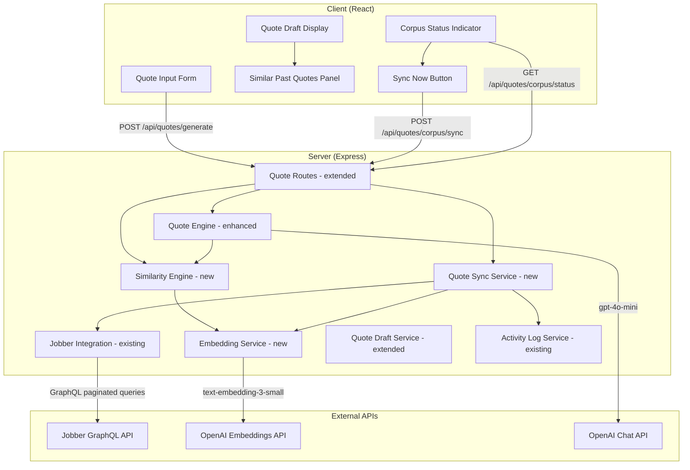

# Design Document: Quote Similarity Matching

## Overview

This feature adds a similarity-based reference system to the existing quote generation workflow. Instead of relying solely on the product catalog and template library, the system builds a local corpus of ~526 completed Jobber quotes, computes text embeddings via the OpenAI `text-embedding-3-small` model, and performs cosine similarity search to find the most relevant past quotes for any new customer request. The top matches are injected into the Quote Engine's AI prompt as additional context, producing more accurate line item suggestions and pricing.

### Key Design Decisions

1. **In-application cosine similarity (no vector DB)**: With ~600 quotes and 1536-dimensional embeddings, the entire corpus fits comfortably in memory (~3.5 MB). Computing cosine similarity across all vectors takes <10ms in JavaScript. A dedicated vector database (pgvector, Pinecone) would add operational complexity without meaningful benefit at this scale. Embeddings are stored as JSON arrays in Postgres and loaded into memory on demand.

2. **OpenAI `text-embedding-3-small` at 1536 dimensions**: This model costs $0.02 per 1M tokens and produces 1536-dimensional vectors. For ~600 quotes averaging ~200 tokens each, the full corpus embedding costs ~$0.0024 — essentially free. The 8,192 token input limit is more than sufficient for quote text.

3. **Batch embedding during sync**: The OpenAI embeddings API accepts up to 2,048 inputs per request. During corpus sync, we batch up to 20 texts per API call (as specified in requirements) to minimize round trips while staying well within limits.

4. **Rate-limit-aware sync with point budgeting**: The Jobber API has a 10,000-point budget restoring at 500 points/sec. Each page of 50 quotes costs ~5 points (simple query without lineItems). A full sync of 600 quotes = 12 pages = ~60 points — well within budget. The sync service tracks estimated cost and pauses at 8,000 points as a safety margin.

5. **Similar quote references persisted with drafts**: A new `quote_draft_similar_quotes` join table links drafts to the corpus quotes used as context, preserving the relationship for later review.

6. **Sync is manual-trigger only (no cron)**: Given the small corpus size and infrequent changes, sync is triggered via a button in the UI or API endpoint. This avoids background job infrastructure complexity.

## Architecture



### Request Flow — Quote Generation with Similarity

1. User submits customer request text via `POST /api/quotes/generate`
2. `QuoteEngine` calls `SimilarityEngine.findSimilar(customerText)`
3. `SimilarityEngine` calls `EmbeddingService.embed(customerText)` to get the request embedding
4. `SimilarityEngine` loads all corpus embeddings from the database, computes cosine similarity, and returns the top 5 matches above the 0.3 threshold
5. `QuoteEngine` includes the top 3 similar quotes as context in the AI prompt
6. `QuoteEngine` generates the draft as before, now with better context
7. `QuoteDraftService` saves the draft along with similar quote references
8. Client renders the draft with a "Similar Past Quotes" panel

### Request Flow — Corpus Synchronization

1. User clicks "Sync Now" or calls `POST /api/quotes/corpus/sync`
2. `QuoteSyncService` fetches all approved/converted quotes from Jobber via paginated GraphQL queries (page size 50)
3. For each page, the service tracks estimated API point cost and pauses if approaching the 8,000-point safety threshold
4. New/changed quotes are upserted into the `quote_corpus` table
5. `QuoteSyncService` batches the text of new/changed quotes and calls `EmbeddingService.embedBatch()` (up to 20 per call)
6. Embeddings are stored alongside the quote records
7. Sync timestamp and count are updated in `quote_corpus_sync_status`

## Components and Interfaces

### New Server Services

#### EmbeddingService (`server/src/services/embedding-service.ts`)

```typescript
class EmbeddingService {
  /**
   * Generate a single text embedding.
   * Truncates input to 8,000 tokens before sending.
   */
  async embed(text: string): Promise<number[]>;

  /**
   * Generate embeddings for multiple texts in a single API call.
   * Accepts up to 20 inputs. Each is truncated to 8,000 tokens.
   */
  async embedBatch(texts: string[]): Promise<number[][]>;
}
```

- Uses `AI_TEXT_API_KEY` and `AI_TEXT_API_URL` environment variables (same as existing OpenAI integration)
- Model: `text-embedding-3-small` (1536 dimensions)
- Token truncation: estimates tokens as `Math.ceil(text.length / 4)` and truncates at character level if over 8,000 tokens (~32,000 chars)
- Throws descriptive errors on API failure including HTTP status and message

#### SimilarityEngine (`server/src/services/similarity-engine.ts`)

```typescript
interface SimilarQuote {
  jobberQuoteId: string;
  quoteNumber: string;
  title: string;
  message: string;
  similarityScore: number;
  searchableText: string;
}

class SimilarityEngine {
  /**
   * Find the most similar past quotes to the given customer request text.
   * Returns up to 5 results with similarity score >= 0.3, sorted descending.
   */
  async findSimilar(customerText: string): Promise<SimilarQuote[]>;
}
```

- Loads all corpus records with embeddings from the database
- Computes cosine similarity: `dot(a, b) / (magnitude(a) * magnitude(b))`
- Filters results below 0.3 threshold
- Returns top 5 sorted by score descending
- Returns empty array when corpus is empty

#### QuoteSyncService (`server/src/services/quote-sync-service.ts`)

```typescript
interface SyncResult {
  totalFetched: number;
  newQuotes: number;
  updatedQuotes: number;
  unchangedQuotes: number;
  embeddingsGenerated: number;
  durationMs: number;
}

class QuoteSyncService {
  /**
   * Synchronize the quote corpus with Jobber.
   * Fetches all approved/converted quotes, upserts into corpus,
   * and generates embeddings for new/changed text.
   */
  async sync(): Promise<SyncResult>;

  /**
   * Get the current corpus status.
   */
  async getStatus(): Promise<{ totalQuotes: number; lastSyncAt: string | null }>;
}
```

- Fetches quotes with status "approved" or "converted" using the existing `JobberIntegration` GraphQL infrastructure
- Tracks estimated API point cost per page (~5 points per page of 50)
- Pauses for 20 seconds if cumulative cost exceeds 8,000 points
- Handles HTTP 429 / throttle errors by waiting the specified duration
- Upserts quotes: only recomputes embeddings when title or message text changes
- Batches embedding generation in groups of 20
- Logs sync activity via `ActivityLogService`

### Modified Server Services

#### QuoteEngine (enhanced)

The existing `QuoteEngine.generateQuote()` method is extended to:
1. Call `SimilarityEngine.findSimilar()` with the customer request text
2. Include up to 3 similar quotes in the AI prompt with their similarity scores
3. Add instructions for the AI to prefer line items and pricing from similar quotes
4. Return similar quote references in the output for persistence

The `buildPrompt()` method gains a new `SIMILAR PAST QUOTES` section:
```
SIMILAR PAST QUOTES:
- [Score: 87%] Quote #1234 "Deck Repair" — Full message text...
- [Score: 72%] Quote #1189 "Fence Installation" — Full message text...
```

#### QuoteDraftService (extended)

- `save()` now also persists similar quote references to `quote_draft_similar_quotes`
- `getById()` and `list()` now join and return similar quote references
- `delete()` relies on CASCADE to clean up similar quote references

### New API Routes

| Method | Path | Description |
|--------|------|-------------|
| `POST` | `/api/quotes/corpus/sync` | Trigger manual corpus synchronization |
| `GET` | `/api/quotes/corpus/status` | Get corpus status (count + last sync timestamp) |

### Modified API Routes

| Method | Path | Change |
|--------|------|--------|
| `POST` | `/api/quotes/generate` | Now includes similar quote lookup before AI generation |
| `GET` | `/api/quotes/drafts/:id` | Response now includes `similarQuotes` array |
| `GET` | `/api/quotes/drafts` | Each draft now includes `similarQuotes` array |

### Client Components

#### SimilarQuotesPanel (new)

Displayed within `QuoteDraftPage` when a draft has associated similar quotes:
- Shows each similar quote with title, quote number, and similarity score as percentage
- Color-coded badge: green (>70%), yellow (50-70%), gray (30-50%)
- Click to expand inline detail view showing the quote message text
- Hidden entirely when no similar quotes exist

#### CorpusStatusIndicator (new)

Displayed on the Settings page or Quotes section:
- Shows total indexed quote count and last sync timestamp
- "Sync Now" button triggers `POST /api/quotes/corpus/sync`
- Progress indicator while sync is in progress (polling `GET /api/quotes/corpus/status`)
- Disables button during sync, re-enables on completion or failure
- Error message on sync failure

## Data Models

### New Shared Types (`shared/src/types/quote.ts` — additions)

```typescript
/** A similar past quote found via embedding similarity search */
export interface SimilarQuote {
  jobberQuoteId: string;
  quoteNumber: string;
  title: string;
  message: string;
  similarityScore: number;
}

/** Extended QuoteDraft with similar quote references */
// Add to existing QuoteDraft interface:
//   similarQuotes?: SimilarQuote[];
```

### New Database Tables (migration `007_quote_corpus.sql`)

```sql
-- Quote corpus: stores completed Jobber quotes with embeddings
CREATE TABLE quote_corpus (
    id UUID PRIMARY KEY DEFAULT uuid_generate_v4(),
    jobber_quote_id VARCHAR(255) NOT NULL UNIQUE,
    quote_number VARCHAR(50) NOT NULL,
    title VARCHAR(500),
    message TEXT,
    quote_status VARCHAR(50) NOT NULL,
    searchable_text TEXT NOT NULL,
    embedding JSONB,
    created_at TIMESTAMP NOT NULL DEFAULT NOW(),
    updated_at TIMESTAMP NOT NULL DEFAULT NOW()
);

CREATE INDEX idx_quote_corpus_jobber_id ON quote_corpus(jobber_quote_id);
CREATE INDEX idx_quote_corpus_status ON quote_corpus(quote_status);

-- Sync status tracking
CREATE TABLE quote_corpus_sync_status (
    id INTEGER PRIMARY KEY DEFAULT 1 CHECK (id = 1),
    last_sync_at TIMESTAMP,
    total_quotes INTEGER NOT NULL DEFAULT 0,
    last_sync_duration_ms INTEGER,
    last_sync_error TEXT
);

INSERT INTO quote_corpus_sync_status (id, total_quotes) VALUES (1, 0);

-- Similar quote references linked to drafts
CREATE TABLE quote_draft_similar_quotes (
    id UUID PRIMARY KEY DEFAULT uuid_generate_v4(),
    quote_draft_id UUID NOT NULL REFERENCES quote_drafts(id) ON DELETE CASCADE,
    jobber_quote_id VARCHAR(255) NOT NULL,
    quote_number VARCHAR(50) NOT NULL,
    title VARCHAR(500),
    similarity_score NUMERIC(5, 4) NOT NULL,
    display_order INTEGER NOT NULL DEFAULT 0
);

CREATE INDEX idx_draft_similar_quotes_draft_id ON quote_draft_similar_quotes(quote_draft_id);
```

### Embedding Storage Rationale

Embeddings are stored as JSONB arrays in Postgres rather than using pgvector. At ~600 records with 1536-dimensional vectors, the full corpus loads into memory in <100ms and cosine similarity computation across all vectors takes <10ms. This avoids adding a Postgres extension dependency for negligible performance gain at this scale.

### Cosine Similarity Implementation

```typescript
function cosineSimilarity(a: number[], b: number[]): number {
  let dot = 0, magA = 0, magB = 0;
  for (let i = 0; i < a.length; i++) {
    dot += a[i] * b[i];
    magA += a[i] * a[i];
    magB += b[i] * b[i];
  }
  const denom = Math.sqrt(magA) * Math.sqrt(magB);
  return denom === 0 ? 0 : dot / denom;
}
```

This is a pure function with no external dependencies — ideal for property-based testing.


## Correctness Properties

*A property is a characteristic or behavior that should hold true across all valid executions of a system — essentially, a formal statement about what the system should do. Properties serve as the bridge between human-readable specifications and machine-verifiable correctness guarantees.*

### Property 1: Cosine similarity range, symmetry, and identity

*For any* two non-zero vectors of equal length, cosine similarity SHALL return a value in the range [-1, 1]. Additionally, `cosineSimilarity(a, b)` SHALL equal `cosineSimilarity(b, a)` (symmetry), and `cosineSimilarity(a, a)` SHALL equal 1.0 (identity). For any zero vector, cosine similarity SHALL return 0.

**Validates: Requirements 3.2**

### Property 2: Similarity search returns sorted, filtered, capped results with required fields

*For any* customer request embedding and any quote corpus, the similarity search results SHALL be sorted by similarity score in descending order, contain at most 5 results, and exclude all quotes with a similarity score below 0.3. Each result SHALL contain the Jobber quote ID, quote number, title, message, similarity score, and searchable text.

**Validates: Requirements 3.3, 3.4, 3.5**

### Property 3: Searchable text composition

*For any* quote with a title and message, the combined searchable text field SHALL be composed of the title and message concatenated together. For any quote with a null or empty title, the searchable text SHALL equal the message. For any quote with a null or empty message, the searchable text SHALL equal the title.

**Validates: Requirements 1.2**

### Property 4: Token truncation

*For any* input text, the text sent to the OpenAI embeddings API SHALL never exceed 8,000 tokens (estimated as `Math.ceil(text.length / 4)` characters). For texts within the limit, the full text SHALL be sent unchanged.

**Validates: Requirements 2.3**

### Property 5: Batch embedding respects size limit

*For any* array of texts submitted for batch embedding, the Embedding Service SHALL never send more than 20 texts in a single API call. For arrays larger than 20, the service SHALL split them into multiple calls.

**Validates: Requirements 2.6**

### Property 6: Embedding error includes status and message

*For any* HTTP error response from the OpenAI embeddings API, the thrown error SHALL contain both the HTTP status code and the error message from the response.

**Validates: Requirements 2.5**

### Property 7: Upsert logic — update only when changed

*For any* quote that already exists in the corpus (matched by Jobber quote ID), the sync service SHALL update the record only when the title, message, or status has changed. The embedding SHALL be recomputed only when the title or message has changed. When no fields have changed, the record SHALL remain unmodified.

**Validates: Requirements 1.4**

### Property 8: Prompt includes at most 3 similar quotes with scores

*For any* set of similar quotes (0 to N), the AI prompt SHALL include at most 3 similar quotes. Each included similar quote SHALL have its similarity score present in the prompt text. When no similar quotes are provided, the prompt SHALL not contain a similar quotes section.

**Validates: Requirements 4.1, 4.3, 4.5**

### Property 9: Similar quote references round-trip

*For any* quote draft with associated similar quote references, saving the draft and then loading it by ID SHALL return the same similar quote references (Jobber quote ID, quote number, title, similarity score) in the same order.

**Validates: Requirements 4.4, 8.1, 8.2**

### Property 10: Draft deletion cascades to similar quote references

*For any* saved quote draft with associated similar quote references, deleting the draft SHALL also remove all associated similar quote references from the database.

**Validates: Requirements 8.3**

### Property 11: Similarity score color badge mapping

*For any* similarity score between 0.3 and 1.0, the color badge SHALL be green when the score is above 0.7, yellow when the score is between 0.5 and 0.7 (inclusive), and gray when the score is between 0.3 and 0.5 (inclusive).

**Validates: Requirements 5.3**

### Property 12: Similar quotes panel display completeness

*For any* similar quote displayed in the panel, the rendered output SHALL contain the quote title, quote number, and similarity score formatted as a percentage.

**Validates: Requirements 5.1**

### Property 13: Rate limit point budgeting

*For any* sequence of paginated sync requests, the sync service SHALL pause synchronization when the estimated cumulative API point cost exceeds 8,000 points. After pausing, the service SHALL resume after a delay.

**Validates: Requirements 7.2**

### Property 14: Sync failure preserves corpus

*For any* existing quote corpus state, if a synchronization attempt fails due to a Jobber API error, the corpus data SHALL remain identical to its state before the sync attempt.

**Validates: Requirements 1.6**

## Error Handling

### Embedding Service Errors

| Error Scenario | Handling |
|---|---|
| OpenAI API key not configured | Throw `PlatformError` with severity `error`, component `EmbeddingService`, recommended action "Set AI_TEXT_API_KEY" |
| OpenAI API returns HTTP error | Throw descriptive error including HTTP status code and response message |
| OpenAI API timeout | Throw `PlatformError` with timeout-specific message (reuse existing 10s timeout pattern) |
| Empty text input | Return a zero vector or skip — do not call the API with empty input |
| Batch size exceeds 20 | Automatically split into multiple API calls (not an error) |

### Sync Service Errors

| Error Scenario | Handling |
|---|---|
| Jobber API unreachable | Log error via `ActivityLogService`, retain existing corpus, return error in sync result |
| Jobber API rate limited (429) | Wait for duration in response headers, then retry the request |
| Estimated point cost exceeds 8,000 | Pause for 20 seconds to allow point restoration, then resume |
| Embedding generation fails mid-sync | Log the error, skip embedding for that quote, continue with remaining quotes |
| Database write failure during sync | Rollback the current batch, log error, return partial sync result |

### Similarity Engine Errors

| Error Scenario | Handling |
|---|---|
| Empty corpus | Return empty array — not an error condition |
| Embedding service failure during search | Log error, return empty similar quotes array, proceed with standard generation |
| Corpus load failure (DB error) | Log error, return empty similar quotes array, proceed with standard generation |

### Client-Side Errors

| Error Scenario | Handling |
|---|---|
| Sync request fails | Display error message in corpus status indicator, re-enable "Sync Now" button |
| Similar quotes fail to load with draft | Hide the similar quotes panel, show draft without references |
| Network error during sync status polling | Stop polling, show last known status |

### Graceful Degradation

The entire similarity matching feature is additive — if any part fails (embedding service, corpus sync, similarity search), the system falls back to the existing quote generation behavior using only the product catalog and template library. No existing functionality is blocked by similarity matching failures.

## Testing Strategy

### Unit Tests

Unit tests cover specific examples, edge cases, and integration points:

- **EmbeddingService**: Test with mocked OpenAI API — verify correct model, headers, token truncation, batch splitting, error formatting
- **SimilarityEngine**: Test `cosineSimilarity()` with known vectors (identical, orthogonal, opposite), test `findSimilar()` with a small corpus and known embeddings
- **QuoteSyncService**: Test upsert logic with mocked Jobber responses — new quotes, updated quotes, unchanged quotes, API failures
- **QuoteEngine (enhanced prompt)**: Test `buildPrompt()` with 0, 1, 3, 5 similar quotes — verify prompt structure and score inclusion
- **QuoteDraftService (extended)**: Test save/load/delete with similar quote references
- **SimilarQuotesPanel**: Test rendering with 0, 1, 3 similar quotes — verify panel visibility, field display, color badges
- **CorpusStatusIndicator**: Test rendering with sync status data, button states during sync

### Property-Based Tests

Property-based tests use `fast-check` (already in devDependencies) with Vitest. Each test runs a minimum of 100 iterations.

| Property | Test Description | Generator Strategy |
|---|---|---|
| Property 1 | Generate random vector pairs, verify cosine similarity range [-1,1], symmetry, and identity | `fc.array(fc.float({ min: -100, max: 100, noNaN: true }), { minLength: 10, maxLength: 10 })` for vectors |
| Property 2 | Generate random corpus with embeddings and a query embedding, verify results are sorted, capped at 5, filtered at 0.3, and contain required fields | Custom arbitrary for corpus entries with random embeddings |
| Property 3 | Generate random title/message pairs (including nulls/empties), verify searchable text composition | `fc.record({ title: fc.option(fc.string()), message: fc.option(fc.string()) })` |
| Property 4 | Generate random strings of varying lengths (0 to 50,000 chars), verify truncation behavior | `fc.string({ minLength: 0, maxLength: 50000 })` |
| Property 5 | Generate random arrays of texts (1-50 items), mock API, verify no single call exceeds 20 inputs | `fc.array(fc.string(), { minLength: 1, maxLength: 50 })` |
| Property 6 | Generate random HTTP status codes and error messages, verify thrown error contains both | `fc.record({ status: fc.integer({ min: 400, max: 599 }), message: fc.string() })` |
| Property 7 | Generate pairs of quote versions with random field changes, verify update/skip decision | Custom arbitrary for old/new quote pairs |
| Property 8 | Generate random arrays of similar quotes (0-10), build prompt, verify at most 3 included with scores | Custom arbitrary for similar quotes |
| Property 9 | Generate random drafts with similar quote references, save then load, verify equivalence | Custom arbitrary for draft + similar quotes |
| Property 10 | Generate random drafts with similar quotes, delete, verify references are gone | Custom arbitrary for draft + similar quotes |
| Property 11 | Generate random scores in [0.3, 1.0], verify correct color mapping | `fc.float({ min: 0.3, max: 1.0, noNaN: true })` |
| Property 12 | Generate random similar quotes, render panel, verify title/number/percentage present | Custom arbitrary for similar quotes |
| Property 13 | Generate random sequences of page costs, verify pause at 8,000 threshold | `fc.array(fc.integer({ min: 1, max: 100 }))` |
| Property 14 | Generate random corpus state, simulate sync failure, verify corpus unchanged | Custom arbitrary for corpus state |

### Test Configuration

- Library: `fast-check` with Vitest
- Minimum iterations: 100 per property test
- Each property test tagged with: `Feature: quote-similarity-matching, Property {N}: {title}`
- Test files: `tests/property/quote-similarity-matching.property.test.ts`
- Unit test files: `tests/unit/embedding-service.test.ts`, `tests/unit/similarity-engine.test.ts`, `tests/unit/quote-sync-service.test.ts`
