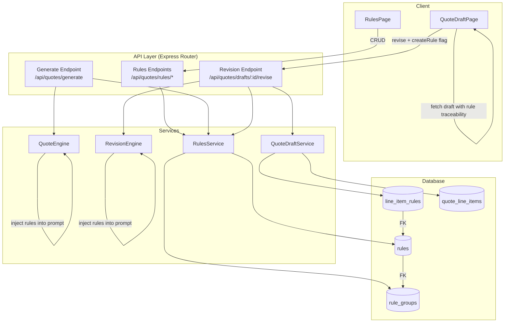
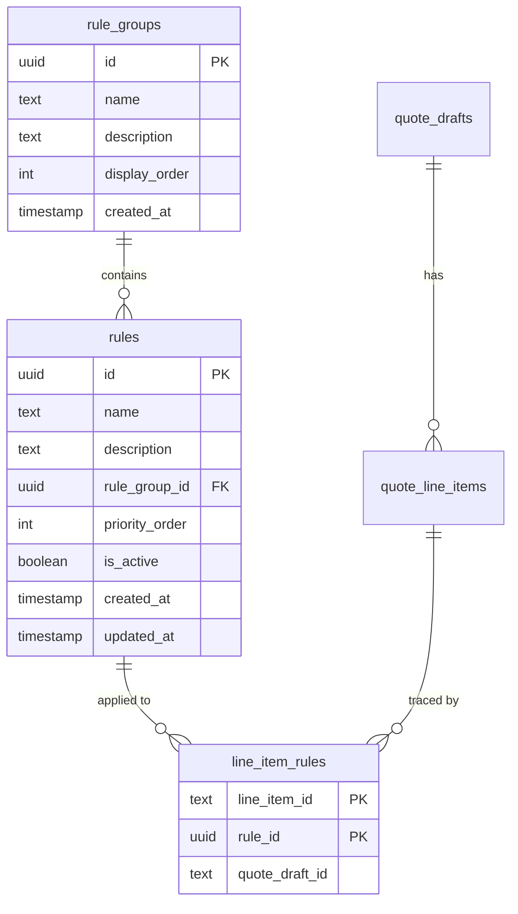

# Design Document: Rules Engine

## Overview

The Rules Engine externalizes the business rules currently hardcoded in the `QuoteEngine` and `RevisionEngine` AI system prompts into a persistent, user-managed data model. This allows business users to create, organize, and maintain rules that govern quote generation and revision — without code changes.

The feature spans all layers of the stack:

- **Database**: New `rule_groups`, `rules`, and `line_item_rules` tables (migration 013)
- **Server**: A `RulesService` class for CRUD operations, plus integration into `QuoteEngine` and `RevisionEngine` prompt construction
- **API**: RESTful endpoints under `/api/quotes/rules` for rules management, and an extended revision endpoint for rule-creation-from-feedback
- **Shared types**: New `Rule`, `RuleGroup` types and an extended `QuoteLineItem` with `ruleIdsApplied`
- **Client**: A `RulesPage` for browsing/managing rules, a traceability panel on `QuoteDraftPage`, and a rule-creation toggle on the revision feedback section

### Design Decisions

1. **Rules live alongside quote routes** (`/api/quotes/rules`) rather than as a top-level `/api/rules` namespace, because rules are scoped entirely to the quote generation domain and share the same auth middleware.
2. **RulesService is a standalone class** instantiated in the routes file, following the existing pattern (e.g., `QuoteDraftService`, `RevisionEngine`).
3. **Rule application is prompt-based** — active rules are injected into the AI system prompt as a structured section. The AI is instructed to return `ruleIdsApplied` per line item, which the engines persist via the `line_item_rules` junction table.
4. **Rule-creation-from-feedback** is handled by extending the existing `/drafts/:id/revise` endpoint with an optional `createRule` flag, rather than requiring two separate client requests. This keeps the revision atomic from the user's perspective.
5. **The "General" rule group** is seeded by the migration and serves as the default catch-all, matching the requirements for ungrouped rules.

## Architecture



### Data Flow: Quote Generation with Rules

1. Client submits a generate request to `POST /api/quotes/generate`
2. Route handler calls `RulesService.getActiveRulesGrouped()` to fetch all active rules ordered by group display order and rule priority
3. Route handler passes the rules to `QuoteEngine.generateQuote()` as a new parameter
4. `QuoteEngine` injects rules into the AI system prompt as a "BUSINESS RULES" section
5. AI returns line items with `ruleIdsApplied` arrays
6. `QuoteEngine` includes `ruleIdsApplied` on each `QuoteLineItem` in the draft
7. `QuoteDraftService.save()` persists rule associations to `line_item_rules`

### Data Flow: Revision with Rule Creation

1. Client submits feedback with `createRule: true` to `POST /api/quotes/drafts/:id/revise`
2. Route handler calls `RulesService.getActiveRulesGrouped()` and passes rules to `RevisionEngine`
3. `RevisionEngine` includes rules in the AI prompt and returns revised line items with `ruleIdsApplied`
4. If `createRule` is true, route handler calls `RulesService.createRuleFromFeedback()` to persist a new rule
5. `QuoteDraftService.update()` persists revised line items and their rule associations
6. Response includes the updated draft and a `ruleCreated` flag with the new rule details

## Components and Interfaces

### RulesService (`server/src/services/rules-service.ts`)

```typescript
import { query, getClient } from '../config/database.js';
import { PlatformError } from '../errors/index.js';
import type { Rule, RuleGroup, RuleGroupWithRules } from 'shared';

export class RulesService {
  /** Fetch all groups with nested rules, ordered by display_order / priority_order */
  async getAllGroupedRules(): Promise<RuleGroupWithRules[]>;

  /** Fetch only active rules, grouped and ordered — used for prompt injection */
  async getActiveRulesGrouped(): Promise<RuleGroupWithRules[]>;

  /** Create a new rule, assigning to "General" group if no groupId provided */
  async createRule(data: {
    name: string;
    description: string;
    ruleGroupId?: string;
    isActive?: boolean;
  }): Promise<Rule>;

  /** Update an existing rule's fields */
  async updateRule(ruleId: string, data: {
    name?: string;
    description?: string;
    ruleGroupId?: string;
    isActive?: boolean;
  }): Promise<Rule>;

  /** Set a rule to inactive (soft delete) */
  async deactivateRule(ruleId: string): Promise<Rule>;

  /** Reorder rules within a group */
  async reorderRules(ruleGroupId: string, ruleIds: string[]): Promise<void>;

  /** Create a new rule group */
  async createGroup(data: { name: string; description?: string }): Promise<RuleGroup>;

  /** Update an existing rule group */
  async updateGroup(groupId: string, data: {
    name?: string;
    description?: string;
    displayOrder?: number;
  }): Promise<RuleGroup>;

  /** Delete a group, reassigning its rules to the "General" group */
  async deleteGroup(groupId: string): Promise<void>;

  /** Create a rule from revision feedback text */
  async createRuleFromFeedback(feedbackText: string, quoteContext?: string): Promise<Rule>;

  /** Persist rule-to-line-item associations for a draft */
  async saveLineItemRules(
    quoteDraftId: string,
    lineItemRules: Array<{ lineItemId: string; ruleIds: string[] }>
  ): Promise<void>;

  /** Fetch rule associations for all line items in a draft */
  async getLineItemRules(quoteDraftId: string): Promise<Map<string, Rule[]>>;

  /** Get the default "General" group ID */
  async getDefaultGroupId(): Promise<string>;
}
```

### Extended QuoteEngine Interface

The `QuoteEngine.generateQuote()` method gains an optional `rules` parameter:

```typescript
// In QuoteEngine
async generateQuote(
  input: QuoteEngineInput,
  catalog: ProductCatalogEntry[],
  templates: QuoteTemplate[],
  rules?: RuleGroupWithRules[],  // NEW
): Promise<QuoteEngineOutput>;
```

The `buildPrompt` method adds a "BUSINESS RULES" section when rules are provided. The AI response schema is extended to include `ruleIdsApplied: string[]` per line item.

### Extended RevisionEngine Interface

Similarly, `RevisionEngine.revise()` gains a `rules` parameter:

```typescript
// In RevisionEngine
export interface RevisionInput {
  feedbackText: string;
  currentLineItems: QuoteLineItem[];
  currentUnresolvedItems: QuoteLineItem[];
  catalog: ProductCatalogEntry[];
  rules?: RuleGroupWithRules[];  // NEW
}
```

### API Endpoints

All endpoints are registered on the existing `quoteRoutes` router and protected by `sessionMiddleware`.

| Method | Path | Description |
|--------|------|-------------|
| `GET` | `/api/quotes/rules` | List all groups with nested rules |
| `POST` | `/api/quotes/rules` | Create a new rule |
| `PUT` | `/api/quotes/rules/:id` | Update an existing rule |
| `PUT` | `/api/quotes/rules/:id/deactivate` | Deactivate a rule |
| `POST` | `/api/quotes/rules/groups` | Create a new rule group |
| `PUT` | `/api/quotes/rules/groups/:id` | Update a rule group |
| `DELETE` | `/api/quotes/rules/groups/:id` | Delete a group (reassigns rules) |

The existing `POST /api/quotes/drafts/:id/revise` endpoint is extended to accept:

```typescript
{
  feedbackText: string;
  createRule?: boolean;  // NEW — when true, also creates a rule from feedbackText
}
```

### Client Components

**RulesPage** (`client/src/pages/RulesPage.tsx`)
- Fetches all groups+rules via `GET /api/quotes/rules` on mount
- Renders groups in display order, rules within each group in priority order
- Inline forms for creating/editing rules and groups
- Visual distinction for active vs. inactive rules (opacity + badge)
- Route: `/quotes/rules`

**Rule Traceability Panel** (inline in `QuoteDraftPage.tsx`)
- Info icon (ℹ) next to each line item in the matched items table
- Click toggles an expandable panel showing applied rules grouped by group name
- When no rules applied, shows "No specific rules were applied"

**Rule Creation Toggle** (inline in `QuoteDraftPage.tsx`)
- Toggle switch adjacent to the feedback textarea
- Defaults to OFF on page load
- When ON, the `reviseDraft` API call includes `createRule: true`
- Success/failure messages displayed after submission

### Client API Functions (`client/src/api.ts`)

```typescript
// New functions
export async function fetchRules(): Promise<RuleGroupWithRules[]>;
export async function createRule(data: { name: string; description: string; ruleGroupId?: string }): Promise<Rule>;
export async function updateRule(id: string, data: Partial<Rule>): Promise<Rule>;
export async function deactivateRule(id: string): Promise<Rule>;
export async function createRuleGroup(data: { name: string; description?: string }): Promise<RuleGroup>;
export async function updateRuleGroup(id: string, data: Partial<RuleGroup>): Promise<RuleGroup>;
export async function deleteRuleGroup(id: string): Promise<void>;

// Modified function — adds optional createRule flag
export async function reviseDraft(
  draftId: string,
  feedbackText: string,
  createRule?: boolean,
): Promise<QuoteDraft & { ruleCreated?: { id: string; name: string } }>;
```

## Data Models

### Database Schema (Migration 013)

```sql
-- 013_rules_engine.sql

-- ============================================================
-- RULE_GROUPS
-- ============================================================
CREATE TABLE rule_groups (
    id UUID PRIMARY KEY DEFAULT gen_random_uuid(),
    name TEXT NOT NULL,
    description TEXT,
    display_order INTEGER NOT NULL DEFAULT 0,
    created_at TIMESTAMP NOT NULL DEFAULT NOW()
);

-- Seed the default "General" group
INSERT INTO rule_groups (id, name, description, display_order)
VALUES (gen_random_uuid(), 'General', 'Default rule group for uncategorized rules', 0);

-- ============================================================
-- RULES
-- ============================================================
CREATE TABLE rules (
    id UUID PRIMARY KEY DEFAULT gen_random_uuid(),
    name TEXT NOT NULL,
    description TEXT NOT NULL,
    rule_group_id UUID NOT NULL REFERENCES rule_groups(id),
    priority_order INTEGER NOT NULL DEFAULT 0,
    is_active BOOLEAN NOT NULL DEFAULT TRUE,
    created_at TIMESTAMP NOT NULL DEFAULT NOW(),
    updated_at TIMESTAMP NOT NULL DEFAULT NOW()
);

-- Unique rule name within a group
ALTER TABLE rules ADD CONSTRAINT uq_rules_name_group
    UNIQUE (name, rule_group_id);

CREATE INDEX idx_rules_group_id ON rules(rule_group_id);
CREATE INDEX idx_rules_active ON rules(is_active);

-- ============================================================
-- LINE_ITEM_RULES (junction table)
-- ============================================================
CREATE TABLE line_item_rules (
    line_item_id TEXT NOT NULL,
    rule_id UUID NOT NULL REFERENCES rules(id),
    quote_draft_id TEXT NOT NULL,
    PRIMARY KEY (line_item_id, rule_id)
);

CREATE INDEX idx_line_item_rules_draft ON line_item_rules(quote_draft_id);
CREATE INDEX idx_line_item_rules_rule ON line_item_rules(rule_id);
```

### Shared Types (`shared/src/types/quote.ts` additions)

```typescript
/** A business rule that influences quote generation */
export interface Rule {
  id: string;
  name: string;
  description: string;
  ruleGroupId: string;
  priorityOrder: number;
  isActive: boolean;
  createdAt: Date;
  updatedAt: Date;
}

/** A named group for organizing related rules */
export interface RuleGroup {
  id: string;
  name: string;
  description: string | null;
  displayOrder: number;
  createdAt: Date;
}

/** A rule group with its nested rules */
export interface RuleGroupWithRules extends RuleGroup {
  rules: Rule[];
}
```

The existing `QuoteLineItem` interface is extended:

```typescript
export interface QuoteLineItem {
  // ... existing fields ...
  ruleIdsApplied?: string[];  // NEW — IDs of rules the AI applied to this item
}
```

### Type Relationships




## Correctness Properties

*A property is a characteristic or behavior that should hold true across all valid executions of a system — essentially, a formal statement about what the system should do. Properties serve as the bridge between human-readable specifications and machine-verifiable correctness guarantees.*

### Property 1: Rule creation round-trip

*For any* valid rule name and description, creating a rule via `RulesService.createRule()` and then fetching it back should return a rule with the same name, description, group assignment, `isActive` defaulting to true, a valid UUID identifier, and timestamps that are not in the future.

**Validates: Requirements 1.1, 2.1, 10.2**

### Property 2: Group creation round-trip

*For any* valid group name and optional description, creating a group via `RulesService.createGroup()` and then fetching it back should return a group with the same name, description, a valid UUID identifier, and a creation timestamp.

**Validates: Requirements 1.2, 2.5, 10.5**

### Property 3: Default group assignment

*For any* valid rule created without an explicit `ruleGroupId`, the resulting rule's `ruleGroupId` should equal the ID of the "General" rule group.

**Validates: Requirements 1.3, 8.8**

### Property 4: Unique name enforcement within group

*For any* rule name and rule group, after successfully creating a rule with that name in that group, attempting to create a second rule with the same name in the same group should fail with a validation error that mentions the name conflict.

**Validates: Requirements 1.4, 1.5**

### Property 5: Rule update preserves changes and advances timestamp

*For any* existing rule and any valid partial update (name, description, or isActive), after applying the update, the returned rule should reflect exactly the changed fields while preserving unchanged fields, and `updatedAt` should be greater than or equal to the original `updatedAt`.

**Validates: Requirements 2.2, 10.3**

### Property 6: Deactivation preserves rule without deletion

*For any* active rule, after calling `deactivateRule()`, the rule should still be retrievable, its `isActive` should be false, and all other fields (name, description, groupId) should remain unchanged.

**Validates: Requirements 2.3, 10.4**

### Property 7: Reorder updates priority to match requested order

*For any* rule group containing N rules and any permutation of those N rule IDs, after calling `reorderRules()` with that permutation, fetching the rules in that group ordered by `priorityOrder` should return them in the same sequence as the provided permutation.

**Validates: Requirements 2.4**

### Property 8: Group deletion reassigns all rules to General

*For any* non-default rule group containing one or more rules, after deleting that group, every rule that was in the deleted group should now belong to the "General" group, and the total count of rules in the system should remain unchanged.

**Validates: Requirements 2.6**

### Property 9: Validation rejects missing required fields

*For any* rule creation request where the name is empty/missing or the description is empty/missing, `createRule()` should throw a `PlatformError` whose description mentions the specific missing field(s).

**Validates: Requirements 2.7**

### Property 10: Prompt builder includes all active rules grouped correctly

*For any* non-empty list of `RuleGroupWithRules` (each group containing at least one rule), the prompt string produced by the prompt builder should contain a "BUSINESS RULES" section, and for each group, the group name should appear as a heading with all of that group's rule descriptions listed beneath it.

**Validates: Requirements 5.2**

### Property 11: AI response ruleIdsApplied round-trip

*For any* AI response JSON containing line items with `ruleIdsApplied` arrays of valid rule ID strings, parsing that response should produce `QuoteLineItem` objects whose `ruleIdsApplied` arrays contain exactly the same rule IDs as the input.

**Validates: Requirements 5.5, 6.3**

### Property 12: Rule from feedback uses feedback as description

*For any* non-empty feedback string, calling `createRuleFromFeedback()` should produce a rule whose `description` equals the original feedback string and whose `name` is a non-empty string derived from (and no longer than) the feedback text.

**Validates: Requirements 8.4**

### Property 13: Rules ordering invariant

*For any* set of rule groups with assigned display orders and rules with assigned priority orders, `getAllGroupedRules()` should return groups sorted by `displayOrder` ascending, and within each group, rules sorted by `priorityOrder` ascending.

**Validates: Requirements 10.1**

### Property 14: Group update preserves changes

*For any* existing group and any valid partial update (name, description, or displayOrder), after applying the update, the returned group should reflect exactly the changed fields while preserving unchanged fields.

**Validates: Requirements 10.6**

## Error Handling

All errors follow the existing `PlatformError` pattern with `severity`, `component`, `operation`, `description`, and `recommendedActions`.

### RulesService Errors

| Scenario | Component | Operation | Description | Recommended Actions |
|----------|-----------|-----------|-------------|---------------------|
| Rule not found | RulesService | getRule / updateRule / deactivateRule | "The rule was not found." | ["Verify the rule ID is correct"] |
| Group not found | RulesService | getGroup / updateGroup / deleteGroup | "The rule group was not found." | ["Verify the group ID is correct"] |
| Duplicate rule name | RulesService | createRule / updateRule | "A rule named '{name}' already exists in this group." | ["Choose a different name", "Move the rule to another group"] |
| Missing required fields | RulesService | createRule | "Rule creation requires a name and description. Missing: {fields}." | ["Provide the missing fields"] |
| Cannot delete default group | RulesService | deleteGroup | "The default 'General' group cannot be deleted." | ["Delete or reassign rules individually instead"] |
| Reorder ID mismatch | RulesService | reorderRules | "The provided rule IDs do not match the rules in this group." | ["Refresh the page and try again"] |

### API Route Errors

| Scenario | HTTP Status | Handling |
|----------|-------------|----------|
| Missing auth token | 401 | Handled by existing `sessionMiddleware` |
| Invalid rule ID format | 400 | Validate UUID format before calling service |
| Rule creation with `createRule` flag fails during revision | 200 (partial) | Revision succeeds, response includes `ruleCreationError` field with the error message |
| Database connection failure | 500 | Caught by existing `errorHandler` middleware |

### Client Error Handling

- **RulesPage**: Validation errors from create/edit forms are displayed inline adjacent to the form. Network errors trigger the global error toast via `ErrorToastProvider`.
- **QuoteDraftPage**: Rule creation failure during revision shows a warning banner ("Quote revised successfully, but rule creation failed: {reason}") while still displaying the revised quote. This follows the partial-success pattern.

## Testing Strategy

### Property-Based Tests (`tests/property/rules-engine.property.test.ts`)

Using **fast-check** with **Vitest**. Each property test runs a minimum of 100 iterations.

Properties to implement:
1. **Rule creation round-trip** — Feature: rules-engine, Property 1
2. **Group creation round-trip** — Feature: rules-engine, Property 2
3. **Default group assignment** — Feature: rules-engine, Property 3
4. **Unique name enforcement** — Feature: rules-engine, Property 4
5. **Rule update preserves changes** — Feature: rules-engine, Property 5
6. **Deactivation preserves rule** — Feature: rules-engine, Property 6
7. **Reorder updates priority** — Feature: rules-engine, Property 7
8. **Group deletion reassigns rules** — Feature: rules-engine, Property 8
9. **Validation rejects missing fields** — Feature: rules-engine, Property 9
10. **Prompt builder includes rules** — Feature: rules-engine, Property 10
11. **AI response ruleIdsApplied round-trip** — Feature: rules-engine, Property 11
12. **Rule from feedback uses feedback** — Feature: rules-engine, Property 12
13. **Rules ordering invariant** — Feature: rules-engine, Property 13
14. **Group update preserves changes** — Feature: rules-engine, Property 14

Properties 10 and 11 test pure functions (prompt builder and AI response parser) and are the highest-value PBT targets since they exercise string construction and JSON parsing with diverse inputs.

Properties 1–9 and 12–14 test `RulesService` methods against a database. These require a test database or mock `query`/`getClient` functions. The mock approach is preferred for speed and isolation, following the existing pattern in `tests/unit/helpers/`.

### Unit Tests (`tests/unit/rules-service.test.ts`)

Example-based tests for:
- CRUD operations with concrete inputs (happy path)
- Edge cases: empty group name, very long rule descriptions, special characters in names
- `createRuleFromFeedback` with various feedback lengths and formats
- Prompt builder with zero rules (no BUSINESS RULES section)
- Prompt builder with rules containing special characters, newlines, markdown
- AI response parsing with missing `ruleIdsApplied` field (should default to empty array)
- AI response parsing with invalid rule IDs in `ruleIdsApplied` (should pass through — validation happens at persistence layer)

### Unit Tests (`tests/unit/rules-page.test.ts`)

Example-based tests for client components:
- RulesPage renders groups in display order
- RulesPage renders rules within groups in priority order
- Active vs. inactive visual distinction
- Empty group shows empty-state message
- Add/edit form display and submission
- Validation error display adjacent to form

### Unit Tests (`tests/unit/quote-draft-rules.test.ts`)

Example-based tests for QuoteDraftPage rule features:
- Info icon renders for each line item
- Traceability panel expands/collapses on click
- Panel shows rule names and descriptions grouped by group
- Panel shows "no rules" message when ruleIdsApplied is empty
- Rule creation toggle defaults to OFF
- Toggle ON sends `createRule: true` in revision request
- Success confirmation message after rule creation
- Warning message when rule creation fails but revision succeeds

### Integration Tests

- Full flow: create rules → generate quote → verify rules appear in prompt → verify ruleIdsApplied on line items
- Full flow: create rules → revise quote with createRule flag → verify new rule created and revision applied
- Auth: verify 401 on all rules endpoints without session token
