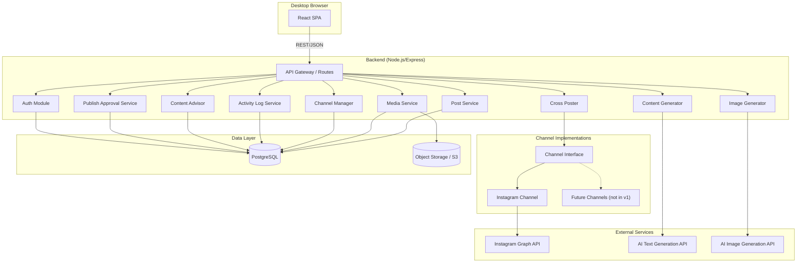
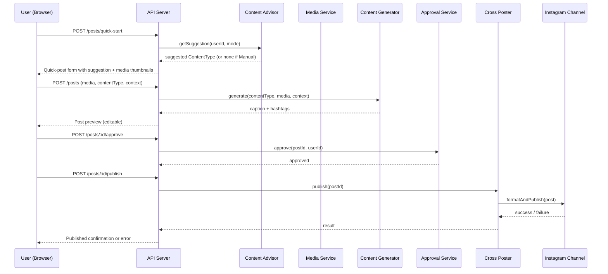
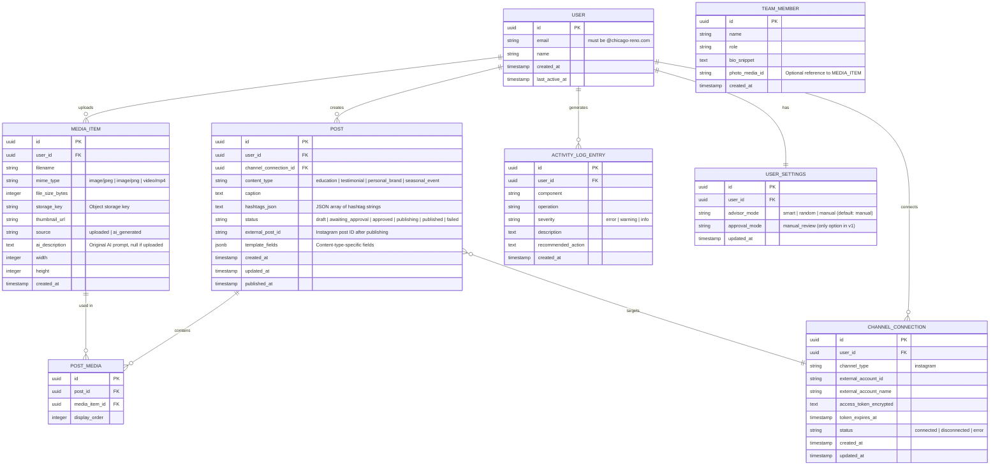
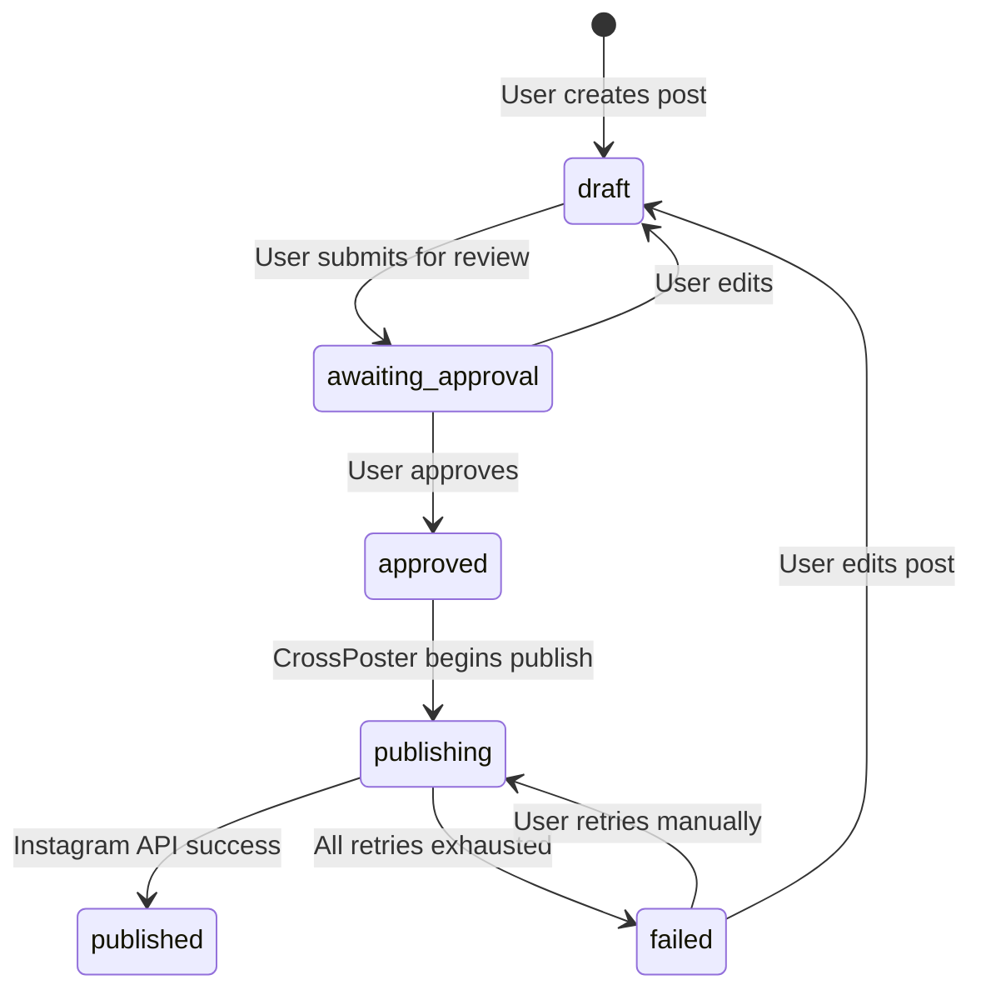
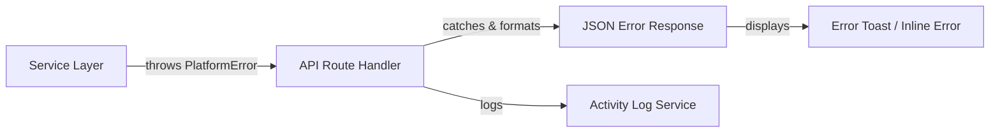

# Design Document: Social Media Cross-Poster

## Overview

The Social Media Cross-Poster is a web-based platform for Chicago Reno that enables team members to create, generate, and publish social media content to Instagram. The platform combines AI-powered content generation (captions, hashtags, images) with a streamlined quick-post workflow to minimize the time from idea to published post.

The v1 scope is Instagram-only, desktop browser-only (Chrome, Firefox, Safari, Edge), with authentication restricted to @chicago-reno.com emails. The architecture uses a pluggable Channel_Interface abstraction so future platforms can be added without modifying core publishing logic.

### Key Design Decisions

1. **Single-Page Application (SPA)**: React + TypeScript frontend for responsive desktop experience. No SSR needed since this is an internal tool with no SEO requirements.
2. **Backend-for-Frontend (BFF)**: Node.js/Express API server that mediates between the frontend and external services (Instagram Graph API, AI image/text generation APIs). This keeps API keys and OAuth tokens server-side.
3. **PostgreSQL**: Relational database for structured data (users, posts, media metadata, channel configs, activity logs). The data is inherently relational (posts belong to users, posts reference media, posts target channels).
4. **S3-compatible Object Storage**: For media files (uploaded images/videos, AI-generated images). Metadata stored in PostgreSQL, binary blobs in object storage.
5. **Channel_Interface as a Strategy Pattern**: Each social media platform implements a common interface. The CrossPoster delegates formatting and publishing to the active channel implementation. Only InstagramChannel exists in v1.
6. **Manual_Review_Mode only in v1**: All posts require explicit user approval before publishing. Auto_Publish_Mode is stubbed as "coming soon" in the UI.

## Architecture

### System Architecture Diagram



### Request Flow: Quick-Post Workflow



## Components and Interfaces

### Channel Interface (Strategy Pattern)

```typescript
/**
 * Abstract interface that all social media channel implementations must conform to.
 * In v1, only InstagramChannel implements this interface.
 */
interface ChannelInterface {
  /** Unique channel identifier */
  readonly channelType: string;

  /** Initiate OAuth flow — returns the authorization URL to redirect the user to */
  getAuthorizationUrl(state: string): string;

  /** Exchange authorization code for access token, store securely */
  handleAuthCallback(code: string, userId: string): Promise<ChannelConnection>;

  /** Revoke stored token and clean up */
  disconnect(connectionId: string): Promise<void>;

  /** Validate and format post content for this channel's constraints */
  formatPost(post: Post): Promise<FormattedPost>;

  /** Validate post against channel-specific constraints. Returns list of violations. */
  validatePost(post: Post): Promise<ValidationResult>;

  /** Publish a formatted post to the channel. Returns the external post ID. */
  publish(formattedPost: FormattedPost): Promise<PublishResult>;

  /** Get the current status of a published post */
  getPostStatus(externalPostId: string): Promise<PostStatus>;

  /** Get channel-specific constraints (caption length, media limits, etc.) */
  getConstraints(): ChannelConstraints;
}
```

### Instagram Channel Implementation

```typescript
class InstagramChannel implements ChannelInterface {
  readonly channelType = 'instagram';

  private readonly constraints: ChannelConstraints = {
    maxCaptionLength: 2200,
    maxHashtags: 30,
    maxCarouselImages: 10,
    maxReelDuration: 90, // seconds
    supportedMediaTypes: ['image/jpeg', 'image/png', 'video/mp4'],
    recommendedDimensions: {
      square: { width: 1080, height: 1080 },
      portrait: { width: 1080, height: 1350 },
      landscape: { width: 1080, height: 566 },
    },
  };

  getAuthorizationUrl(state: string): string { /* Instagram OAuth URL */ }
  async handleAuthCallback(code: string, userId: string): Promise<ChannelConnection> { /* Exchange code for token */ }
  async disconnect(connectionId: string): Promise<void> { /* Revoke token via Instagram API */ }
  async formatPost(post: Post): Promise<FormattedPost> { /* Format for Instagram Graph API */ }
  async validatePost(post: Post): Promise<ValidationResult> { /* Check against Instagram constraints */ }
  async publish(formattedPost: FormattedPost): Promise<PublishResult> { /* Call Instagram Graph API */ }
  async getPostStatus(externalPostId: string): Promise<PostStatus> { /* Query Instagram API */ }
  getConstraints(): ChannelConstraints { return this.constraints; }
}
```

### Content Generator

```typescript
interface ContentGeneratorInput {
  contentType: ContentType;
  media: MediaItem[];
  context?: string;           // Optional user-provided context
  templateFields?: Record<string, string>; // Content-type-specific fields
}

interface GeneratedContent {
  caption: string;
  hashtags: string[];
  formattedCaption: string;   // Caption + hashtags combined
}

class ContentGenerator {
  /**
   * Generate caption and hashtags for a post.
   * Applies the content template for the given ContentType.
   * Must return within 10 seconds.
   */
  async generate(input: ContentGeneratorInput): Promise<GeneratedContent>;

  /**
   * Build the AI prompt based on content type and template.
   * Each ContentType has a dedicated prompt template.
   */
  private buildPrompt(input: ContentGeneratorInput): string;

  /**
   * Validate generated content against channel constraints.
   */
  validateContent(content: GeneratedContent, constraints: ChannelConstraints): ValidationResult;
}
```

### Image Generator

```typescript
interface ImageGenerationRequest {
  description: string;
  style?: 'photorealistic' | 'modern' | 'illustrative';
  count?: number;             // Number of images to generate (default: 1)
}

interface GeneratedImage {
  url: string;                // Temporary URL for preview
  format: 'jpeg' | 'png';
  width: number;
  height: number;
  description: string;        // Original prompt
}

class ImageGenerator {
  /**
   * Generate images from text description.
   * Must return within 30 seconds.
   * Minimum resolution: 1080x1080.
   */
  async generate(request: ImageGenerationRequest): Promise<GeneratedImage[]>;
}
```

### Content Advisor

```typescript
type AdvisorMode = 'smart' | 'random' | 'manual';

interface ContentSuggestion {
  contentType: ContentType;
  reason: string;             // Human-readable explanation
}

class ContentAdvisor {
  /**
   * Get a content type suggestion based on the current mode.
   * Returns null in Manual mode.
   */
  async suggest(userId: string, mode: AdvisorMode): Promise<ContentSuggestion | null>;

  /**
   * Smart mode: analyze post history for recency and variety.
   * Returns the content type that is most "due" based on:
   * - Which types haven't been posted recently
   * - Overall distribution balance across the 4 types
   */
  private async smartSuggest(userId: string): Promise<ContentSuggestion>;

  /**
   * Random mode: weighted random selection favoring types
   * used less frequently in the last 30 days.
   */
  private async randomSuggest(userId: string): Promise<ContentSuggestion>;
}
```

### Publish Approval Service

```typescript
type ApprovalMode = 'manual_review' | 'auto_publish';
type ApprovalStatus = 'awaiting_approval' | 'approved' | 'rejected';

class PublishApprovalService {
  /**
   * Get the current approval mode for a user.
   * Always returns 'manual_review' in v1.
   */
  async getMode(userId: string): Promise<ApprovalMode>;

  /**
   * Approve a post for publishing. Only valid in manual_review mode.
   */
  async approve(postId: string, userId: string): Promise<void>;

  /**
   * Check if a post is approved for publishing.
   */
  async isApproved(postId: string): Promise<boolean>;
}
```

### Cross Poster

```typescript
class CrossPoster {
  /**
   * Publish a post to its target channel.
   * 1. Verify post is approved via PublishApprovalService
   * 2. Get the channel implementation from ChannelManager
   * 3. Format the post via channel.formatPost()
   * 4. Publish via channel.publish()
   * 5. Retry up to 3 times with exponential backoff on failure
   * 6. Update post status and log result
   */
  async publish(postId: string): Promise<PublishResult>;

  /**
   * Retry logic: exponential backoff (1s, 2s, 4s).
   * After 3 failures, mark post as "failed" and notify user.
   */
  private async publishWithRetry(
    channel: ChannelInterface,
    formattedPost: FormattedPost,
    maxRetries: number
  ): Promise<PublishResult>;
}
```

### Media Service

```typescript
class MediaService {
  /**
   * Upload a media file. Validates format and size before storing.
   * Accepted: JPEG, PNG, MP4. Max size: 50MB.
   * Stores binary in object storage, metadata in PostgreSQL.
   * Returns thumbnail URL within 5 seconds.
   */
  async upload(file: UploadedFile, userId: string): Promise<MediaItem>;

  /**
   * Store an AI-generated image in the media library.
   * Tags it with source='ai_generated' and the original description.
   */
  async storeGenerated(image: GeneratedImage, userId: string): Promise<MediaItem>;

  /** Delete a media file from storage and database. */
  async delete(mediaId: string, userId: string): Promise<void>;

  /** List all media for a user, with source labels. */
  async list(userId: string, pagination: PaginationParams): Promise<MediaItem[]>;
}
```

### Activity Log Service

```typescript
interface ActivityLogEntry {
  id: string;
  timestamp: Date;
  userId: string;
  component: string;          // e.g., 'ContentGenerator', 'CrossPoster', 'MediaService'
  operation: string;          // e.g., 'generate_caption', 'publish_post', 'upload_media'
  severity: 'error' | 'warning' | 'info';
  description: string;        // Human-readable, no stack traces
  recommendedAction?: string;  // What the user should do
}

class ActivityLogService {
  async log(entry: Omit<ActivityLogEntry, 'id' | 'timestamp'>): Promise<void>;
  async getEntries(userId: string, pagination: PaginationParams): Promise<ActivityLogEntry[]>;
}
```

### Auth Module

```typescript
class AuthModule {
  /**
   * Validate that email belongs to @chicago-reno.com domain.
   * Initiate email-based authentication flow.
   */
  async initiateAuth(email: string): Promise<AuthResult>;

  /**
   * Verify authentication token. Sessions expire after 30 minutes of inactivity.
   */
  async verifySession(sessionToken: string): Promise<User | null>;

  /** Middleware: reject requests with expired or invalid sessions. */
  sessionMiddleware(req: Request, res: Response, next: NextFunction): void;
}
```

### Error Formatting

```typescript
interface PlatformError {
  severity: 'error' | 'warning';
  component: string;
  operation: string;
  description: string;        // User-friendly, no technical jargon
  recommendedActions: string[]; // At least one actionable step
}

/**
 * All service methods that can fail MUST throw or return a PlatformError.
 * The API layer catches these and formats them consistently for the frontend.
 */
function formatErrorResponse(error: PlatformError): ErrorResponse {
  return {
    severity: error.severity,
    component: error.component,
    operation: error.operation,
    message: error.description,
    actions: error.recommendedActions,
  };
}
```


## Data Models

### Entity Relationship Diagram



### Post Status State Machine



### Content Type Templates

Each ContentType maps to a template that defines the fields, prompt structure, and layout guidance:

| ContentType | Template Fields | Prompt Focus |
|---|---|---|
| `education` | topic_title, key_points, supporting_media | Informative caption, tips, home improvement hashtags |
| `testimonial` | customer_quote, customer_name, is_anonymous, project_type | Review highlight, project reference, social proof hashtags |
| `personal_brand` | member_name, role, bio_snippet | Team member intro, expertise, team culture hashtags |
| `seasonal_event` | event_name, event_date, renovation_tie_in | Event-renovation connection, seasonal hashtags |

### API Routes Summary

| Method | Path | Description |
|---|---|---|
| POST | `/auth/login` | Initiate email auth (validates @chicago-reno.com) |
| POST | `/auth/verify` | Verify auth token |
| POST | `/auth/logout` | End session |
| GET | `/channels` | List connected channels |
| POST | `/channels/instagram/connect` | Start Instagram OAuth |
| GET | `/channels/instagram/callback` | Handle OAuth callback |
| DELETE | `/channels/:id` | Disconnect channel |
| GET | `/media` | List media library |
| POST | `/media/upload` | Upload media file |
| POST | `/media/generate` | Generate AI image |
| POST | `/media/:id/save-generated` | Save AI image to library |
| DELETE | `/media/:id` | Delete media |
| GET | `/posts` | List posts (with status filter) |
| POST | `/posts` | Create post |
| POST | `/posts/quick-start` | Initialize quick-post workflow |
| PUT | `/posts/:id` | Update post |
| POST | `/posts/:id/generate-content` | Generate caption/hashtags |
| POST | `/posts/:id/approve` | Approve post for publishing |
| POST | `/posts/:id/publish` | Publish post to Instagram |
| GET | `/posts/:id/preview` | Get Instagram preview |
| GET | `/content-advisor/suggest` | Get content type suggestion |
| GET | `/settings` | Get user settings |
| PUT | `/settings` | Update user settings |
| GET | `/activity-log` | Get activity log entries |
| GET | `/content-types` | List available content types + templates |
| GET | `/holidays` | List upcoming holidays/events for Seasonal_Event |


## Correctness Properties

*A property is a characteristic or behavior that should hold true across all valid executions of a system — essentially, a formal statement about what the system should do. Properties serve as the bridge between human-readable specifications and machine-verifiable correctness guarantees.*

### Property 1: Email domain validation

*For any* email string, the authentication module should accept it if and only if it ends with `@chicago-reno.com` (case-insensitive). All other email strings must be rejected with an appropriate error message.

**Validates: Requirements 1.1, 1.2, 1.3**

### Property 2: Session expiry after inactivity

*For any* session and any timestamp, the session should be considered invalid if and only if the elapsed time since the last activity exceeds 30 minutes. Valid sessions (within 30 minutes) must be accepted; expired sessions must be rejected.

**Validates: Requirements 1.4**

### Property 3: Media upload validation

*For any* file upload attempt, the Media Service should accept the file if and only if the MIME type is one of `image/jpeg`, `image/png`, or `video/mp4` AND the file size is at most 50 MB. Files that violate either constraint must be rejected with a descriptive error identifying which constraint was violated.

**Validates: Requirements 3.2, 3.3, 3.4**

### Property 4: Media source label invariant

*For any* media item in the Media Library, the `source` field must be exactly one of `'uploaded'` or `'ai_generated'`. No media item may exist without a source label.

**Validates: Requirements 3.6, 3A.8**

### Property 5: AI-generated image metadata round trip

*For any* AI-generated image saved to the Media Library, retrieving that media item should return `source = 'ai_generated'` and the `ai_description` field should equal the original text description used to generate the image.

**Validates: Requirements 3A.5**

### Property 6: Generated image minimum resolution

*For any* image produced by the Image Generator and accepted into the system, the width must be >= 1080 pixels and the height must be >= 1080 pixels, and the format must be JPEG or PNG.

**Validates: Requirements 3A.3**

### Property 7: Generated content respects Instagram constraints

*For any* content produced by the Content Generator for Instagram, the caption length must be <= 2200 characters and the number of hashtags must be <= 30.

**Validates: Requirements 4.3**

### Property 8: Content type to template mapping

*For any* valid content type, there must exist exactly one corresponding content template. Selecting a content type must always produce the correct template, and changing the content type must update the template to match the newly selected type.

**Validates: Requirements 4.6, 10.3, 10.4, 10.5**

### Property 9: Post validation catches constraint violations

*For any* post, the validation function should return violations if and only if the post violates Instagram's constraints (caption > 2200 chars, > 30 hashtags, > 10 carousel images, video > 90 seconds, unsupported media type). A post with violations must not be publishable.

**Validates: Requirements 5.4, 5.5, 9.1**

### Property 10: Draft post round trip

*For any* post saved as a draft, retrieving that post should return the same caption, hashtags, media attachments, content type, and template fields that were saved.

**Validates: Requirements 5.3**

### Property 11: Unapproved posts cannot be published

*For any* post whose status is not `'approved'`, the Cross Poster must reject the publish request. Only posts with status `'approved'` may proceed to publishing.

**Validates: Requirements 7.1, 7.2, 19.5**

### Property 12: Post status state machine

*For any* post, status transitions must follow the valid state machine: `draft → awaiting_approval → approved → publishing → published`, with `publishing → failed` on error, `failed → publishing` on retry, and `failed → draft` or `awaiting_approval → draft` on edit. No other transitions are permitted.

**Validates: Requirements 7.4, 19.4, 19.6**

### Property 13: Publish retry with bounded attempts

*For any* publish operation that encounters failures, the Cross Poster must retry at most 3 times (4 total attempts). If all attempts fail, the post status must be set to `'failed'`. The delay between retries must follow exponential backoff (1s, 2s, 4s).

**Validates: Requirements 7.5, 7.6**

### Property 14: New user defaults

*For any* newly created user, the Content Advisor mode must default to `'manual'` and the Publish Approval mode must default to `'manual_review'`.

**Validates: Requirements 18.3, 19.2**

### Property 15: Smart mode recommends least-recent content type

*For any* post history and user in Smart mode, the Content Advisor should recommend a content type that has not been posted recently, favoring types with the longest gap since last use. The suggestion must include a non-empty explanation string.

**Validates: Requirements 18.4, 18.5, 18.6**

### Property 16: Random mode weighted selection

*For any* post history and user in Random mode, the Content Advisor must return a valid content type from the four available types. Over a sufficient number of samples, content types used less frequently in the last 30 days should appear more often than frequently used types.

**Validates: Requirements 18.7**

### Property 17: Manual mode returns no suggestion

*For any* user in Manual mode, the Content Advisor must return null (no suggestion). The advisor must never produce a content type recommendation in Manual mode.

**Validates: Requirements 18.8**

### Property 18: Auto-publish mode blocked in v1

*For any* attempt to set the approval mode to `'auto_publish'`, the system must reject the change and keep the mode as `'manual_review'`.

**Validates: Requirements 19.8**

### Property 19: Error format consistency

*For any* PlatformError produced by any component, the formatted error response must include all four required fields: `severity` (error or warning), `component` (non-empty string), `description` (non-empty, human-readable), and `recommendedActions` (array with at least one entry). No field may be null or empty.

**Validates: Requirements 20.1, 20.4, 20.5, 20.6, 20.9, 20.10, 20.12**

### Property 20: Error events logged to Activity Log

*For any* error that occurs in the system, a corresponding Activity Log entry must be created with a timestamp, the affected component, the operation attempted, and the error details.

**Validates: Requirements 20.3**

### Property 21: Anonymous testimonial omits customer name

*For any* testimonial marked as anonymous, the generated caption must not contain the customer name string. If `is_anonymous` is true and a `customer_name` is provided, the name must be absent from the output caption.

**Validates: Requirements 14.4**

### Property 22: Channel connection error produces descriptive message

*For any* channel connection failure, the error response must identify the specific channel and authorization step that failed, and offer the user the option to retry.

**Validates: Requirements 2.5**

### Property 23: Media deletion removes item

*For any* media item, after deletion, querying for that media item by ID must return not found. The item must not appear in any subsequent media library listing.

**Validates: Requirements 3.5**

### Property 24: Quick-post workflow provides smart defaults

*For any* user initiating the quick-post workflow, the system must return pre-selected defaults for content type (based on advisor mode), hashtag count, and Instagram format, so the user can proceed without manual configuration of these fields.

**Validates: Requirements 17.2**


## Error Handling

### Error Handling Strategy

Every failure in the platform must produce a structured `PlatformError` that is surfaced to the user. No errors are silently discarded.

### Error Structure

All errors conform to the `PlatformError` interface:

```typescript
interface PlatformError {
  severity: 'error' | 'warning';
  component: string;       // 'AuthModule' | 'MediaService' | 'ContentGenerator' | 'ImageGenerator' | 'CrossPoster' | 'ChannelManager' | 'ContentAdvisor'
  operation: string;       // What was attempted
  description: string;     // User-friendly, no stack traces or raw API codes
  recommendedActions: string[]; // At least one actionable step
}
```

### Error Handling by Component

| Component | Failure Scenario | Error Description | Recommended Actions |
|---|---|---|---|
| AuthModule | Invalid email domain | "Only @chicago-reno.com email addresses can access this platform." | ["Enter a valid @chicago-reno.com email address"] |
| AuthModule | Session expired | "Your session has expired due to inactivity." | ["Log in again to continue"] |
| MediaService | File too large | "The file exceeds the 50 MB size limit." | ["Reduce the file size and try again"] |
| MediaService | Unsupported format | "This file format is not supported. The platform accepts JPEG, PNG, and MP4 files." | ["Convert the file to JPEG, PNG, or MP4 and try again"] |
| MediaService | Storage error | "The file could not be saved due to a storage issue." | ["Try uploading again", "Contact support if the problem persists"] |
| ContentGenerator | Generation timeout | "Content generation took too long to complete." | ["Try again", "Simplify the input context"] |
| ContentGenerator | Invalid input | "The provided input could not be used to generate content." | ["Modify the input context and try again", "Write the caption manually"] |
| ImageGenerator | Generation failure | "The image could not be generated from the provided description." | ["Try again with the same description", "Modify the description", "Select an existing image from the Media Library"] |
| ImageGenerator | Generation timeout | "Image generation took too long to complete." | ["Try again", "Use a simpler description"] |
| CrossPoster | Publish failure (retries remaining) | "Publishing to Instagram failed. Retrying automatically ({n} attempts remaining)." | ["Wait for automatic retry"] |
| CrossPoster | Publish failure (retries exhausted) | "Publishing to Instagram failed after multiple attempts. Reason: {reason}." | ["Retry manually", "Edit the post and try again", "Re-authenticate your Instagram account"] |
| CrossPoster | Unapproved post | "This post has not been approved for publishing." | ["Review and approve the post before publishing"] |
| ChannelManager | OAuth failure | "Could not connect to Instagram. {reason}." | ["Try connecting again", "Check your Instagram account permissions"] |
| ChannelManager | Token expired | "Your Instagram connection has expired." | ["Reconnect your Instagram account"] |

### Error Propagation Flow



1. Service methods throw or return `PlatformError` on failure.
2. API route handlers catch errors, call `ActivityLogService.log()`, and return a formatted JSON error response.
3. The frontend displays errors as toast notifications (transient) or inline error messages (contextual), depending on the operation.
4. All errors are recorded in the Activity Log with timestamp, component, operation, and details.

### Retry Strategy

The Cross Poster uses exponential backoff for Instagram publish failures:

```
Attempt 1: immediate
Attempt 2: wait 1 second
Attempt 3: wait 2 seconds
Attempt 4: wait 4 seconds
After attempt 4: mark as "failed", stop retrying
```

Retries are only applied to transient failures (network errors, rate limits, server errors). Permanent failures (invalid media format, expired token) fail immediately without retry.

## Testing Strategy

### Dual Testing Approach

The platform uses both unit tests and property-based tests for comprehensive coverage:

- **Unit tests**: Verify specific examples, edge cases, integration points, and error conditions. Use concrete inputs and expected outputs.
- **Property-based tests**: Verify universal properties that must hold across all valid inputs. Use randomized input generation to explore the input space.

Both are complementary and required. Unit tests catch concrete bugs at specific boundaries; property tests verify general correctness across the full input domain.

### Property-Based Testing Configuration

- **Library**: [fast-check](https://github.com/dubzzz/fast-check) for TypeScript/JavaScript
- **Minimum iterations**: 100 per property test
- **Tag format**: Each property test must include a comment referencing the design property:
  ```
  // Feature: social-media-cross-poster, Property {number}: {property_text}
  ```
- **One test per property**: Each correctness property from this design document must be implemented by exactly one property-based test

### Test Organization

```
tests/
├── unit/
│   ├── auth.test.ts              # Email validation examples, session edge cases
│   ├── media-service.test.ts     # Upload examples, deletion, format edge cases
│   ├── content-generator.test.ts # Template selection examples, content type specifics
│   ├── image-generator.test.ts   # Style parameter handling, error cases
│   ├── cross-poster.test.ts      # Publish flow examples, retry timing
│   ├── content-advisor.test.ts   # Mode switching, suggestion examples
│   ├── approval-service.test.ts  # Approval flow examples
│   ├── activity-log.test.ts      # Log entry creation examples
│   └── error-formatting.test.ts  # Error format examples per component
├── property/
│   ├── auth.property.test.ts           # Properties 1, 2
│   ├── media.property.test.ts          # Properties 3, 4, 5, 6, 23
│   ├── content.property.test.ts        # Properties 7, 8, 21
│   ├── post.property.test.ts           # Properties 9, 10, 11, 12
│   ├── publishing.property.test.ts     # Property 13
│   ├── advisor.property.test.ts        # Properties 14, 15, 16, 17
│   ├── approval.property.test.ts       # Property 18
│   ├── error.property.test.ts          # Properties 19, 20
│   ├── channel-error.property.test.ts  # Property 22
│   └── quick-post.property.test.ts     # Property 24
└── integration/
    ├── instagram-oauth.test.ts   # OAuth flow with mocked Instagram API
    ├── instagram-publish.test.ts # Publish flow with mocked Instagram API
    └── quick-post-flow.test.ts   # End-to-end quick-post workflow
```

### Unit Test Focus Areas

- **Specific examples**: Concrete email addresses (valid and invalid), specific file sizes at the 50MB boundary, exact caption lengths at 2200 chars
- **Edge cases**: Empty strings, whitespace-only inputs, zero-byte files, maximum carousel size (10 images), 90-second video boundary
- **Integration points**: OAuth callback handling, Instagram API response parsing, AI service response mapping
- **Error conditions**: Network timeouts, malformed API responses, concurrent operations

### Property Test Focus Areas

Each of the 24 correctness properties maps to a property-based test using fast-check generators:

- **Generators needed**: arbitrary email strings, file metadata (size, mime type), post objects with variable caption lengths and hashtag counts, content type enums, post history sequences, PlatformError instances
- **Shrinking**: fast-check's built-in shrinking will minimize failing examples to the simplest reproduction case
- **Seed reproducibility**: All property tests should log the random seed for reproducibility of failures

### Example Property Test Structure

```typescript
import fc from 'fast-check';

// Feature: social-media-cross-poster, Property 1: Email domain validation
describe('Property 1: Email domain validation', () => {
  it('accepts only @chicago-reno.com emails', () => {
    fc.assert(
      fc.property(fc.string(), (localPart) => {
        const validEmail = `${localPart}@chicago-reno.com`;
        const invalidEmail = `${localPart}@other-domain.com`;
        expect(validateEmailDomain(validEmail)).toBe(true);
        expect(validateEmailDomain(invalidEmail)).toBe(false);
      }),
      { numRuns: 100 }
    );
  });
});

// Feature: social-media-cross-poster, Property 3: Media upload validation
describe('Property 3: Media upload validation', () => {
  const validMimeTypes = ['image/jpeg', 'image/png', 'video/mp4'];
  const maxSize = 50 * 1024 * 1024; // 50MB

  it('accepts valid files and rejects invalid ones', () => {
    fc.assert(
      fc.property(
        fc.record({
          mimeType: fc.oneof(
            fc.constantFrom(...validMimeTypes),
            fc.string()
          ),
          size: fc.nat({ max: 100 * 1024 * 1024 }),
        }),
        ({ mimeType, size }) => {
          const result = validateUpload(mimeType, size);
          const isValidType = validMimeTypes.includes(mimeType);
          const isValidSize = size <= maxSize;
          expect(result.accepted).toBe(isValidType && isValidSize);
        }
      ),
      { numRuns: 100 }
    );
  });
});
```
